#  AAAI 2026｜全面发力！快手3篇论文获Oral，12篇论文入选！

原创 快手技术 快手技术 [ 快手技术 ](javascript:void\(0\);)

______

在小说阅读器中沉浸阅读

**导读**

  

快手有12篇论文入选AAAI 2026，研究成果涵盖搜索与推荐系统、多镜头视频生成、多模态内容理解与评估、生成式模型基础技术、视频大语言模型、实验设计以及LLM隐空间推理等方向。

  
  

  

AAAI人工智能会议（AAAI Conference on Artificial Intelligence）由人工智能促进会（AAAI）主办，是人工智能领域历史最悠久的国际学术会议之一。AAAI 2026将于1月20日至1月27日在新加坡博览中心举办，本届共收到了23,680份论文投稿，其中4,167篇被录用，整体录用率为17.6%。其中快手共有12篇论文入选AAAI 2026。这些论文涵盖搜索与推荐系统、多镜头视频生成、多模态内容理解与评估、生成式模型基础技术、视频大语言模型、实验设计以及LLM隐空间推理等方向。其中3篇论文成果已被 AAAI 2026 接收为 Oral，其研究创新性和重大影响力获国际认可。  

  

****

论文精选  

  
论文01：**Align³GR: Unified Multi-Level Alignment for LLM-based Generative Recommendation【Oral】**

**|****** 论文链接：https://arxiv.org/abs/2511.11255

  

**|******论文简介：大语言模型（LLM）在世界知识利用、多步推理与冷启动场景中展现出显著优势。然而，将其直接应用于广告推荐系统时，由于LLM自然语言的语义空间与推荐系统的用户行为空间之间存在固有“鸿沟”，仍面临根本性技术挑战。  
  
为弥合这一鸿沟，我们推出了Align³GR——一个统一 token-behavior-preference 多级对齐的生成式推荐框架，有效融合了LLM的语义理解能力与推荐系统的协同过滤机制。该框架主要包括以下三个关键部分：1、融合语义‑协同ID：在表征层面深度融合语义信息与协同信号，生成统一的“语义‑协同ID”（SCID），为下游任务提供兼具内容理解与行为洞察的基础Token表示；2、多任务监督微调：通过双向对齐的监督微调框架，使基于LLM的生成式推荐模型具备基础推荐能力；3、渐进式偏好对齐：结合自博弈优化与真实场景反馈，采用渐进式强化学习策略进行稀疏反馈下的偏好对齐，实现动态适应性优化。  
  
在公开数据集上，Align³GR在Recall@10与NDCG@10两项指标上，分别较现有最优基线显著提升+17.8%与+20.2%。同时，Align³GR已在快手商业化广告全流量推全，驱动商业化广告大盘收入显著提升。  

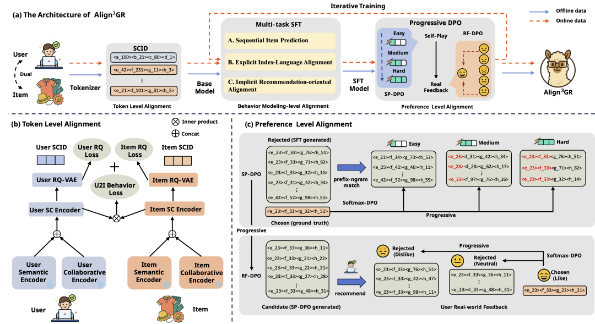

**论文02：****CroPS: Improving Dense Retrieval with Cross-Perspective Positive Samples in Short-Video Search【Oral】**

  

**|**** 论文链接**：https://arxiv.org/pdf/2511.15443

  

**|****** 论文简介：向量检索是现代短视频搜索系统的核心范式，通常依赖用户的历史点击行为进行训练。然而在工业级落地中，这种“自我强化”的闭环训练面临严峻的信息茧房问题：模型倾向于只推荐历史曝光过的内容，而将大量相关但未曾曝光的潜在优质视频误判为负样本。这种偏置导致检索结果日益保守、同质化，难以捕捉用户的新颖兴趣，限制了系统的探索能力。

  

针对该问题，文章提出了 CroPS（跨视角正样本） 增强框架。一方面，构建了多视角数据引擎，通过引入三类异构信号打破数据边界：（1）Query级增强：利用用户Query改写后的交互行为，捕捉用户在连续搜索中的深层意图；（2）系统级扩展：打破搜索与推荐的壁垒，引入推荐流中的高置信度交互数据以补充个性化偏好；（3）世界知识注入：利用LLM作为“虚拟检索器”生成合成样本，补充系统内缺失的外部语义知识。另一方面，面对多源数据置信度参差不齐的难题，简单的二元分类会导致训练次优。为此，CroPS 设计了分层标签分配（HLA）策略配合 H-InfoNCE 损失函数。该机制摒弃了非正即负的粗糙逻辑，引导模型学习【强相关 > 弱相关 > 负样本】的细粒度排序阶梯，在单次推理中同时优化对不同相关度层级的区分能力。

  

CroPS 已作为核心组件在快手搜索业务全量部署，服务亿级用户。实验结果表明，CroPS 方法不仅可扩展性强，并且在线上环境中显著提升了用户点击率与视频长播表现，同时，有效降低了用户换Q率，整体改善了用户搜索体验。

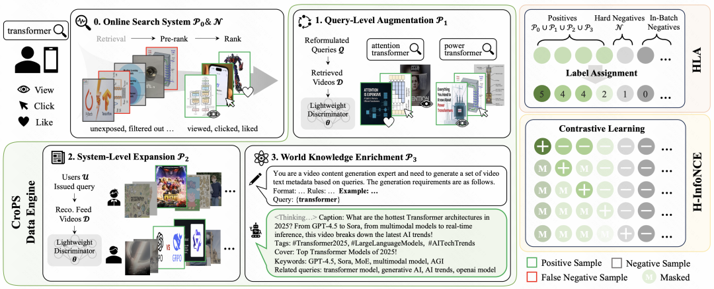  
论文03：Fairness-Aware Design for Contextual Experiments: Guaranteeing Reliability and Equity in Heterogeneous Subgroups【Oral】

  

**|****** 论文简介：在医疗保健、市场营销和公共政策中的基于证据的决策等领域，实验设计至关重要。然而，在异质子群体中设计高效的实验面临着诸多挑战。现有的方法通常优化统计功效或总体样本效率，但忽视了不同子群体之间的公平性问题。为了解决这一问题，我们提出了一种公平意识的情境跟踪与停止设计（F-CTSD）算法，该算法在保证子群体公平性的同时，最小化所需的样本量。我们量化了公平性与效率之间的权衡，并推导了在公平性约束下，F-CTSD算法的精确样本复杂度。我们进一步从理论上证明，F-CTSD算法在保持公平性的情况下，仍能一致地提供准确的处理效应估计，从而增强统计可靠性。实验表明，F-CTSD算法优于现有方法，能够在提高样本效率的同时，将子群体公平性违背率降低4.95%。  

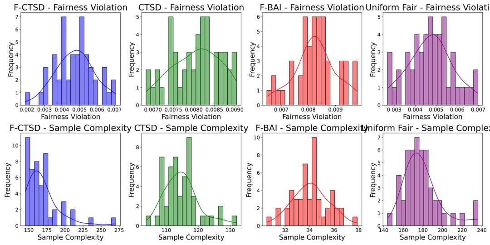

**论文04：Beyond Tokens: Dynamic Latent Reasoning via Semantic Residual Refinement**

****|** 论文简介：大语言模型（LLM）的思维链（CoT）推理范式严重依赖离散符号生成，面临表达力瓶颈与效率限制，在精准刻画用户画像、生成式推荐等需处理模糊、抽象语义的场景中尤为突出。现有潜空间推理方法或需高昂的微调成本，或因简单的插值造成语义降级，难以有效捕捉用户难以用离散词汇表达的深层兴趣。**

**  
**

**为解决这一挑战，本文提出了DyLaR（动态潜空间推理），一个旨在无需额外训练即可实现语义保真与灵活推理的全新框架。其核心技术包含两大创新：首先，通过语义残差精炼（SRR）模块，迭代式地将隐状态与词嵌入空间的投影残差进行融合，生成能够超越词嵌入凸包限制、更富表达力的潜空间表征，从而在免训练前提下确保了对原始隐状态的语义保真度。其次，设计了基于模型不确定性的动态切换策略，利用输出概率熵作为决策依据，使模型能够在高置信度时执行精确的离散推理，而在模糊、抽象的步骤中自适应切换至潜空间进行探索，打破了传统方法的僵化模式。**

**  
****在多项知识与逻辑推理基准上的实验表明，DyLaR在推理准确率和令牌效率上均取得显著优势，准确率最高提升4.95%，令牌消耗最多降低17.52%。该框架为LLM解锁了更高效、更灵活的类人认知能力，在提升生成式推荐、用户意图理解等下游任务的效果上展现出巨大潜力。**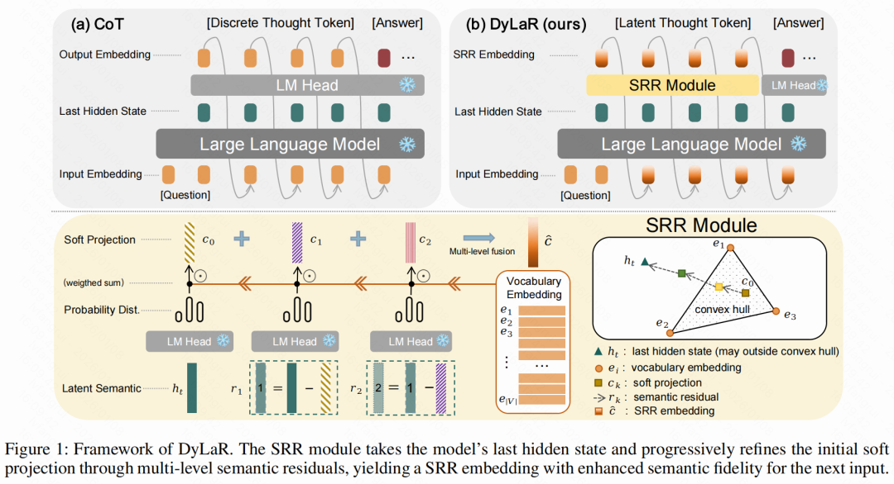**  
**

  

**论文05：BLM-Guard: Explainable Multimodal Ad Moderation with Chain-of-Thought and Policy-Aligned Rewards**

**|******论文简介：为解决视觉信息、误导性字幕等规避传统审核机制，对客户权益构成潜在风险，我们提出了BLM-Guard——一个融合思维链（Chain-of-Thought）推理、策略对齐奖励机制与规则驱动监督的多模态广告审核框架。其中，交错模态思维链（Interleaved-modal Chain-of-Thought, ICoT）的构建方式主要是通过将视觉定位（visual grounding）、跨模态信息融合（文本/视频）、风险识别与因果分析编织于统一推理链中，使模型能够显式捕捉多模态间的因果依赖关系。为解决大语言模型在审核场景中的因果一致性不足、可解释性缺失等问题，我们提出GRPO-SCAR算法（Self-Consistency and Adaptive Reward），通过双层监督机制实现策略动态对齐：使用政策规则+模型结合进行打分的方法来进行动态适配，在Guide Model中增加可动态自适应的政策规则以基于先验做监督信号；同时，对模型推理结果在不同的情形（清晰/模糊、不同场景的审核尺度不同等）下给予不同的得分做后验进行结果监督。实验表明，BLM-Guard在准确率、跨场景一致性和规则泛化能力上显著优于现有基线模型，为大规模内容审核提供了可解释、可控的解决方案。

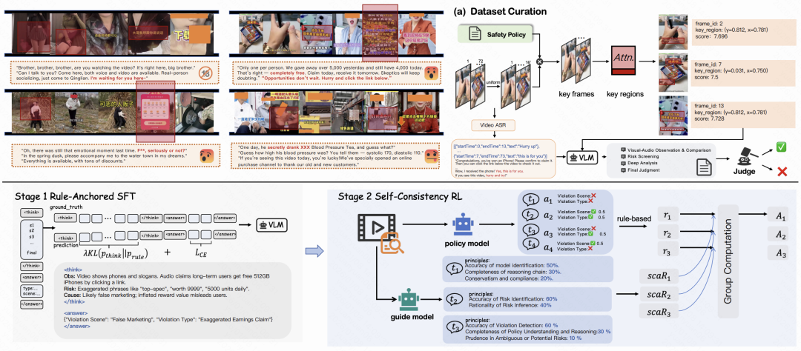

**论文06：****Boosting Resolution Generalization of Diffusion Transformers with Randomized Positional Encodings**

**|******论文链接： https://arxiv.org/abs/2503.18719

**|****** 论文简介：在高质量图像生成中，训练分辨率等于推理分辨率几乎已成为默认前提。一旦想把模型直接用于更高分辨率，训练成本通常会成倍上涨。我们最新提出的二维随机位置编码（RPE-2D），从根源上解决了扩分辨率时训练和推理之间位置编码分布不一致的关键瓶颈：训练阶段在更大的二维网格上分别对横纵坐标做无放回随机采样并排序，让高分辨率推理所需的位置编码在统计意义上被训练覆盖；推理阶段再使用确定性的近似等距网格，从而把外推转化为更稳健的内插。同时，我们引入随机缩放和裁剪增强，并配合条件注入显式告知裁剪与缩放模式，进一步强化模型对位置顺序的建模；结合注意力缩放与时间步偏移，在高分辨率采样时也能保持稳定表现。实验显示，RPE-2D在ImageNet上实现了领先的分辨率泛化效果：低分辨率训练即可生成更高分辨率图像，并兼顾低分辨率生成、多阶段训练加速与多分辨率继承等实用价值。  

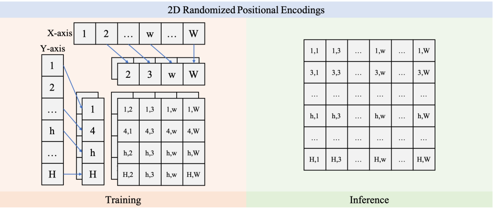  

**论文07：****Bridging Cognitive Gap: Hierarchical Description Learning for Artistic Image Aesthetics Assessment**

  

**|**** 论文链接**：https://arxiv.org/abs/2512.23413

  

**|****** 论文简介：美学质量评估任务对于构建与人类审美一致的 AIGC 量化评估系统具有关键作用。然而，由于该问题涉及视觉感知、认知和情感等多个方面，其研究面临巨大挑战。尽管美学描述为这种复杂性提供了一种可行的表达方式，但仍存在两个关键挑战：（1）数据稀缺与不平衡：由于人工标注成本高昂，现有数据集过度关注视觉感知，而忽略了更深层次的维度；（2）模型碎片化：当前的视觉网络通过多分支编码器孤立地处理美学属性，而以对比学习为代表的多模态方法在有效处理长文本描述方面存在困难。为解决这一挑战，我们首先构建了精炼美学描述（RAD）数据集——一个包含 7 万样本的大规模多维结构化数据集。该数据集通过迭代流程生成，无需高昂的标注成本且易于扩展。其次，我们提出了ArtQuant，这是一个用于艺术图像的美学评估框架，它不仅通过联合描述生成将孤立的美学维度结合起来，还利用大语言模型解码器更好地对长文本语义进行建模。此外，理论分析证实了这种共生关系：RAD的语义充分性（数据）和生成范式（模型）共同将预测熵降至最低，为该框架提供了数学基础。我们的方法在多个数据集上取得了最先进的性能，同时仅需传统训练轮数的33%，缩小了艺术图像与审美判断之间的认知差距。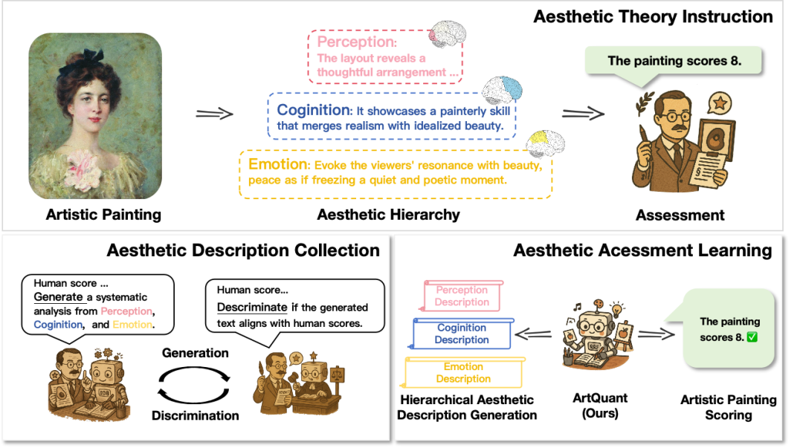  

**论文08：****FilmWeaver: Weaving Consistent Multi-Shot Videos with Cache-Guided Autoregressive Diffusion**

**|****** 论文链接：https://arxiv.org/abs/2512.11274

**  
****|****** 论文简介：当前视频生成模型在单镜头合成方面表现良好，但在处理多镜头时却面临困难，尤其在跨镜头保持角色和背景一致性，以及灵活生成任意长度和任意镜头数量上存在着巨大挑战。为了解决这些局限性，我们提出了一种名为 FilmWeaver 的新颖框架，该框架旨在生成具有一致性且任意长度的多镜头视频。首先，它采用一种自回归扩散范式来实现任意长度的视频生成。为了保持一致性，我们集成了一套双层缓存机制：用于缓存前序镜头关键帧的镜头记忆模块，以保持长期的角色与背景身份特征；用于保留当前镜头历史帧的时序记忆模块，以确保运动的平滑和镜头内部的连贯性。我们提出的框架允许灵活的、多轮的用户交互来创作多镜头视频。得益于这套双层缓存机制，我们的方法通过支持多概念注入和视频扩展等下游任务，展现出了高度的通用性。此外我们还开发了一套完整的流程来构建一个高质量的多镜头视频数据集。大量的实验结果表明，我们的方法在一致性和美学质量的评估指标上均超越了现有方法，为多镜头视频生成领域树立了新的标杆。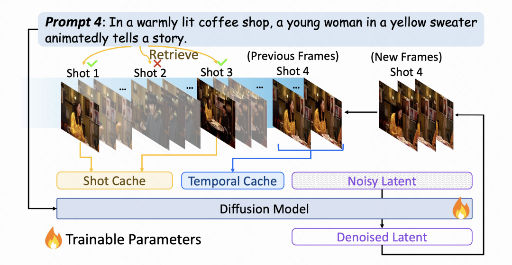

  

**论文09：****LLM-Aligned Geographic Item Tokenization for Local-Life Recommendation**

**|****** 论文链接：https://arxiv.org/abs/2511.14221

**| 项目地址：https://github.com/JiangHaoPG11/LGSID**

**|****** 论文简介：生活服务类团购业务具有“线上下单，到店核销”的特性，人-货匹配效率随分发距离显著下降，因而属于近场分发场景。该场景推荐既要做好精准的兴趣匹配，同时又要考虑分发距离和当前空间特性，即充分的空间感知。近年来，大语言模型（Large Language Models, LLMs）的快速发展，使其在语义理解与推理方面展现出强大能力，为推荐模型提升了语义泛化能力。现有基于LLM的推荐方法通常通过精心设计的Prompt对候选Item的文本进行表征编码，再利用量化模型生成语义ID，从而赋能下游推荐任务。然而，在近场分发场景中，如果简单地将Item内容信息和地理位置信息同时注入Prompt中，难以有效刻画细粒度的空间位置关系，从而无法实现充分的空间感知。  
为此，我们提出LGSID，一种面向近场分发场景的LLM地理感知对齐与量化方法。该框架包含两个核心模块：基于强化学习的地理感知LLM对齐机制（RL-based Geographic LLM Alignment）和层次化地理感知量化方案（Hierarchical GeographicItem Tokenization）。具体而言，在LLM对齐模块中，我们首先基于地理位置密度感知采样和Prompt错配策略，训练得到一个List-wise奖励模型，以捕捉POI的内容语义与地理语义之间的偏好关系。在此基础上，我们创新性地提出了G-DPO（Geographic Direct Preference Optimization）偏好对齐算法，构建针对近场分发体系的混合样本偏好数据集，并借助预训练奖励模型进行“内容-地理”偏好评分，通过强化学习将地理位置信息注入LLM底层。该算法在保持LLM原有语义理解能力的同时，有效注入泛化的地理空间知识与协同信号。此外，为充分满足近场分发场景下“先地理感知，再兴趣匹配”的分发逻辑，我们进一步设计了层次化地理感知量化方案：首层量化ID由离散化的空间属性与泛化内容特征聚类生成，后续层量化ID则基于地理感知语义表征向量进行残差量化，从而实现“先空间、后兴趣”的层次化语义表达——LGSID。  
我们在快手工业级数据集上进行了大量实验，结果表明，将LGSID分别应用于判别式模型与生成式模型中，其在多项指标上均显著优于现有对齐与量化方案。进一步的消融实验、可视化分析以及案例研究也充分验证了该方法的有效性与鲁棒性。目前，LGSID已在快手生活服务场景全量上线，推动业务GMV与订单量的显著增长。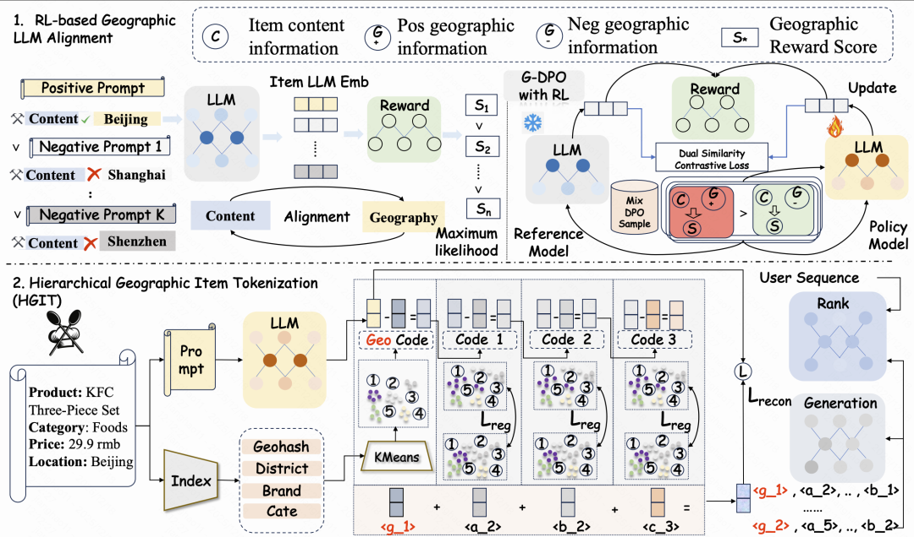

  

**论文10：****OneSug: The Unified End-to-End Generative Framework for E-commerce Query Suggestion**

**|****** 论文链接：https://arxiv.org/pdf/2506.06913

**| 项目地址：https://github.com/Edgis/OneSug**

**  
**

**| 论文简介：传统的Sug系统通常采用多阶段级联架构，在系统耗时与业务转化之间进行权衡。然而，这种“分段式”优化方式由于各阶段目标不一致，造成整体效率受限，难以持续释放模型能力，成为电商搜索体验和转化提升的瓶颈。**

**  
**

**为此，我们推出了 OneSug —— 一个面向电商场景的端到端Sug生成框架。OneSug 打破了传统“召回—排序—重排”的割裂式流程，将Sug统一为整体生成任务。系统核心包含三项关键能力：首先，通过prefix2query的表示增强模块，融合语义理解与用户交互信号，充分挖掘用户真实意图；其次，借助enc-dec生成模型，实现Sug的端到端建模与优化；最后，采用基于行为分档的奖励加权策略，精准刻画用户在不同阶段的细粒度偏好，从而持续优化最终展示结果。**

**  
**

**在大规模真实业务数据上的结果表明，OneSug 在体验和效率上均显著优于传统多阶段方案。目前，OneSug 已全面上线快手电商搜索系统，并稳定承载全流量超过半年。**

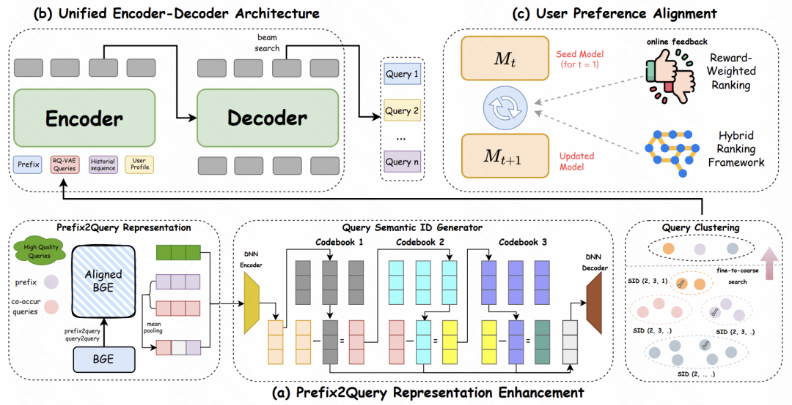

**论文11：****TEMPLE: Incentivizing Temporal Understanding of Video Large Language Models via Progressive Pre-SFT Alignment**

**|******论文链接： https://arxiv.org/pdf/2503.16929

**| 项目地址：https://github.com/lscpku/TEMPLE**

**  
**

**| 论文简介：其主要技术亮点在于其针对现有视频大语言模型普遍存在时序理解能力薄弱的问题，系统地提出了一个‌基于直接偏好优化的完整方案‌。首先，为解决高质量时序密集型监督数据稀缺的核心瓶颈，我们设计了一套创新的自动化数据生成流水线，通过‌三步走的策略‌系统性地构建偏好数据对，即精心选择富含复杂时间关系的视频内容、设计针对模型时序理解弱点的视频专用扰动策略，以及通过对比模型在干净视频输入与施加了诸如‌随机片段丢弃、片段乱序、片段反转‌等时序扰动后的输入上的响应，从而自动生成高质量的“选中-拒绝”偏好对。其次，在训练策略上提出了名为“‌渐进式预监督微调对齐‌”的全新方法，其核心创新点包含两个关键方面：一是引入了‌课程学习机制‌，通过一个可量化的难度因子来调控扰动的强度，并在训练过程中逐步增加难度，让模型先从区分明显的对比中学习，再逐渐适应更细微的时序差异，从而最大化数据利用效率并稳健地提升模型能力；二是颠覆了传统先SFT后RL的训练范式，主张在进行通用指令跟随训练之前，先用生成的时序偏好数据对模型进行直接偏好优化，优先夯实模型的‌细粒度时序对齐基础‌，使模型在真正学习复杂任务指令前，就建立起对视频内容内在时间结构的深刻理解。实验表明这种方法带来了更低的训练损失和更稳定的梯度更新，以相对较少的数据量显著提升了视频大语言模型在时序感知、时序推理等多个维度的性能。**

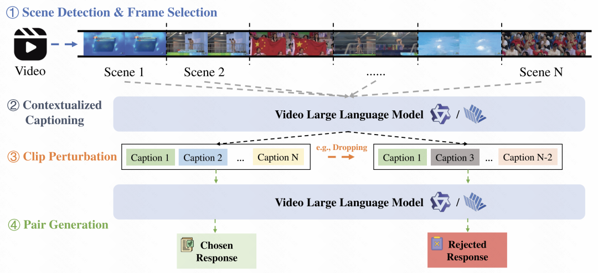

**论文12：****TIME: Temporal-Sensitive Multi-Dimensional Instruction Tuning and Robust Benchmarking for Video-LLMs**

**|******论文链接： https://arxiv.org/pdf/2503.09994

  

**|******论文简介： 本文提出了旨在提升视频大语言模型时序理解能力的 TIME 框架，其核心技术亮点在于针对现有视频大语言模型时序理解能力薄弱、易依赖数据捷径的关键问题，系统提出了一套 “数据 - 训练 - 基准” 三位一体的完整优化方案。首先，为破解高质量时序专用指令数据稀缺的瓶颈，我们构建了时序敏感多维指令微调数据集，通过三方面核心策略实现高效构建：一是精准划分动态、推理、时长、位置、顺序五大时序关键维度，全面覆盖视频时序理解核心场景；二是基于 VidOR、Ego4D 等多源优质视频数据集定向筛选清洗，剔除冗余信息与潜在捷径；三是通过自动化问答生成与多重数据去偏机制，确保数据质量与时序针对性。其次，在训练策略上创新提出多任务提示微调方法，核心突破在于无需额外标注成本：引入帧索引预测、指定视频问答两类无监督辅助任务，实现时序能力与通用任务的联合训练。最后，为解决现有基准维度覆盖不全、易被捷径利用的问题，构建了时序专用基准，通过严格的单帧捷径过滤机制、均衡答案分布等设计，实现对五大时序维度的无偏评估。实验表明，该方案在四大时序基准上显著提升了四款主流视频大语言模型的时序理解能力，同时保持通用视频任务性能稳定，充分验证了数据构建、训练策略与基准设计的协同优化效果。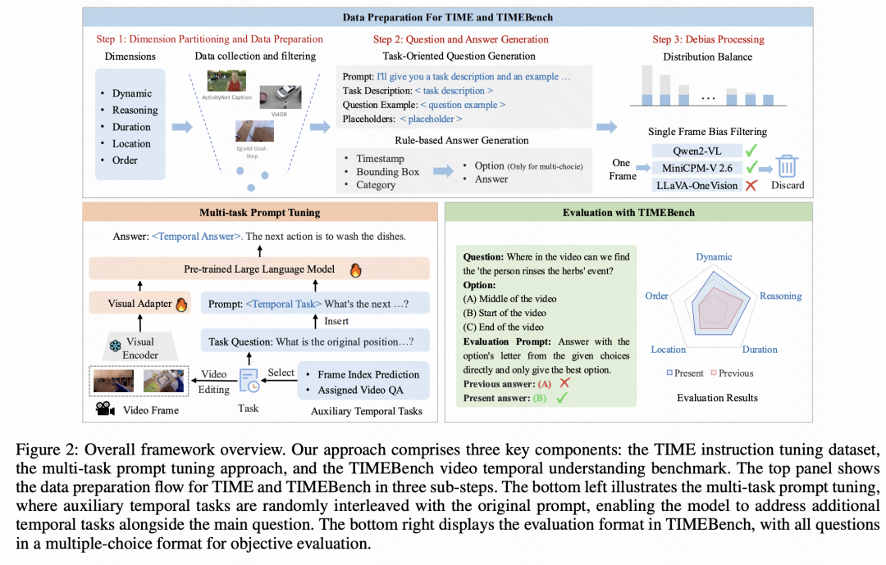  
结语作为一家以人工智能为核心驱动力和技术依托的科技公司，快手致力于持续深化研发投入，将技术打造为驱动业务增长的强劲引擎。同时，公司将在人工智能领域不断探索，积极推动前沿技术在业务场景中的落地应用。欲获取相关论文的详尽内容与深度解读，敬请关注快手技术公众号的后续更新。  
****【相关阅读】****

预览时标签不可点

微信扫一扫  
关注该公众号

继续滑动看下一个

轻触阅读原文

快手技术 

向上滑动看下一个

[知道了](javascript:;)

微信扫一扫  
使用小程序

****

[取消](javascript:void\(0\);) [允许](javascript:void\(0\);)

****

[取消](javascript:void\(0\);) [允许](javascript:void\(0\);)

****

[取消](javascript:void\(0\);) [允许](javascript:void\(0\);)

× 分析

__

微信扫一扫可打开此内容，  
使用完整服务

： ， ， ， ， ， ， ， ， ， ， ， ， 。 视频 小程序 赞 ，轻点两下取消赞 在看 ，轻点两下取消在看 分享 留言 收藏 听过
