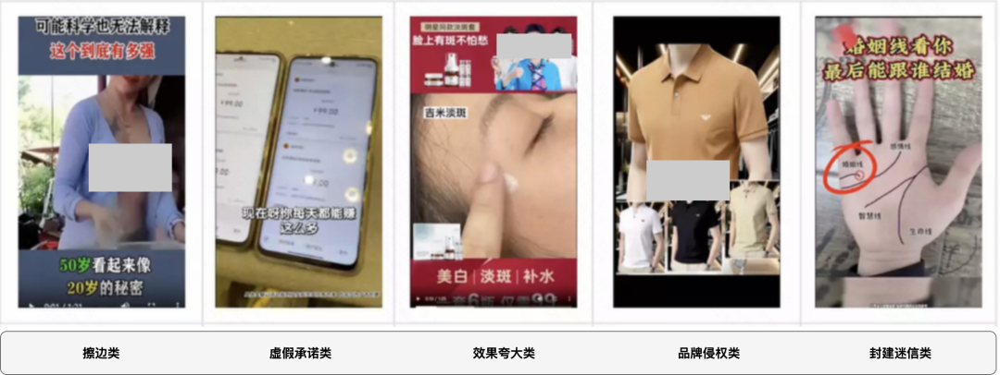
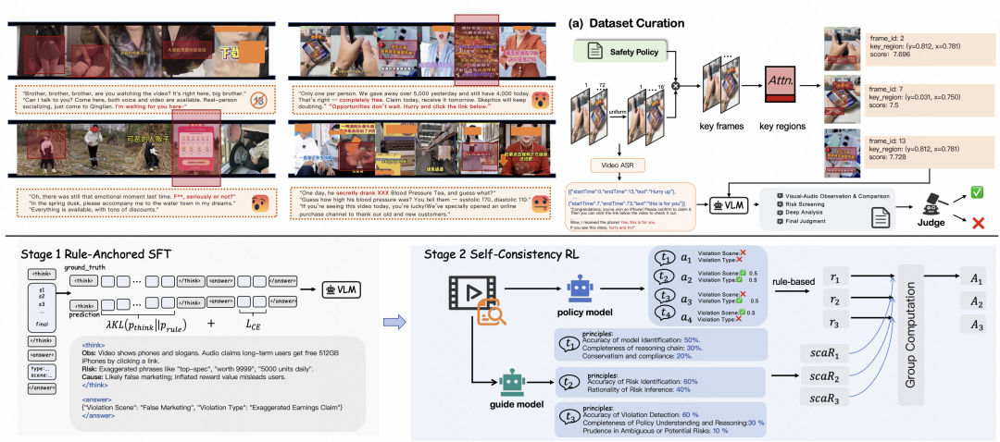
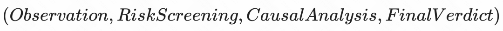
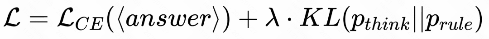
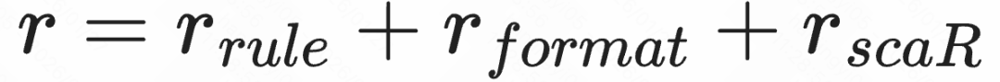
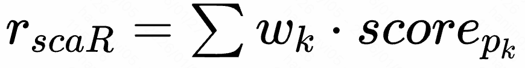
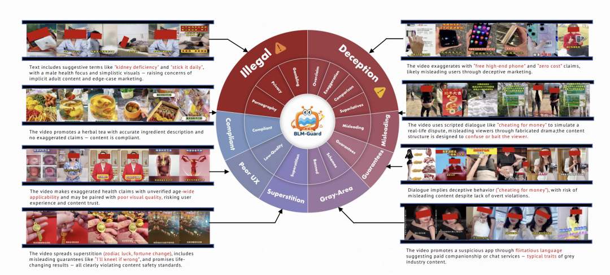
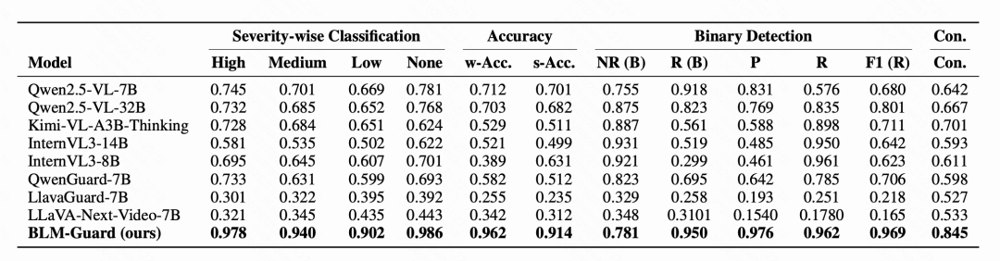
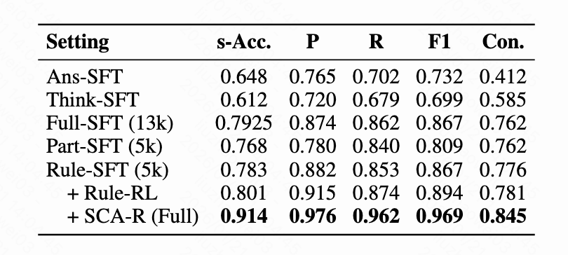

#  AAAI 2026｜基于思维链与强化学习的可解释多模态广告审核护栏

快手技术 快手技术 [ 快手技术 ](javascript:void\(0\);)

______

在小说阅读器中沉浸阅读

你是否刷到过这样的短视频广告：如何在家躺着日赚几百块”、“通过手相预测未来姻缘”。在快手商业化广告素材审核过程中，快手商业化生态与体验团队每天也会拦截大量的风险素材。这些内容轻则破坏用户体验、损伤商业化生态，重则触及底线问题、危害整个商业化业务。团队的任务是通过技术手段将下述这些不同的风险都识别出来并拦截。  

图1 风险素材案例

  

与传统的显性风险不同，商业广告的违规往往隐藏在跨模态的错位中——画面合规但口播违规、字幕合规但暗示性极强。这类“高风险、强对抗”的内容，对审核系统提出了极高的要求：不仅要判得准（准确性），还要说得清（可解释性），更要跟得上政策的快速迭代（政策对齐）。面对这一挑战，传统的“黑盒”判别模型或通用多模态大模型（VLM）往往力不从心：前者缺乏因果推理能力，后者难以适应细粒度的商业审核策略。

  

为解决这一痛点，快手商业生态与体验算法团队提出了BLM-Guard，这是一个专为高风险短视频广告设计的可解释性多模态审核框架。该框架融合了多模态思维链（CoT）推理与策略对齐的强化学习（RL），通过模拟人类审核员的“观察-归因-判断”逻辑，提升了模型在商业化场景下的审核精度与推理一致性。

  

本研究相关成果《BLM-Guard: Explainable Multimodal Ad Moderation with Chain-of-Thought and Policy-Aligned Rewards》已被人工智能顶级会议 AAAI 2026（Main Track） 接收。

图2 BLM-Guard 两阶段训练框架示意图

核心亮点：

  * 【像审核员一样思考】 针对短视频广告违规隐蔽性强的问题，本文提出ICoT（Interleaved-modal Chain-of-Thought） 流水线。通过规则驱动的数据合成，生成包含“视觉定位-风险筛查-因果分析-最终判决”的结构化推理链，解决模型“只知其一不知其二”的黑盒问题。

  * 【动态策略自适应】 面对不断变化的审核规则，创新性提出SCA-R（Self-Adaptive Critique Reward） 奖励机制。基于动态原则对模型的推理过程进行打分，结合 GRPO 强化学习算法，确保模型在策略漂移下仍能保持高一致性。

  * 【首个多模态广告风控基准】 发布了 BLM-Guard Benchmark，这是业界首个包含三级风险分类体系（风险场景、违规类型、严重程度）的短视频广告数据集，涵盖非法内容、虚假营销、误导性操作等七大核心场景，填补了精细化广告审核评测的空白。

  

**一、研究背景  
**

  

随着短视频商业化深入，广告已成为平台核心支柱，但违规内容日益呈现“隐蔽化、协同化、对抗化”趋势。这种高风险、强对抗的业态对现有的审核体系提出了严峻挑战，主要体现在以下三个维度：

  

1\. 违规形态演变

多模态协同欺骗生成式 AI 的普及使得违规手段从单一的显性违规（如敏感词、违规画面）升级为“多模态协同欺骗”。这类内容通常单模态看似合规，但通过跨模态的信息错位（如画面正常但口播违规）传递恶意意图，极大地增加了识别难度。

  

2\. 审核标准困境

动态性与复杂性的多重矛盾商业广告审核面临政策、场景与风险的三重复杂性：

  * 政策漂移与规则适配： 法规（如《广告法》）与平台规范的动态更新，导致静态模型难以适应不断漂移的政策边界。

  * 场景差异与通用性： 医疗、金融、教育等不同行业审核逻辑迥异，通用模型难以兼顾细粒度的领域规则。

  * 风险分层与二元判决： 现有模型多为“通过/拦截”的二元判决，无法区分高风险（非法）、中风险（误导）与低风险（体验）内容，难以满足精细化运营需求。

  

3\. 行业落地诉求

从“黑盒”到全链路可解释审核不仅是技术判别，更需服务于平台监管、商家整改与合规追溯的全链路。传统规则模型泛化差，通用大模型（VLM）虽有理解力但决策过程如“黑盒”，缺乏结构化的归因逻辑。商家无法获知具体违规点，监管难以追溯证据链，且行业缺乏针对多模态协同违规的高质量数据集。

面对上述“违规识别难、规则适配难、结果落地难”的困境，本研究提出 BLM-Guard 框架。通过引入模拟人类审核逻辑的“多模态思维链（CoT）”与策略对齐的强化学习（RL），旨在实现对隐蔽违规的精准识别与动态政策适配，并构建业界首个精细化多模态广告风控基准，为短视频商业生态的安全与可持续发展提供技术支撑。

  

**二、技术方案  
**

  

BLM-Guard 采用了一种渐进式的“两阶段”训练范式，分别是第一阶段中规则锚定的ICoT冷启动（Rule-Anchored SFT）和第二阶段中基于SCA-R的强化学习（Self-Consistency RL），确保模型既能学到规则，又能灵活应用。  

** _2.1 第一阶段：规则锚定的 ICoT 冷启动_**  

这一阶段的目标不是简单地微调 VLM，而是解决“黑盒模型无法理解细粒度商业规则”的问题。  

  

2.1.1 数据构造——自适应关键帧与 ICoT 生成

为了让模型“看懂”违规细节，采用了一套新的提取流程 ：

1\. 自适应关键帧采样 (AKS):

  * CLIP 相似度筛选： 计算每一帧图像嵌入 与预定义风险提示词（如"false marketing", "illegal content"）嵌入 的余弦相似度 。

  * BIN+TOP 策略： 将视频划分为个时间桶（BIN）选局部最优，若不足则补充全局最高分帧，确保既有时间覆盖又有语义显著性 。

  

2.Patch 级区域定位： 使用 InternViT-6B 提取 Patch 特征，计算 L2 范数作为显著性分数，定位出关键图像区域（如字幕、产品特写） 。

  

3\. ICoT（交错模态思维链）生成：利用冻结的 InternVL-3-78B 作为教师模型，生成结构化的推理链：

  
2.1.2 训练目标——引入规则先验在 SFT 阶段，BLM-Guard 修改了标准的 Cross-Entropy 损失，加入了 KL 散度约束 ：

  * : 保证最终判罚（Answer）的准确性 。

  * : 这是一个关键设计。是基于违规场景关键词构建的软分布。该项强制模型的<think>推理过程中的 token 分布向这些规则关键词靠拢，防止模型推理“跑偏”或产生幻觉 。

** _2.2 第二阶段：基于 SCA-R 的强化学习_**  

SFT 模型虽然具备了初步推理能力，但在面对由于政策快速迭代导致的“策略漂移”时，泛化性不足。该阶段引入了GRPO（Group-wise Relative Policy Optimization）算法进行优化。其中，混合奖励函数设计如下：  

  

为了平衡准确性、格式规范和逻辑一致性，奖励函数由三部分组成 ：

  * (规则正确性): 离散奖励。如果场景和违规类型全对给 1.0，仅场景对给 0.5，否则为 0 。

  * (结构约束)：强约束奖励，确保输出严格包含<think>和<answer>标签，便于后续解析 。

  * (SCA-R: 自适应批判奖励):

动态 Critique: 引入一个 Guide Model（ GPT-4o），它不依赖静态标签，而是 根据当前的审核 Policy 和输入，动态构建评分原则 。

  

  

  

  

评分逻辑: Critic 针对推理链进行打分（0, 0.5, 1），计算加权和：。这解决了“判决对了但理由错了”的逻辑一致性问题。

  

** _2.3 总结_**  
从技术架构角度看，BLM-Guard 的核心壁垒在于：

  * 显式因果建模： 通过 散度将规则“注入”到模型的隐空间推理路径中。
  * 抗策略漂移： 利用 动态奖励，使得模型不仅拟合数据分布，更是在拟合“审核逻辑”，从而适应不断变化的业务规则。  

**三、效果性能  
**

  

** _3.1核心指标_**

在构建的 BLM-Guard Benchmark 以及UCF等五个公开数据集上，BLM-Guard 均展现了 SOTA（State-of-the-Art）性能。

1\. 准确率提升：相比Qwen2.5-VL、InternVL3-8B 等强力基线，BLM-Guard 在七大风险场景下的严格准确率（Strict Accuracy） 平均提升超过 20%，尤其在“虚假营销”和“误导性操作”等高难度场景表现突出。

2\. 推理一致性：通过 GPT-4o 进行的一致性评分显示，BLM-Guard 的推理逻辑得分达 0.845，超基线模型的 0.5-0.6 水平。这意味着模型不仅判得对，而且理由充分、逻辑自洽。

图3 BLM-Guard Benchmark 风险分类体系

  

** _3.2消融实验_**

 实验证明，“规则微调（Rule-SFT）+ SCA-R 强化学习” 的组合是性能提升的关键。仅依靠 SFT，模型容易产生幻觉；而加入 SCA-R 后，模型学会了在不确定时更加谨慎，提升了模型的泛化效果。  

**四、未来展望  
**

  

快手商业生态与体验研发中心始终致力于用技术守护快手广告的清朗。

  
未来，团队将继续深耕以下方向：

1\. 理解+生成 OneModel：探索理解+生成深度融合的oneModel新范式，进一步精准识别违规内容，同时引入营销视角生成高转化、有吸引力的修复建议，提升商家体验；

2\. 风控大模型基座KwaiBLM：自主研发KwaiBLM风控大模型基座，作为风控领域的统一认知底座，支撑内容理解、风险识别、策略生成等多项核心能力，推动风控从经验驱动向数据智能驱动转型；

3\. RiskAgent智能体：构建多Agent协作的智能体系统，建设下一代人机协同的智能风控引擎RiskMatrix，提升业务场景风险防控效率与防控效果；

4\. Deepfake攻防能力：针对AI生成内容带来的新型风险，构建Deepfake检测与对抗技术体系。通过多模态特征融合、内容理解等技术手段，提升识别AI生成的虚假素材、篡改内容、合成视频等，守护平台内容真实性；

5\. 动态图算法：探索融合图神经网络与Attention机制，将Graph RAG图表征能力与大模型KwaiBLM相结合提升识别能力，挖掘隐蔽关联风险。

  

\- END -

”

  

  

欢迎加入

【我们是谁】

商业生态与体验研发中心，全面负责商业化风控能力构建，通过领先的工程架构和算法模型，驱动商业化风控在风险感知、认知、对抗、运营上取得全面的效率优势，保障商业化业务生态的安全、健康、可持续发展。在这里，你可以见识到所有商业化业务的形态，可以了解到各式各样的黑灰产对抗，可以参与到先进的大模型、多模态、图计算等算法的应用实践。  

  

【热招岗位】

多模态大模型算法工程师-AIGC-生态与体验研发中心

  * 了解多模态内容生成相关算法，如Diffusion Models 、 GAN 、 VAE 、 Autoregressive Models等，包括但不限文本/图像/视频生成，解决生成质量、多样性、可控性、采样效率、可编辑等问题；

  * 了解端到端多模态生成式大模型的框架设计、训练与调优，构建基于生成模型的AI系统，推动多模态AIGC在快手各业务场景的产品化落地。

  

【任职要求】

  * 硕士及以上学历，计算机、数学或统计学相关专业；
  * 对基于图像、视频、语音、文本等模态内容的各类算法有一定的理解，并在如下一个或多个相关方向有相关研究经历： GAN 、扩散模型、图像生成、多模态等；
  * 具备扎实的编程功底，熟悉 Pytorch 等主流深度学习框架，熟练使用 C ++/ Python 等至少一种编程语言，熟悉 Linux 开发环境；
  * 对学术前沿有浓厚兴趣，时刻跟进技术前沿，并善于利用各类技术解决复杂的实际问题，有良好的沟通表达能力。

  

【投递方式】

投递简历至邮箱：mateng03@kuaishou.com

  

【相关阅读】

  
  
  
  

  

预览时标签不可点

微信扫一扫  
关注该公众号

继续滑动看下一个

轻触阅读原文

快手技术 

向上滑动看下一个

[知道了](javascript:;)

微信扫一扫  
使用小程序

****

[取消](javascript:void\(0\);) [允许](javascript:void\(0\);)

****

[取消](javascript:void\(0\);) [允许](javascript:void\(0\);)

****

[取消](javascript:void\(0\);) [允许](javascript:void\(0\);)

× 分析

__

微信扫一扫可打开此内容，  
使用完整服务

： ， ， ， ， ， ， ， ， ， ， ， ， 。 视频 小程序 赞 ，轻点两下取消赞 在看 ，轻点两下取消在看 分享 留言 收藏 听过
