#  AAAI 2026｜快手LGSID助力业务GMV实现两位数增长：从地理可达，到兴趣匹配

快手技术 快手技术 [ 快手技术 ](javascript:void\(0\);)

______

在小说阅读器中沉浸阅读

你是否有过这样的经历：刷到一家价格合适、评价不错的餐厅，却发现门店远在城市另一端，交通成本过高，只能无奈划走。对于生活服务类内容来说，“感兴趣”只是开始，“方便到达”才是决定下单的关键。

  

正因如此，生活服务推荐与传统内容推荐存在本质差异——用户的消费决策天然受到地理位置的强约束。只有同时满足“离得近”和“感兴趣”，推荐结果才有可能转化为线下到店与交易。然而，这一看似简单的需求却对推荐系统提出了极高挑战：系统不仅需要理解用户兴趣偏好，还要精准感知用户所处位置，并感知用户与内容的空间关系。

  

为应对生活服务推荐模型在空间感知方面的挑战，快手生活服务算法团队引入大语言模型对Item进行高质量的文本语义与地理语义联合偏好建模，并通过基于强化学习的后训练范式，缓解预训练 LLM 中普遍存在的“重语义、轻地理”先天偏置，从而使内容表征更加充分地适配生活服务推荐场景。基于上述思路，快手生活服务团队提出了业界首个面向近场分发场景的地理模态表征建模解决方案——LGSID。

  

本研究相关成果《LLM-Aligned Geographic Item Tokenization for Local-Life Recommendation》已被人工智能顶级会议AAAI 2026接收，同时LGSID已在快手生活服务场景全量上线，助力业务累计实现GMV和订单10%以上的增长。

  

[🔮 论文标题]：

LLM-Aligned Geographic Item Tokenization for Local-Life Recommendation

[📖 论文链接]：https://arxiv.org/abs/2511.14221

[📝 论文代码]：https://github.com/JiangHaoPG11/LGSID

  

图1 LGSID模型示意图

  

核心亮点：

在LLM兴起前，传统方法通过离散化的空间特征和特定空间下的用户兴趣建模为模型引入空间感知能力。然而，此类方法强依赖人工特征设计，离散化的空间特征难以有效刻画空间位置的相对关系，空间感知能力有限。因此，我们尝试借助LLM对Item的地理位置模态建模，利用自然语言表征与大模型世界知识，从高维语义理解层面刻画空间位置与相对关系，以增强Item自身的空间表达能力。

  * 【教会LLM如何学习地理位置信息】针对预训练LLM地理感知能力弱的问题，本文创新性地提出G-DPO算法，通过LLM Post-Training过程，将Item在真实世界中的相对空间关系显式注入LLM底层，从而引导模型更有效地学习地理位置信息，并平衡好内容语义与地理语义。

  * 【帮助推荐模型更好适配近场分发】针对现有单一表征量化无法层次化建模的问题，本文创新性地提出了地理感知层次化量化的方案—HGIT。量化ID的首层通过“硬”的离散化地理位置（GeoHash，经纬度）生成初始化聚类，其余层则使用具有地理位置感知能力的内容表征逐层残差量化。

  

**一、背景  
**

  

在生活服务内容推荐场景中，业务核心逻辑是用户线上下单、线下到店核销。由于核销成本高，且强依赖用户与 Item 之间的地理位置关系，空间距离在该场景中对用户转化具有显著影响。如下图数据表明，随着“人—货距离”的增加，用户转化效率明显下降。因此，近场分发体系需要同时兼顾兴趣匹配准确性与空间感知能力。

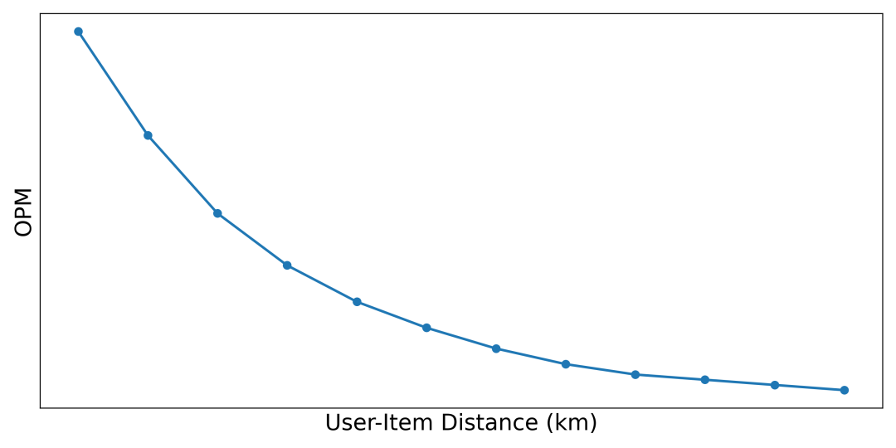

图2 “人-货距离”与转换效率趋势图

  

近年来，大语言模型（Large Language Models, LLMs）在语义理解与推理方面展现出强大能力。现有基于 LLM 的推荐方法通常通过精心设计的 Prompt 对候选 Item 的文本信息进行表征编码，并借助量化模型生成语义 ID 用于下游推荐任务。然而，由于缺乏对空间感知能力的有效建模，这类方法在近场分发场景中往往表现受限。尽管已有工作（如 GNPR-SID）尝试将地理位置信息注入 Prompt 以获取地理感知表征，但我们在理论分析和实验中发现，如果简单地将Item内容信息与地理位置信息同时拼接注入Prompt，难以有效刻画细粒度的空间位置关系。

  

然而，这种将地理信息直接注入 Prompt 的方式为何难以生效，其内在原因仍有待进一步分析。

  

首先，通过地理感知Prompt生成的内容表征中，LLM会不可避免地呈现“重内容，轻地理”的现象。如图3所示，由于LLM主要依赖通用预训练语料进行训练，而内容信息在语料中占比通常高于地理位置信息，这导致模型更倾向于捕获内容特征，而对地理位置信息的表达能力不足。

图3 LLM地理感知缺陷示意图

  
其次，现有 LLM 对细粒度地理位置的区分能力较弱，例如，在区分“北京西二旗上地十街”与“黑龙江大兴安岭地区加格达奇区”等具体位置时，模型在实际应用中往往仅利用“北京”“黑龙江”等粗粒度地理语义。如下图所示，街道级别等细粒度位置的召回表现较差，准确率仅为16%，无法做到充分的空间感知。

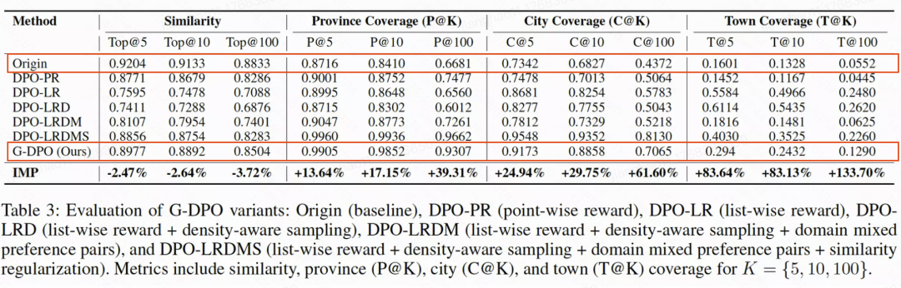

图4 原始表征（Origin）和本研究表征（G-DPO）在不同地理级别的召回准确率对比图

  
此外，在生活服务推荐场景中，用户受地理位置约束，其决策过程天然呈现出“先地理可达、后兴趣匹配”的层次化结构。然而，现有主流量化方法通常针对单一连续表征空间进行近似聚类建模，未能显式刻画地理约束与兴趣偏好之间的层级关系。如下图5所示，若Item表征及其对应的语义ID仅表达文本语义，当用户身处“北京”时，推荐系统可能仅基于用户兴趣将位于“上海”的某品牌门店进行推荐，导致最终难以促成有效交易，损害用户的消费体验与平台信任度。

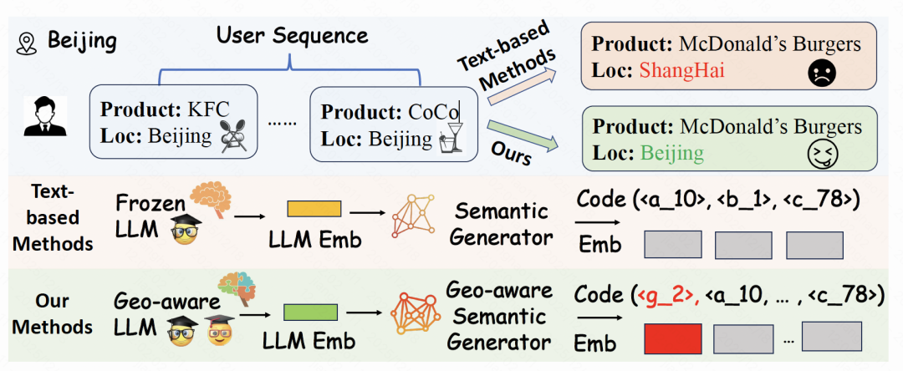

图5 生活服务内容分发示意图

  

因此，如何准确激发大语言模型的空间理解能力，进而提升精排模型的空间感知能力，已成为近场分发体系中亟需解决的关键问题。

**二、技术方案  
**

  

  

  
2.1 模块一：RL-based Geographic LLM Alignment  
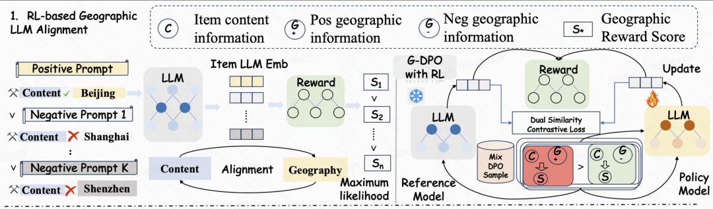  

图6 RL-based Geographic LLM Alignment模块示意图

#####   

##### 2.1.1 地理感知的奖励模型

我们首先训练了一个能够判别内容与地理位置相关偏好的模型，用于衡量文本语义与地理位置之间的匹配程度。具体而言，我们提出了一种List-wise奖励模型，以刻画POI内容与其他候选POI位置之间的距离关系。为了增强模型对细粒度区域差异的感知能力，我们设计了一种地理密度感知困难负采样策略（Density-aware Hard Negative Sampling Strategy）。该策略通过计算目标POI与候选池中POI之间的Haversine距离，并按由近及远的顺序进行的排序采样。通过优先近距离采样，同时保留远距离区域采样的方法，针对性提升LLM的地理感知能力。近一步，我们采用Prompt错配策略构建输入Prompt序列，即固定目标POI的文本内容，并分别与采样得到的负样本POI的地理位置信息进行匹配。

  

在得到Prompt序列之后，我们将其输入至LLM中进行表征编码，通过NN网络进行打分以衡量文本与地理位置之间的匹配程度。此外，为将相对距离信息注入LLM训练过程，我们基于固定内容–候选POI地理位置之间的相对空间距离，为每个错配Prompt设计连续的软标签（soft labels），从而对地理位置更为接近的Prompt赋予更高的标签权重。基于上述设计，我们采用Weighted Binary Cross-Entropy Loss进行奖励模型优化。

  

##### 2.1.2 G-DPO算法

在训练得到奖励模型之后，我们进一步提出了G-DPO算法，用于将文本–地理相对位置偏好通过后训练的方式注入LLM。具体而言，基于对推荐任务及生活服务场景特性的理解，我们构建了一种Domain-mixed的混合偏好样本集，并利用奖励模型进行打分作为RL的偏好程度。具体来说，混合偏好样本主要包含两类数据：领域协同Item Pairs与地理约束Item Pairs。

  * 对于领域协同Item Pairs，在近场分发场景，用户发生共现交互的Item通常天然受到地理位置约束，往往分布在相对近距离的空间范围内。因此，我们针对协同Item Pairs进行更细粒度的偏好建模，以捕获用户在局部区域内的兴趣感知能力，同时间接增强LLM对下游推荐任务的适配性。

  * 对于地理约束Item Pairs，我们从不同距离区间的POI候选集合中随机采样，以保证样本在空间距离覆盖上的多样性，从而提升模型对不同地理尺度偏好的整体建模能力。在得到样本数据后，我们对每个Item pair通过奖励模型打分，分别送入Policy Model和Reference Model中，构建类DPO的损失计算偏好优化目标。此外，为保证LLM的语义理解能力，我们引入了in-batch对比学习Loss作为相似度正则器，并整合两类Loss进行端到端的训练。

  

** _2.2 模块二：Hierarchical Geographic Item Tokenization_**

** _  
_**

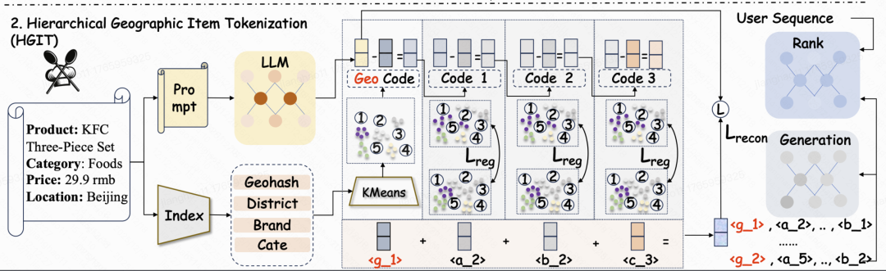

图7 Hierarchical Geographic Item Tokenization模块示意图

  

为适配近场分发体系中“先地理可达，再兴趣匹配”的分发逻辑，我们提出了层次化地理感知的量化方案—HGIT。

  

对于首层，我们利用多种Item离散化特征构建Geography-aware Token，包括Item的经纬度，省份ID，城市ID，区域ID和对应的内容粗粒度表示，以构建聚类特征向量。在获得对应的向量表示后，我们采用K-Means算法生成首层Token的聚类中心。每个聚类的表示由归属于该中心的LLM表征取均值构建，并在后续层的训练过程中保持固定，以作为稳定的地理层级锚点表示。

  

对于其余层，我们构建了基于欧式距离分类的可学习聚类中心，并优化重构损失。同时，为了更好地平衡各聚类中心的利用率并防止码本坍塌，我们引入了一种Entropy-based Regularization机制。该机制旨在鼓励每一层中输入表征被分配到不同聚类中心的概率尽可能均衡。具体而言，在训练过程中，我们逐层统计输入表征归属于各个聚类中心的频率分布。随后，我们通过将该频率分布与均匀分布之间的KL散度作为正则项约束，并整合两类Loss作为最终的量化模型优化目标。

  

**三、效果性能  
**

  

** _3.1 推荐总体性能  
_**

我们将本文所产出的LGSID分别作用于判别式推荐模型和生成式推荐模型，相较于其他的量化方案，LGSID均取得突出性能。

  

##### 3.1.1 判别式推荐模型结果

下表展示了LGSID作用于判别式推荐模型时的性能，覆盖了DIN、DIEN、SIM、TWIN以及 ETA等工业界主流判别式模型。实验结果表明，LGSID在所有模型上均取得了最大的性能提升。性能增益的关键原因在于：离散化ID难以刻画空间邻近关系，限制了地理位置在注意力计算的作用。LGSID利用G-DPO将对齐后的LLM空间知识，引导模型更关注真实空间上地理位置邻近的POI，以提升交互效果。

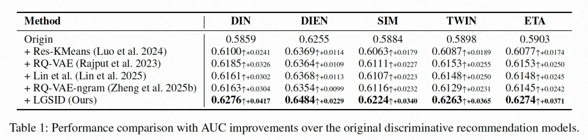图8 判别式推荐模型实验结果对比图

#####   

##### 3.1.2 生成式推荐模型结果

下表展示了在生成式推荐模型不同量化方法的性能对比结果，包含了两类主流模型TIGER与OneRec。实验结果表明，LGSID在两个模型上均取得了最大的性能提升。性能增益主要来源于基于强化学习的LLM对齐机制，使模型生成具备地理感知能力的语义表示，并通过分层量化模型将这些表示稳定地映射为层次化的语义ID，使得生成式推荐任务更符合业务分发逻辑，即“先地理可达，再兴趣匹配”，使得用户兴趣受到地理位置的约束和权衡，提升模型流量分发效率。

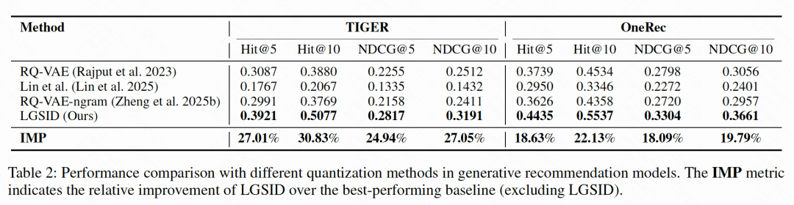

图9 生成式推荐模型实验结果对比图

** _3.2 LLM对齐表征分析_**

为验证G-DPO的有效性，我们在微调前后对LLM表征进行了系统评估，以证明模型表征在微调前后对于地理位置空间感知的变化。我们设计了两类评价指标评估其语义相似性和地理位置感知能力。

  * 【语义相似度】：为衡量向量检索结果在语义空间中的相似程度，我们将原始语义空间的表征作为Ground Truth，通过计算对齐后的LLM表征所召回Item在原始语义空间中的相似度，来刻画LLM语义理解能力的变化。

  * 【地理感知能力】：为衡量向量检索结果在地理位置上的准确性，我们首先用原Item的对齐后LLM表征进行Top-K召回，然后通过计算召回结果与原Item在省、市、区三级的覆盖率（P@K、C@K、T@K），来评估检索结果在不同地理层级上的一致性。

  

具体结果如下表所示，省份覆盖率（P@5）由0.8716提升至0.9905，城市覆盖率（P@5）由0.7342提升至0.9548，街道覆盖率（T@5）由0.1601 显著提升至0.5584。实验结果证明，传统方法仅依赖语义相似度，不足以建模地理感知能力，文本相似性无法反映真实空间距离关系。 其次，通过G-DPO算法地理相对距离得以有效压缩并迁移至LLM中，从而使相近距离的POI在表征层面上更相似。此外，融合密度感知的List-wise奖励模型建模进一步增强了近距离敏感性，提升了对细粒度距离的感知能力。最后，过度强调地理感知并不能保证下游推荐性能最优，因此，引入语义相似度正则项，在保持语义一致性的同时实现地理感知与语义表达的平衡，最终获得最优整体表现。

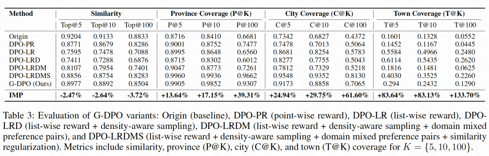

图10 不同地理级别的召回准确率对比图

** _3.3 LLM对齐表征可视化_**

左图的T-SNE可视化结果表明，我们对经G-DPO对齐后的LLM表征进行降维后，省份、城市与区县各层级的聚类中心在嵌入空间中呈现出收敛趋势。与此同时，NMI指标由0.0137–0.0845大幅提升至0.6430–0.8644，表明模型学习到的聚类结构与真实地理标签之间的一致性显著增强。

  

右图展示了不同分位点下不同量化方法产出SID的码本覆盖能力。结果表明，在Level-1层级中，LGSID在对齐与未对齐两种设置下均呈现出高度一致的覆盖模式，在90%分位点仍可保持约11k的覆盖能力，而RQ-VAE在相同条件下已衰减至约8k。随着层级粒度进一步细化至Level-2与Level-3，LGSID的优势愈发明显，其在雷达图中的覆盖面积显著大于其他方法，表明其具备更强的表达容量以及更稳定的分布特性。

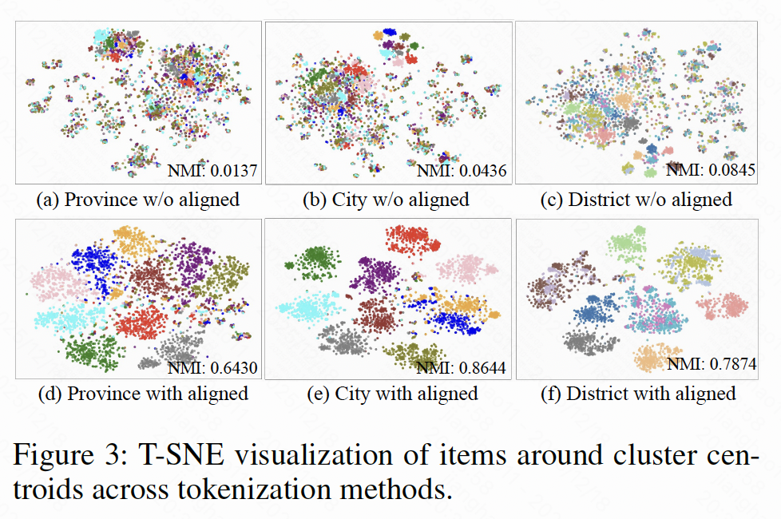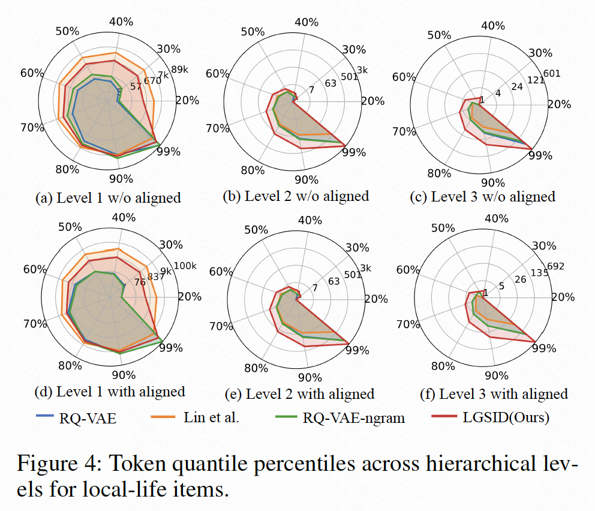

图11 LLM对齐后表征可视化示意图

** _3.4 案例分析_**

下图对比了在是否引入G-DPO对齐的条件下，LGSID分层量化模型所生成的SID分布。由于第一层基于预先计算的地理特征聚类，其在对齐与未对齐设置下的整体分布保持相对一致。然而，在引入G-DPO对齐后，如下图 (b) 所示，第一层 Token（[350, 93, *]）能够将BBQ & Grilled品类完整地聚合至同一粗粒度标识之下；而在未对齐条件下，如图(e)所示，该品类则被分散映射到多个不同的SID根节点，导致类别一致性受损。上述现象表明，上游LLM表征的对齐质量直接影响分层量化结构的有效性，进一步突显了G-DPO在LGSID框架中的关键作用。

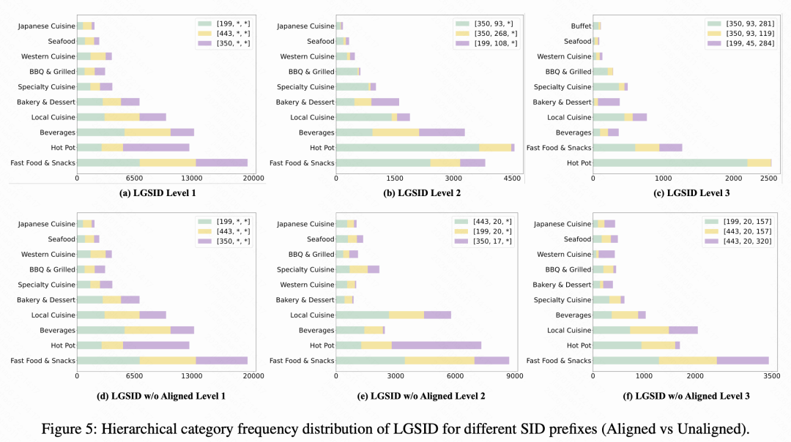

图12 语义ID分布示意图

  

**四、未来方向  
**

  

快手生活服务团队作为公司的核心算法研发力量，始终站在并引领下一代推荐系统的前沿探索。团队致力于打造行业领先的近场分发体系，通过持续的技术创新提升推荐效率与用户体验，为用户提供更加便捷、丰富、可信的生活服务。同时，团队以技术驱动业务增长，不断拓展生活服务场景与能力边界，助力业务GMV提升与商业化收入增长。

  

未来，团队将继续深耕近场分发、多模态大模型内容理解与生成式推荐，探索 AI 赋能下一代推荐系统。重点围绕多模态理解、语义量化 ID 与推荐大模型开展创新研究，融合图像、音频、视频等异构数据，提升表征与量化 ID 可解释性，打造具备时空推理能力的大模型，为用户提供更优质的生活服务体验。

-END-

”

欢迎加入

【我们是谁】

生活服务业务是快手商业化增速最快的业务之一，包含线索和本地团购类型行业。一起探索下一代推荐系统，包括端到端生成式推荐OneLoc、精排模型Scaling Law、近场分发场景下的多模态表征、基于RL的长期价值最大化。团队技术氛围浓厚，在近场分发推荐、多模态内容理解、生成式推荐等方向持续突破。团队成员已在NeurIPS、ACL、KDD、AAAI、SIGIR、ICLR、CIKM等国际顶级会议发表多篇论文，多次获得学界与业界的认可。

  

  

【热招岗位】

广告算法工程师/推荐算法工程师-【生活服务】职位描述：1、负责生服广告和自然内容推荐系统的核心精排模型算法持续迭代优化，提升业务的核心指标，帮助快手生服业务高速增长；2、基于快手的海量用户和商家数据，探索使用机器学习、迁移学习、强化学习、LLM、diffusion、多模态技术、博弈论等前沿技术来解决快手生活服务业务所面临的多元异构数据的挑战，将前沿技术在生服业务上落地，推动业务高速发展；3、通过数据分析挖掘业务潜在机会，面向流量投放侧和广告主优化侧进行算法设计和效果优化；

  

【任职要求】

1、计算机科学、数学、统计学等相关专业硕士及以上学历，精通c/c++java,python等至少一门编程语言；2、有机器学习、数据挖掘、自然语言处理、推荐系统等相关研究经验或工作经验优先，在相关领域顶级会议上发表论文者优先；3、强烈的技术热情和学习渴望，对技术驱动业务有不懈的追求，具备优秀的分析和解决问题的能力，良好的沟通能力，较强的团队合作精神。

  

【投递方式】

投递简历至邮箱：liyuzhe@kuaishou.com

  

”

【相关阅读】

  
  
  
  

点个在看你最好看

  

预览时标签不可点

微信扫一扫  
关注该公众号

继续滑动看下一个

轻触阅读原文

快手技术 

向上滑动看下一个

[知道了](javascript:;)

微信扫一扫  
使用小程序

****

[取消](javascript:void\(0\);) [允许](javascript:void\(0\);)

****

[取消](javascript:void\(0\);) [允许](javascript:void\(0\);)

****

[取消](javascript:void\(0\);) [允许](javascript:void\(0\);)

× 分析

__

微信扫一扫可打开此内容，  
使用完整服务

： ， ， ， ， ， ， ， ， ， ， ， ， 。 视频 小程序 赞 ，轻点两下取消赞 在看 ，轻点两下取消在看 分享 留言 收藏 听过
