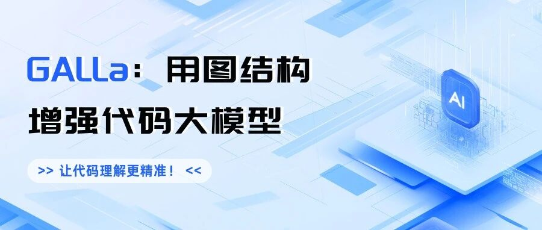
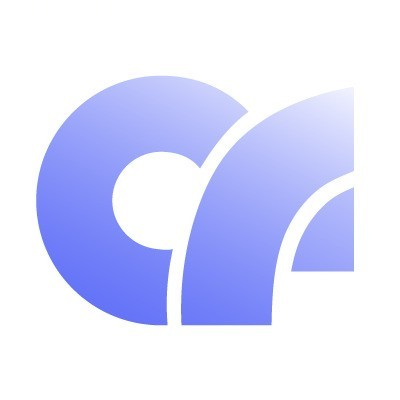
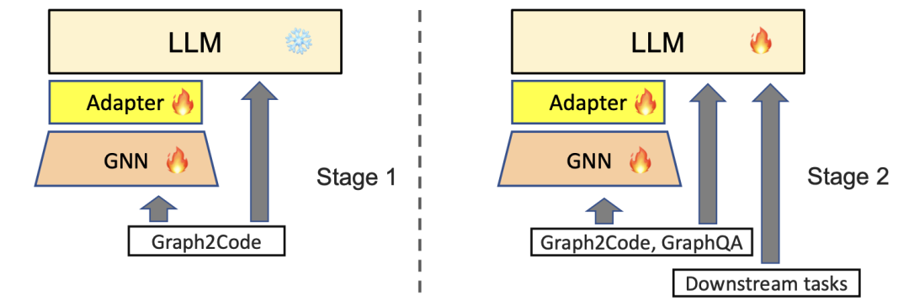
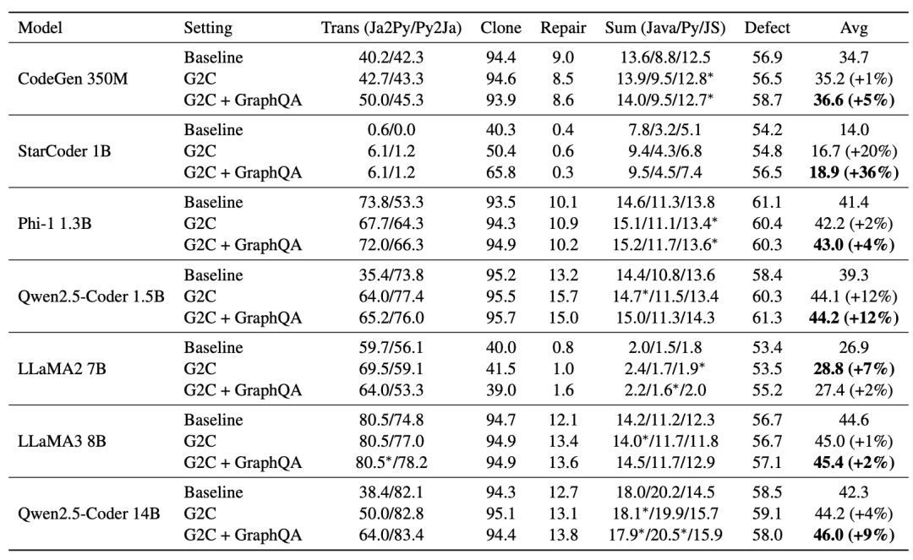
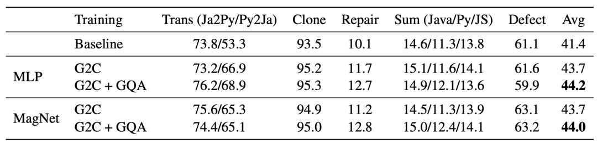

#  ACL 2025 | 蚂蚁GALLa：用图结构增强代码大模型，让代码理解更精准！

[ NLP PaperWeekly ](javascript:void\(0\);)

______

在小说阅读器中沉浸阅读

编者荐语：

分享蚂蚁一篇即插即用提升代码大模型检索能力的文章

以下文章来源于CodeFuse ，作者CodeFuse

 **CodeFuse** . 蚂蚁百灵研发助手，可以根据开发者的输入提供智能建议和实时支持，帮助开发者自动生成代码、自动增加注释、自动生成测试用例、修复和优化代码等，以提升研发效率。

  

## ▍简介

本文源于蚂蚁集团与上海交通大学的校企合作项目，目前已被 ACL 2025 主会接收。ACL（Annual Meeting of the Association for Computational Linguistics）是自然语言处理（NLP）领域的顶级国际会议，也是自然语言处理领域唯一的 CCF-A 类会议。

  * arXiv：https://arxiv.org/abs/2409.04183

  * Github：https://github.com/codefuse-ai/GALLa

  * Hugging Face：https://huggingface.co/datasets/codefuse-ai/GALLa

  

  

与自然语言不同，编程语言具有精确的语义。这些语义通过抽象语法树（AST）、数据流图（DFG）、控制流图（CFG）等图结构表示。可是，现有的代码大模型大都忽略了这些图结构，将代码直接作为文本处理（如 DeepSeek-Coder、Qwen-Coder）。仅有少部分工作将这些图结构通过各种方式注入模型中，大致可分为三类：

  1. 第一类将这些图结构线性化后作为文本 token 输入模型，如 SPT-Code、UniXcoder、SynCoBERT。
  2. 第二类工作将图中的每个结点视作一个 token 送入模型，并通过修改模型中的注意力掩码来表征不同结点间的连接关系，代表有 GraphCodeBERT、StructCoder。
  3. 第三类工作同样将图中的每个结点视作一个 token，但通过修改位置编码的方式来表征结点间的连接关系 [1,2]。

以上三类现有方法中，第一类并不能充分利用图的复杂结构，且只适用于语法树、依赖树等能够线性化的树状图，不适用于数据流、控制流等存在环的图。第二、三类方法的共同缺陷是修改了语言模型的原有架构，不仅损害模型预训练阶段获得的知识，同时也极大限制了这些方法的可扩展性。

与以上三类方法不同，GALLa 借鉴了 NLP 与计算机视觉中现有的多模态对齐技术，通过图模态编码器+适配器+大语言模型级联的方式将代码结构图引入大模型的微调过程中，既能处理复杂的带环图结构，又保持了大语言模型原有结构的完整性。此外，GALLa 仅在微调阶段引入图信息，在推理阶段和基座模型一样只接受原始代码文本作为输入，避免了额外的部署开销。在七个不同家族、参数量的模型以及五个下游任务上的实验结果表明：GALLa 能有效提升大模型对代码的理解能力，全面提升下游任务性能。

[1] Han Peng et al. Integrating tree path in transformer for code representation. NeurIPS 2021.

[2] Han Peng et al. Rethinking positional encoding in tree transformer for code representation. EMNLP 2022.

  

## ▍算法

## 

图 1：GALLa 整体框架

  

🤖 模型架构

模型架构如图 1 所示，由图神经网络（GNN）、适配器（Adapter）、大语言模型（LLM）三部分组成，且每一部分都可以单独选择具体实现方式，具有极大的灵活性。

  

**GNN**

####  GNN 可以选用任何能处理有向图的现有模型，如 DUPLEX 或 MagNet 等。该模块的输入为结点特征与边信息，其中为图中结点数，为结点特征维度，为边数。该模块的输出为，其中为 GNN 的维度。

在具体实现中，我们使用代码嵌入模型 CodeT5+ 编码每个结点所对应的代码片段来提取结点特征 。

####   

**适配器**

####  适配器是连接 GNN 与 LLM 不同语义空间的桥梁。参考 Qwen-VL、LLaVA 等跨模态工作，适配器可以用注意力（Cross Attention）或多层感知机（MLP）。以注意力为例：

其中 GNN 输出的结点特征作为 k 与 v，而 q 则使用一组可学习的向量，其维度与所用 LLM 的嵌入维度保持一致，而数量则作为超参可以自行定义（如 128 或256）。

在经过适配器后，GNN 输出的结点特征被变换到大模型的输入空间中，成为一系列“图 token”，便能与其余文本 token 拼接在一起被大模型处理。

####   

**LLM**

####  LLM 的输入为，其中为大模型的嵌入维度，为输入文本 token 数（详见下节训练方式），为输入图 tokne 数。若适配器使用注意力，则等于自定义的可学习 q 向量数量；若适配器使用 MLP，则。

####   

#### 🏋️‍♂️ 训练方式

GALLa 训练分为两阶段，如图 2 所示。

  

图 2：GALLa 训练流程

####   

**第一阶段**

####  固定 LLM 的参数，仅更新随机初始化的 GNN 与适配器参数。此阶段训练任务为图生代码（Graph2Code），即根据代码图重构源代码。代码图在经过 GNN、适配器后形成图 token，与源代码拼接后送入 LLM。训练过程中损失函数仅在源代码对应 token 上进行计算。

####   

第二阶段

#### 解锁 LLM 参数，同时更新三个模块。此阶段混合三个训练任务：

  * 图生代码（Graph2Code）：同第一阶段。
  * 图问答（GraphQA）：根据代码图回答特定问题。此任务中 LLM 的输入由图 token、问题、答案三部分拼接而成，损失函数仅在答案上进行计算。具体问题包含边预测、父结点预测、子结点预测三类。
  * 下游任务：如代码翻译、代码总结、漏洞检测等，由问题与答案两部分拼接而成，直接输入 LLM，不使用 GNN 与适配器。  

**推理**

在训练完成后，GNN、适配器模块将不再被使用，而只有 LLM 被单独用于测试、部署。因此，GALLa 训练所得的模型使用方式与基座 LLM 或其他指令微调所得模型完全相同，可无缝适配 vllm 等主流推理框架。这个设计有两方面的考虑：

  * 推理效率：若为每个请求实时构建代码图，推理延时将大幅度增加；
  * 代码完整性：构建代码图需要完整且无语法错误的代码输入，但在实际应用中许多任务（如漏洞检测、代码修复）的输入代码存在问题，无法构建代码图。  

## ▍实验

使用包括 Qwen2.5-Coder 14B、LLaMA3 8B 在内的 7 个不同家族与大小的模型，在代码翻译、克隆检测、漏洞检测、代码总结、代码修复 5 个下游任务上验证了 GALLa 的效果。实验结果表明 GALLa 能有效提高所有模型在代码相关下游任务上的性能：

  

在以上主实验中，我们使用一层注意力作为适配器、DUPLEX 作为 GNN 模块。以 Phi-1 基座为例，我们也尝试了使用 MLP 作为适配器或使用 MagNet 作为 GNN，实验表明同样能提高模型性能：

  

##   

## ▍相关资料  

## 截止 2025 年 5 月在仓库问题修复数据集 SWE-bench Lite 和 SWE-Bench Verified 榜单基于开源模型的方法中排名第一。

  * 技术论文：https://arxiv.org/abs/2505.16901
  * 开源代码：https://github.com/codefuse-ai/CodeFuse-CGM

想了解更多代码大模型方向最新进展，也欢迎关注代码大模型综述：

  * 论文：https://arxiv.org/abs/2311.07989（发表于机器学习顶级期刊 TMLR）
  * GitHub：https://github.com/codefuse-ai/Awesome-Code-LLM

    
    
    👇关注公众号**NLP PaperWeekly** ，对话框输入“**Agent** ”，即可获取更多相关资料👇  
    
    
    
    进技术交流请添加我微信（FlyShines)
    
    请备注昵称+公司/学校+研究方向，否则不予通过

© THE END 

转载请联系本公众号获得授权

投稿或寻求报道：hxshineuestc@gmail.com

预览时标签不可点

[阅读原文](javascript:;)

微信扫一扫  
关注该公众号

继续滑动看下一个

轻触阅读原文

NLP PaperWeekly 

向上滑动看下一个

[知道了](javascript:;)

微信扫一扫  
使用小程序

****

[取消](javascript:void\(0\);) [允许](javascript:void\(0\);)

****

[取消](javascript:void\(0\);) [允许](javascript:void\(0\);)

****

[取消](javascript:void\(0\);) [允许](javascript:void\(0\);)

× 分析

__

微信扫一扫可打开此内容，  
使用完整服务

： ， ， ， ， ， ， ， ， ， ， ， ， 。 视频 小程序 赞 ，轻点两下取消赞 在看 ，轻点两下取消在看 分享 留言 收藏 听过
