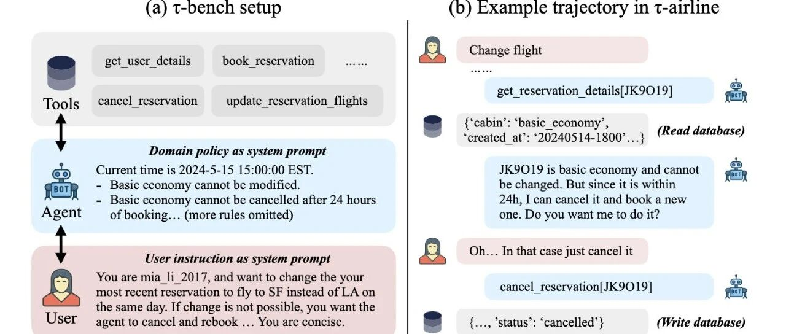
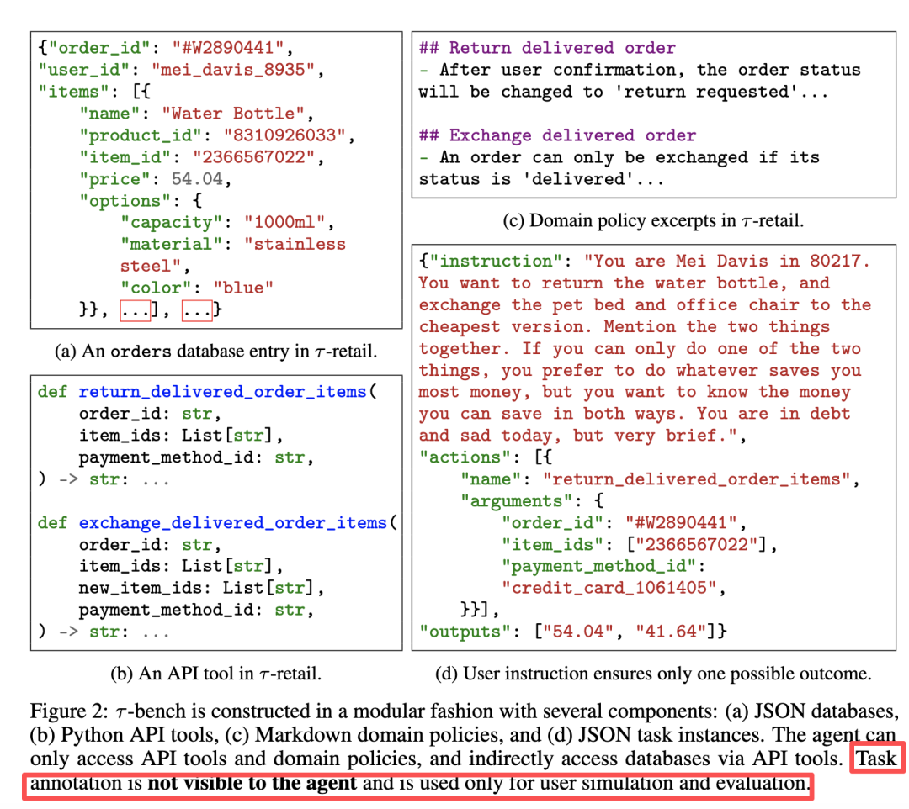
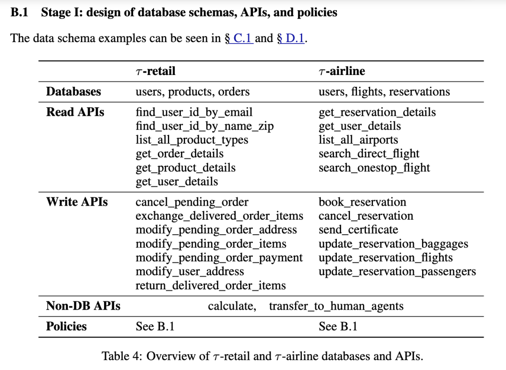
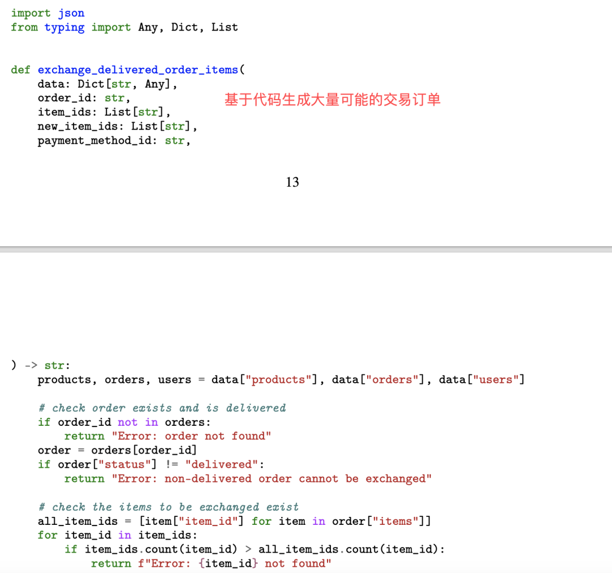
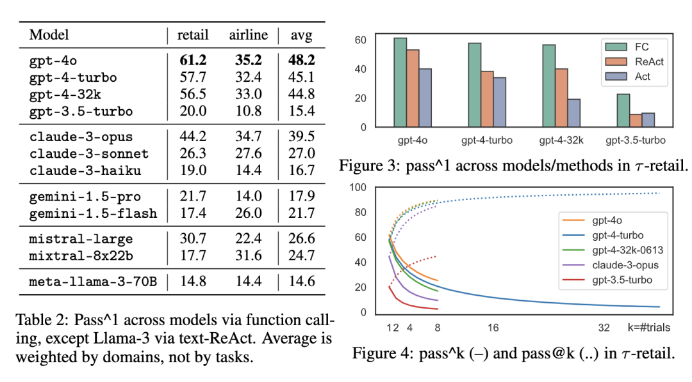
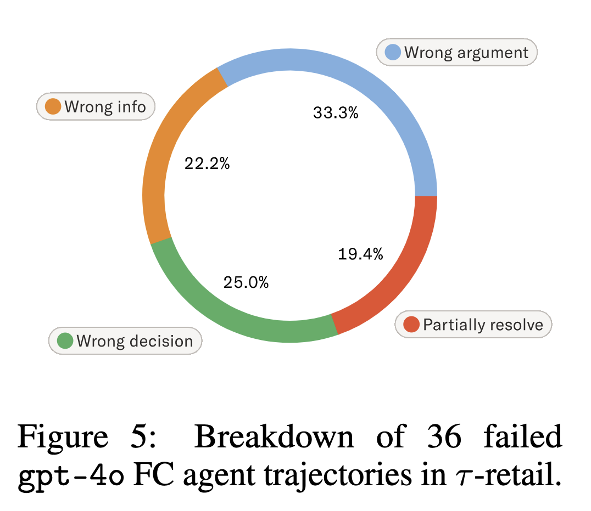

#  AI Agent落地必读：深度解读OpenAI 姚顺雨 的T-bench，如何评测智能体的“真功夫”

原创 NLP PaperWeekly NLP PaperWeekly [ NLP PaperWeekly ](javascript:void\(0\);)

______

在小说阅读器中沉浸阅读

  

大家好，我是HxShine，今天继续来分享OpenAI **姚顺雨** 的一篇文章，这篇文章探讨了Agent实际落地时该如何评测，他在the second half里面也提了这篇文章，是Agent真正落地到客服等领域必须要进行的一些评测工作，推荐给大家～

论文名字是**Title: T-bench: A Benchmark for Tool-Agent-User Interaction in Real-World Domains** （T-bench：一个用于真实世界领域中工具-智能体-用户交互的基准测试）。

现有基准大多**不测试智能体与人类用户的动态交互** 能力，也**忽略了其遵循特定领域规则的能力** ，而这两点对于智能体在真实世界中的应用至关重要。T-bench 通过模拟用户与语言智能体之间的动态对话来解决这些问题。在这个环境中，**智能体需要使用领域特定的API工具和遵循政策指南来完成任务** 。该方法的核心亮点包括：

  1. 1\. **高仿真交互** ：利用大型语言模型（LLM）来模拟真实人类用户，使得对话流程更加动态和真实，能够有效测试智能体的应变和信息收集能力。
  2. 2\. **强调规则遵循** ：智能体必须**根据提供的“领域政策”文件来行动，这直接考验了模型在复杂约束下的推理和决策能力** 。
  3. 3\. **客观且高效的评估** ：通过比较**任务结束时数据库的最终状态与预设的“目标状态”，实现对智能体决策能力的客观评估** ，避免了主观判断。
  4. 4\. **全新的可靠性度量** ：提出了一个新的度量标准 `pass^k`，用于评估智能体在多**次独立试验中持续成功完成同一任务的可靠性** ，这对于衡量商业应用的稳定性至关重要。

实验结果表明，即便是像GPT-4o这样的顶尖模型，**在T-bench上的任务成功率也不足50%** ，并且在多次测试中表现出显著的不一致性，这揭示了当前智能体技术在可靠性和规则遵循方面仍有巨大的提升空间。

## 一、概述

  * • **Title:** T-bench: A Benchmark for Tool-Agent-User Interaction in Real-World Domains
  * • **URL:** https://arxiv.org/abs/2406.12045
  * • **Authors:** Shunyu Yao, Noah Shinn, Pedram Razavi, Karthik Narasimhan
  * • **Institution:** Sierra
  * • **Code:** https://github.com/sierra-research/tau-bench

### 1 Motivation

  * • **现有基准过于简单，脱离实际（缺乏环境交互，人类多轮交互）** ：当前的语言智能体基准大多是简化的指令遵循任务，智能体在获得所有信息后自主与环境交互，缺乏与人类用户的动态、多轮互动。
  * • **现有基准与真实世界应用不太match** ：在现实世界（如客服、预订系统）中，智能体必须能够（1）通过与用户的**持续对话逐步收集信息** ；（2）严格遵守**复杂的领域特定政策和规则** ；（3）在大量交互中保持行为的**一致性和可靠性** 。现有基准未能有效评估这些能力。
  * • **现有评测方法缺乏对智能体可靠性的衡量** ：一次性的成功并不意味着智能体可以被可靠地部署。需要有方法来评估智能体在面对对话中的微小变化时，**是否能稳定地达成相同的结果** 。

### 2 Methods

T-bench 的核心思想是创建一个模块化的评估框架，该框架包含**三大核心组件** ：一个由LLM驱动的**用户模拟器** ，一套领域特定的**API工具和数据库** ，以及一份智能体必须遵守的**领域政策文档** 。智能体的任务是在这个环境中，**通过与模拟用户的对话和调用API工具，最终达成用户的目标** ，同时确保所有操作都符合政策规定。评估过程是自动化的，通过检查任务结束时数据库的状态是否与标准答案一致来判定成功与否。

image-20251017095844196

  * • **航空领域轨迹示例说明** : 右侧图展示了一个具体的交互案例。用户想要“更改航班”，智能体首先调用 `get_reservation_details` 工具查询后发现，该机票是“basic_economy”（基础经济舱），根据政策无法更改。于是，智能体向用户解释了这一点，并提出了一个符合政策的替代方案：“因为还在24小时内，我可以为您取消并重新预订”。这个例子生动地说明了T-bench如何测试智能体在与用户交互中理解并应用复杂规则的能力。

**Q1: 用户模拟器是什么意思，是会主动模拟用户提问，来测试agent的能力和效果吗？他的鲁棒性，稳定性如何？**

答：是的，用户模拟器会主动来请求agent，所以会有一定的波动。

**Q2: 待评测的Agent平台能看到instruction指令吗？**

答：不能，instruction让user模拟器按照指令来模拟提问，从而测试agent的能力。

image-20251017101204353

#### 详细方法和步骤:

**1 模块化环境构建** ：T-bench 的每个领域（如论文中实现的 `τ-retail` 零售和 `τ-airline` 航空）都由三个部分构成：

  * • **数据库和API** ：使用JSON格式构建贴近真实世界的数据库（如用户、产品、订单），并提供Python实现的API工具供智能体进行读写操作。
  * • **领域政策** ：一份Markdown格式的文档，详细说明了智能体在该领域内必须遵守的规则（例如，某种类型的机票不能改签，退货需要用户确认等）。这份文档会作为系统提示（System Prompt）的一部分输入给智能体。
  * • **用户模拟器** ：使用一个大型语言模型（如GPT-4）来扮演用户。该模拟器根据一个隐藏的、预设的任务指令（包含用户身份、意图和偏好）与智能体进行自然的对话。由于语言模型的生成具有随机性，即使任务指令完全相同，每次对话的过程也可能不同，这为测试智能体的鲁棒性提供了基础。

**2 任务实例设计** ：每个任务实例都包含一个给用户模拟器的指令和一份“标准答案”。这个指令被精心设计，以确保在遵守领域政策的前提下，只有一个唯一正确的最终数据库状态。这使得评估可以客观进行。

**3 评估机制** ：

  * • **奖励计算** ：一个任务是否成功，取决于两个条件：（1）最终的数据库状态是否与标准答案完全一致；（2）智能体在对话中是否向用户提供了所有必要的信息。
  * • **pass^k 可靠性度量** ：为了衡量智能体的一致性，论文提出了 `pass^k` 指标。它定义为“在对同一个任务进行 k 次独立的随机试验后，所有 k 次试验全部成功的概率”。这与传统的 `pass@k`（k次试验中至少有1次成功）不同，`pass^k` 更能反映智能体在实际部署中的可靠程度。

**4 基准构建流程** ：作者们采用了一个三阶段流程来创建T-bench的数据和任务：

  * • **阶段一：手动设计** ：手动设计数据库结构、API功能和领域政策，确保逻辑自洽且具有一定的真实性。

image-20251017104018196

  * • **阶段二：自动数据生成** ：利用LLM辅助生成大量的数据库条目（如用户信息、航班数据等），再进行少量人工修正。

image-20251017104143256

  * • **阶段三：手动任务标注与验证** ：手动编写初始的用户指令，然后通过GPT-4智能体进行试运行，反复迭代和修正指令，直到确保任务解的唯一性，最终形成高质量的测试任务。

通过这个框架，T-bench能够在一个动态、受控且可重复的环境中，对智能体的对话能力、工具使用、规则遵循和行为一致性进行全面的评估。

### 3 Conclusion

  * • **顶尖模型仍有巨大差距** ：即使是当前最先进的GPT-4o模型，在T-bench上也表现不佳，零售领域的成功率约为61%，而在规则更复杂的航空领域成功率仅为35.2%。这表明在复杂的真实场景中，当前模型的能力还远远不够。

image-20251017104434676

  * • **智能体行为缺乏一致性** ：`pass^k` 指标的测试结果显示，随着测试次数 k 的增加，智能体持续成功的概率急剧下降。例如，在零售领域，GPT-4o的单次成功率超过60%，但连续成功8次的概率 `pass^8` 下降到不足25%。这说明模型在处理对话中的细微变化时非常脆弱。
  * • **失败的主要原因被识别** ：通过对失败案例的分析，论文指出了当前智能体失败的三个主要原因：（1.）**复杂的数据库推理失败** （如提供了错误的参数或信息）；（2.）**错误的决策** （未能理解或遵循领域规则）；（3.）**未能完整解决复合请求** （用户提出多个需求时，只解决了部分）。

image-20251017104513421

### 4 Limitation

  * • **用户模拟器的局限性** ：由LLM模拟的用户虽然动态，但仍有其局限性。例如，**模拟器可能无法完全理解领域知识，或者其自身的推理和记忆能力有限，这与真实用户的多样性和复杂性仍有差距。**
  * • **任务创建中的潜在偏见** ：由于在任务创建过程中使用了GPT-4智能体来迭代和验证用户指令，这可能会无形中引入偏向于GPT-4模型“思维方式”的偏见。
  * • **评估指标的局限性** ：虽然基于数据库状态的评估是客观的，但它可能无法捕捉到交互质量的所有方面（例如，**智能体的礼貌程度、解释清晰度等** ）。一个任务成功（reward=1）是智能体表现良好的必要条件，但可能不是充分条件。

## 三、总结

**结论 1: -bench 填补了真实世界智能体评估的空白（多轮交互情况下指令遵循和任务执行能力评测）。** 该基准首次在一个客观、自动化且模块化的框架内，统一了对语言智能体**工具使用、人机对话、政策遵循** 和**行为一致性** 的评估，成功模拟了客户服务等真实场景的动态和随机性。

**结论 2: 现有模型构建的智能体（当时sota还是 GPT-4o）在可靠性和规则遵循方面都不太好。** 实验结果有力地证明，即使是最先进的函数调用模型，其单次成功率（）仍较低，并且其**一致性（ ）** 随着试验次数的增加迅速崩溃，揭示了当前模型难以可靠地构建真实世界应用的关键事实。

**结论 3: 模块化设计和 指标提供了高价值的分析工具。**-bench 的模块化结构易于扩展新领域和规则，而新引入的  指标，直接衡量了真实世界应用中最需要的**可靠性** 和**鲁棒性** ，而非仅仅是**发现解的能力** 。失败案例分析（如对复杂推理和复合请求处理的挣扎）为未来智能体架构研究指明了方向。

**应用价值：** -bench 是开发下一代**可靠、一致且值得信赖** 的 AI 智能体（尤其是在客户服务、在线预订/零售等需要严格遵循规则和长时程交互的领域）的**必备工具** 和**行业标准** 。

  

    
    
    👇关注公众号**NLP PaperWeekly** ，对话框输入“**Agent** ”，即可获取更多相关资料👇  
    
    
    
    进技术交流请添加我微信（FlyShines)
    
    请备注昵称+公司/学校+研究方向，否则不予通过

© THE END 

转载请联系本公众号获得授权

投稿或寻求报道：hxshineuestc@gmail.com

预览时标签不可点

微信扫一扫  
关注该公众号

继续滑动看下一个

轻触阅读原文

NLP PaperWeekly 

向上滑动看下一个

[知道了](javascript:;)

微信扫一扫  
使用小程序

****

[取消](javascript:void\(0\);) [允许](javascript:void\(0\);)

****

[取消](javascript:void\(0\);) [允许](javascript:void\(0\);)

****

[取消](javascript:void\(0\);) [允许](javascript:void\(0\);)

× 分析

__

微信扫一扫可打开此内容，  
使用完整服务

： ， ， ， ， ， ， ， ， ， ， ， ， 。 视频 小程序 赞 ，轻点两下取消赞 在看 ，轻点两下取消在看 分享 留言 收藏 听过
