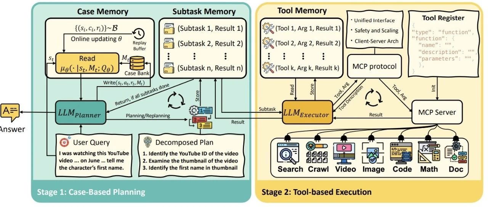

#  AgentFly：重塑Agent，无需微调LLM，如我们一样的记忆和经验持续学习

[ NLP PaperWeekly ](javascript:void\(0\);)

______

在小说阅读器中沉浸阅读

以下文章来源于深度学习自然语言处理 ，作者编辑部

 **深度学习自然语言处理** . 一个热衷于深度学习与NLP前沿技术的平台，期待在知识的殿堂与你相遇~

近年来，大型语言模型（LLM）智能体已成为AI领域的热点，它们能自主使用工具、进行多步推理，完成复杂任务，如深度研究、代码生成、多轮对话等。然而，现有的LLM智能体面临两大困境：一是依赖**静态、手工设计的工作流程** ，缺乏灵活性，无法适应新环境；二是通过**微调LLM参数** 来实现适应，虽然灵活但成本极高，且容易发生“灾难性遗忘”，不适合持续学习。

这就引出了一个核心问题：**能否让LLM智能体像人类一样，通过记忆和经验持续学习，而不必每次都重新训练或微调模型？**

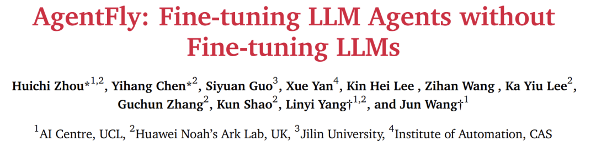

  * 论文：AgentFly: Fine-tuning LLM Agents without Fine-tuning LLMs
  * 链接：https://arxiv.org/pdf/2508.16153

本论文正是针对这一挑战提出的创新解决方案。作者受人类记忆机制启发，提出了一个**基于记忆的在线强化学习框架** ，智能体通过不断积累成功和失败的经验（存入“案例库”），在遇到新任务时快速检索相似案例指导决策，从而实现持续进步——**整个过程完全不更新LLM的权重** 。

AgentFly在多个权威基准测试中表现卓越，如在GAIA验证集上达到87.88%的准确率（排名第一），在DeepResearcher上显著超越已有训练型方法，证明了其高效性和泛化能力。这不仅为构建低成本、高自适应的通用智能体提供了新范式，也推动了AI向更接近人类学习方式的方向发展。

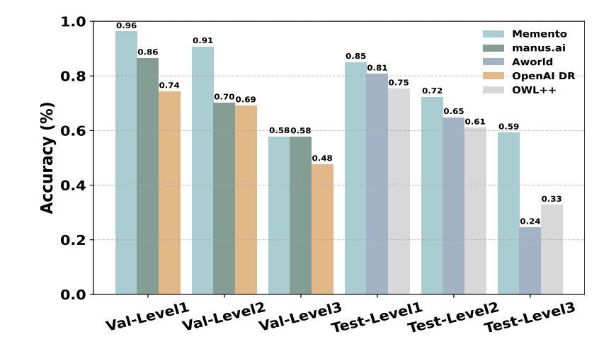

下面，我们将深入解读AgentFly的核心方法、实现细节、实验结果及其深远意义。

## 核心方法：基于记忆的MDP与案例推理（CBR）

### 形式化框架：记忆增强的MDP（M-MDP）

传统强化学习使用马尔可夫决策过程（MDP）建模智能体与环境的交互，包括状态、动作、转移概率、奖励函数等。AgentFly在此基础上引入**外部记忆空间** ，形成记忆增强的MDP（Memory-augmented MDP, M-MDP），其定义为：

其中：

  * ：状态空间（当前任务或环境状态）
  * ：动作空间（智能体可执行的操作）
  * ：状态转移函数
  * ：奖励函数
  * ：折扣因子
  * ：记忆空间，存储历史经历（案例）

**记忆空间** 是AgentFly的核心创新。每个案例  是一个三元组 ，分别表示过去某次任务的状态、执行的动作和获得的奖励。智能体通过不断积累这些案例，形成一个不断增长的“经验库”。

### CBR智能体的决策机制

AgentFly的决策过程模仿人类的案例推理（Case-Based Reasoning, CBR）过程，分为四步：

  1. **检索（Retrieve）** ：根据当前状态 ，从案例库  中检索出最相关的案例 。
  2. **重用与修订（Reuse & Revise）**：基于检索到的案例 ，LLM生成当前动作 。
  3. **评估（Evaluate）** ：执行动作 ，获得奖励  和下一个状态 。
  4. **保留（Retain）** ：将本次经历  存入案例库，更新记忆。

整个轨迹的概率可表示为：

### 优化目标：最大熵强化学习与软Q学习

为了优化案例检索策略 ，作者采用**最大熵强化学习** ，在最大化累积奖励的同时鼓励策略多样性，避免陷入局部最优。其目标函数为：

其中  是熵， 是温度超参，控制探索与利用的平衡。

在该框架下，**软Q函数** 表示在状态  和记忆  下选择案例  的期望回报，其贝尔曼方程为：

其中  是软价值函数。最优检索策略  具有闭式解：

**该公式是核心中的核心** ：它告诉我们，检索案例的概率由它们的Q值决定——Q值越高的案例（即过去越成功的案例），被选中的概率越大。温度参数  控制着探索程度： 越大，策略越随机； 越小，越倾向于选择Q值最高的案例。

### 两种记忆机制实现

AgentFly提供了两种实现检索策略  的方式：

  * **非参数化记忆** ：直接使用向量检索（如余弦相似度）从案例库中找最相似的案例。简单高效，但缺乏适应性。
  * **参数化记忆** ：训练一个神经网络Q函数  来评估案例价值，并通过梯度下降更新（见公式15和26）。更灵活，能学习到任务之间的潜在规律。

## 实现：AgentFly深度研究智能体

AgentFly被实例化为一个**规划器-执行器（Planner-Executor）架构** ，如上图所示，两者交替工作，共同完成任务。

### 双阶段协作流程

  * **规划器（Planner）** ：由强大LLM（如GPT-4.1）驱动，是一个CBR智能体。它接收用户任务，从**案例记忆** 中检索K个相关案例，据此制定计划（分解为子任务），并写入**子任务记忆** 。
  * **执行器（Executor）** ：由轻量LLM（如o4-mini）驱动，负责执行子任务。它读取子任务，使用**工具记忆** （记录工具使用历史），调用相应工具（如搜索、代码执行），并将结果写回。

### 三类记忆模块分工

  * **案例记忆（Case Memory）** ：存储宏观规划经验（任务-计划-奖励）。
  * **子任务记忆（Subtask Memory）** ：记录当前任务的子任务列表及其状态。
  * **工具记忆（Tool Memory）** ：记录每个子任务下的工具调用和返回结果。

这种设计确保了任务上下文的持续传递和精细化管理。

### 强大的工具集成

为了应对深度研究的复杂需求，AgentFly通过**Model Context Protocol (MCP)** 集成了丰富的外部工具：

  * **信息获取** ：Meta搜索引擎（SearxNG） + 精准爬虫（Crawl4AI）
  * **多模态处理** ：支持图片、音频、视频、PDF、PPT、表格等数十种格式的解析与理解
  * **推理与分析** ：Python代码执行沙盒、数学计算工具

这使得AgentFly能真正像人类研究员一样，在互联网上搜索信息，阅读各种格式的文档，进行数据分析，并最终给出答案。

### 记忆读写机制对比

机制| 写入（Write）| 读取（Read）| 特点  
---|---|---|---  
**非参数化**|  直接追加案例| TopK相似度检索| 简单、快速、可解释  
**参数化**|  追加案例 + 更新Q网络| 按Q值TopK检索| 自适应、可学习、更精准  
  
在深度研究场景中，任务通常是**单步规划** （即规划器只规划一步，执行器执行多个工具调用），因此作者将Q学习目标简化为**监督学习** ，避免了时序差分学习的不稳定性，并用交叉熵损失替代MSE，更适合二值奖励信号。

## 实验与性能

论文在4个具有挑战性的基准上进行了全面评估，充分验证了AgentFly的有效性。

### 数据集

  * **GAIA** ：复杂工具使用与多步规划，分3个难度等级。
  * **DeepResearcher** ：7个开源QA数据集合集，测试实时网络研究与多跳推理。
  * **SimpleQA** ：事实性单跳问答，检验幻觉抑制能力。
  * **HLE** (Humanity's Last Exam)：涵盖多学科的长尾知识问答，测试极限推理能力。

### 主要结果

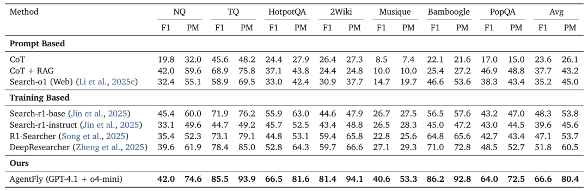

  * **DeepResearcher** ：AgentFly取得了**66.6% F1** 和**80.4% PM** 的平均分数，显著超越所有Prompt-Based和Training-Based基线模型，证明了其在线研究能力的强大。
  * **GAIA** ：在验证集上达到**87.88% Pass@3** ，排名第一；在测试集上达到**79.40%**，名列前茅，超越了Manus、AWorld、OWL等知名开源框架。
  * **SimpleQA** ：达到**95.0%**的准确率，创下新SOTA，表明其出色的** 事实准确性和抗幻觉能力**。
  * **HLE** ：达到**24.4% PM** ，仅次于GPT-5，在专家级长尾知识问题上展现了惊人潜力。

### 消融实验

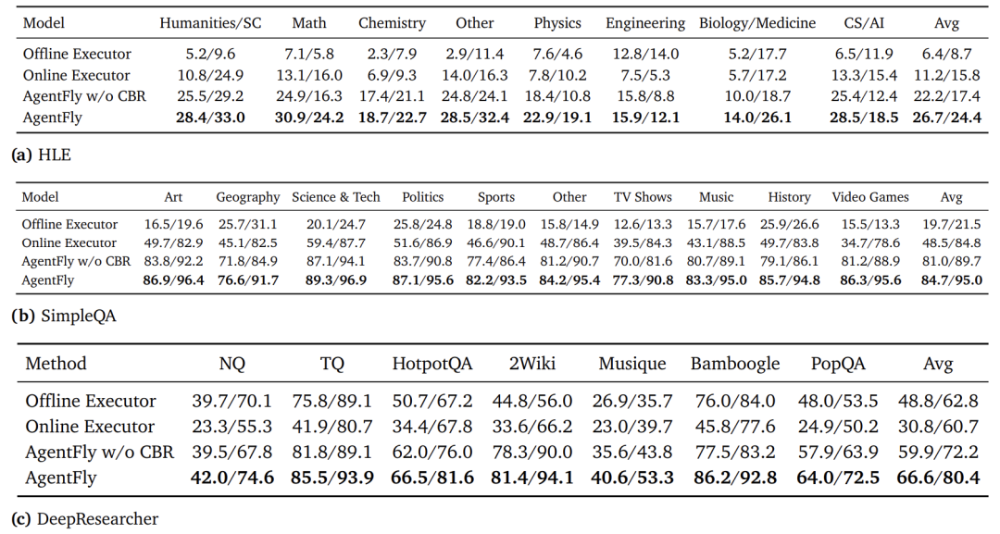

消融实验清晰地展示了各个组件的贡献：

  * **离线执行器 → 在线执行器** ：接入实时工具带来巨大提升（如SimpleQA: +28.8 F1），但有时因数据污染会下降（DeepResearcher: -18.0 F1），说明**模型内部知识同样重要** 。
  * **在线执行器 → AgentFly (w/o CBR)**：增加规划器带来全面、显著的提升（所有任务+10~30点），证明** 规划与工具编排至关重要**。
  * **AgentFly (w/o CBR) → 完整AgentFly** ：引入CBR记忆机制带来**一致的额外提升** （+4~8点），证明了**案例推理的独立价值** 。

### 持续学习与泛化能力

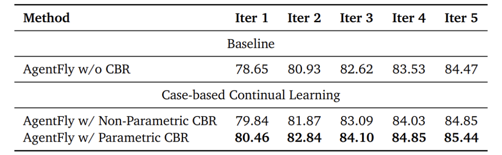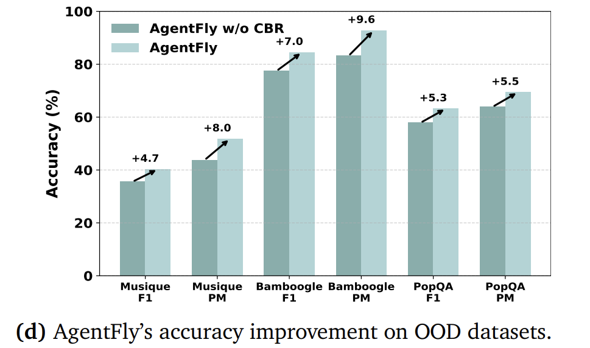

  * **持续学习** ：随着迭代次数增加（案例库变大），性能持续提升，参数化CBR增益优于非参数化。
  * **OOD泛化** ：在训练时未见的任务上（MusiQue, Bamboogle, PopQA），性能仍有**4.7% ~ 9.6%** 的绝对提升，展现了出色的泛化能力。

### 超参数分析

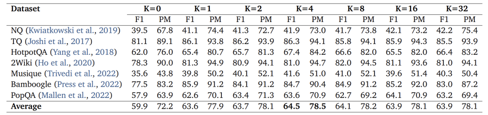

检索案例数  并非越多越好。实验表明， 时效果最佳，超过后性能持平或下降。这说明**少量高质量案例比大量噪声案例更有效** ，与少样本学习中的“越多越好”结论不同，凸显了**记忆 curation（策展）的重要性** 。

## 讨论与分析

### 效率与成本分析

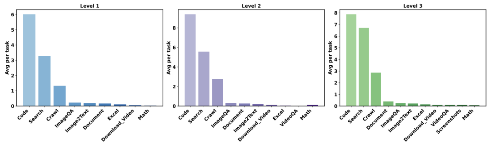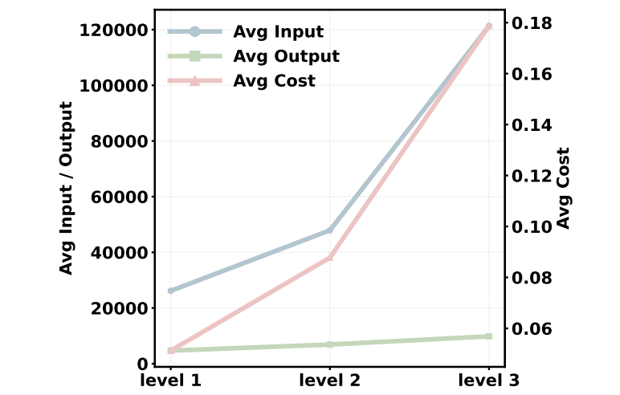

  * **工具使用统计** ：随着任务难度增加，代码、搜索、爬虫工具的使用占比显著上升，说明复杂任务更依赖外部信息获取和处理。
  * **Token消耗** ：Level 3任务的输入Token（~121k）远高于输出Token（~9.8k），说明**计算开销主要来自整合和分析多步工具的输出** ，而非生成最终答案。这为优化系统性能指明了方向。

### 规划器模式：“快思考”胜于“慢思考”

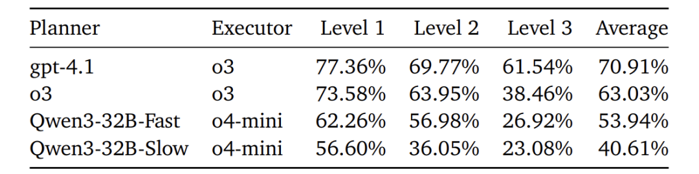

一个有趣的发现是：使用**快速、非慎思** 的规划器（GPT-4.1）配以强大的执行器（o3），其效果（70.9%）远好于使用**慢速、慎思** 的规划器（o3本身，63.03%）。分析表明，慢速规划器容易产生冗长、模糊的计划，甚至跳过规划直接回答问题，导致执行器困惑。而快速规划器能生成**简洁、结构化的计划** ，更有效地指导执行器。

这揭示了在模块化系统中，**角色清晰分工** 比每个组件都“大力出奇迹”更重要。

## 结论

AgentFly提出了一种**革命性的LLM智能体持续学习范式** 。其核心在于将智能体形式化为一个**记忆增强的MDP** ，通过**案例推理（CBR）** 机制，利用外部记忆库存储和复用历史经验，从而实现**在线、高效的适应性学习，而无需微调LLM参数** 。

这项工作的巨大价值在于：

  1. **理论创新** ：将CBR与最大熵RL相结合，为智能体学习提供了新的形式化框架。
  2. **工程实用** ：提出的 planner-executor 架构与MCP工具集成，是一个强大、可扩展的深度研究智能体系统。
  3. **性能卓越** ：在多个权威基准上达到顶尖水平，充分验证了方法的有效性。
  4. **低成本高效益** ：开辟了一条不依赖昂贵微调、更接近人类学习方式的智能体发展路径。

未来，AgentFly的研究方向可能包括：更高效的记忆压缩与检索机制、遗忘策略以应对记忆爆炸、以及在更开放的多智能体环境中的协作与应用。这项工作无疑为迈向通用人工智能（AGI）的关键一步——**持续终身学习** ——提供了坚实而高效的实现基础。

  

预览时标签不可点

微信扫一扫  
关注该公众号

继续滑动看下一个

轻触阅读原文

NLP PaperWeekly 

向上滑动看下一个

[知道了](javascript:;)

微信扫一扫  
使用小程序

****

[取消](javascript:void\(0\);) [允许](javascript:void\(0\);)

****

[取消](javascript:void\(0\);) [允许](javascript:void\(0\);)

****

[取消](javascript:void\(0\);) [允许](javascript:void\(0\);)

× 分析

__

微信扫一扫可打开此内容，  
使用完整服务

： ， ， ， ， ， ， ， ， ， ， ， ， 。 视频 小程序 赞 ，轻点两下取消赞 在看 ，轻点两下取消在看 分享 留言 收藏 听过
