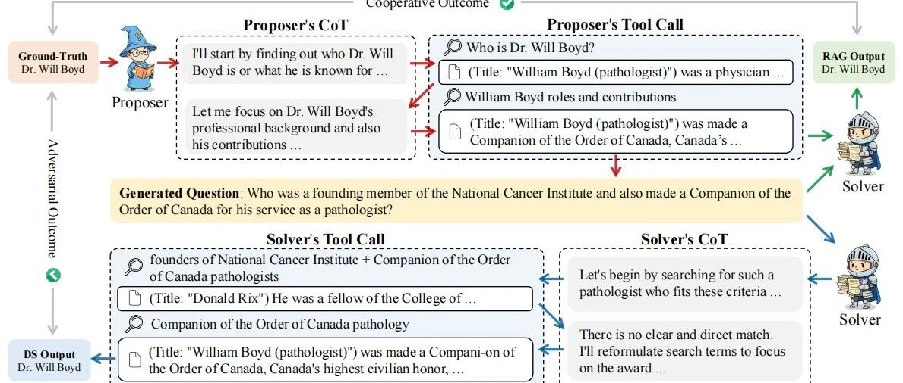

#  ICLR26 | 阿里Qwen：仅靠自博弈，将Agent搜索能力推向新SOTA

原创 NLP PaperWeekly NLP PaperWeekly [ NLP PaperWeekly ](javascript:void\(0\);)

______

在小说阅读器中沉浸阅读

大家好，我是HxShine  
今天继续分享一篇来自Qwen Team发表在ICLR26的一篇论文，题为 **"Search Self-play: Pushing the Frontier of Agent Capability without Supervision"** （搜索自博弈：在无监督情况下推动Agent能力前沿）。  
当前Agent的优化，例如提升RAG和Multi-HopQA等问答能力，**严重依赖高质量标注数据或人工设计奖励（RLVR）** 。那我们能否利用无监督训练方法，来优化Agent的信息获取或者问答能力呢？这篇文提出了一种名为 **Search Self-play (SSP)** 的训练框架。该框架受到AlphaGo Zero的启发，通过**让大模型在“提问者”和“回答者”两个角色之间进行对抗性自博弈，实现了Deep Search Agent（深度搜索智能体）的自主进化** 。  
该方法的核心亮点在于：1）**无需人工标注** ：完全依靠模型自我生成问题和验证；2）**自适应课程学习** ：提问者会生成越来越难的问题来挑战回答者，形成自动化的课程；3）**RAG校验机制** ：利用检索增强生成来验证生成问题的正确性和可解性，防止“幻觉”或无解问题干扰训练。  
实验表明，SSP在Qwen2.5、LLaMA-3.1等多个模型上，均能显著提升其在**GeneralQA和Multi-HopQA基准** 上的表现，表明了**自监督方法提升Agent能力** 的可行性。

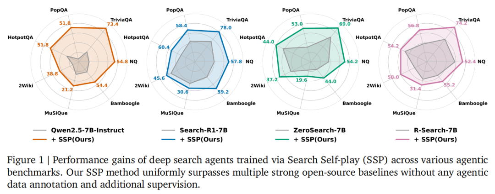image-20260202102317547

## 一、概述

  * • **Title:** Search Self-play: Pushing the Frontier of Agent Capability without Supervision
  * • **URL:** https://arxiv.org/abs/2510.18821v2
  * • **Authors:** Hongliang Lu, Yuhang Wen, Pengyu Cheng, et al.
  * • **Institution:** Qwen Large Model Application Team, Peking University; Sun Yat-sen University.
  * • **Code:** https://github.com/Qwen-Applications/SSP

### 1\. Motivation

  * • **RLVR的数据瓶颈：** 目前基于**可验证奖励的强化学习（RLVR）是训练LLM Agent的主流技术** ，但它高度依赖精心设计的查询（Queries）和对应的标准答案（Ground-truth）来提供准确奖励。这需要大量人力，阻碍了大规模扩展。
  * • **现有合成数据的缺陷：** 虽然已有工作探索任务合成（Task Synthesis），但生成的Agent任务难度难以控制，且很**难保证生成的“问题-答案”对在逻辑上的一致性和正确性** ，导致RL训练效率低下。
  * • **缺乏自适应性：** 离线合成的数据无法根据模型当前的能力动态调整难度，**难以像自博弈（Self-play）那样提供持续的训练红利** 。

### 2\. Method

**Search Self-play (SSP)** 是一个让LLM“左右互搏”的框架。同一个LLM交替扮演**提问者（Proposer）**和** 解题者（Solver）**。提问者利用搜索工具**逆向生成带有陷阱或需要多跳推理的难题** ；解题者尝试解决这些问题。为了防止提问者胡编乱造，引入了**RAG验证机制** ：如果解题者拿着提问者搜索到的文档都答不对，说明问题太难或无解；如果能答对，才进入正式的搜索对抗训练。通过这种机制，模型在不需要人类老师的情况下，**搜索和推理能力螺旋上升** 。

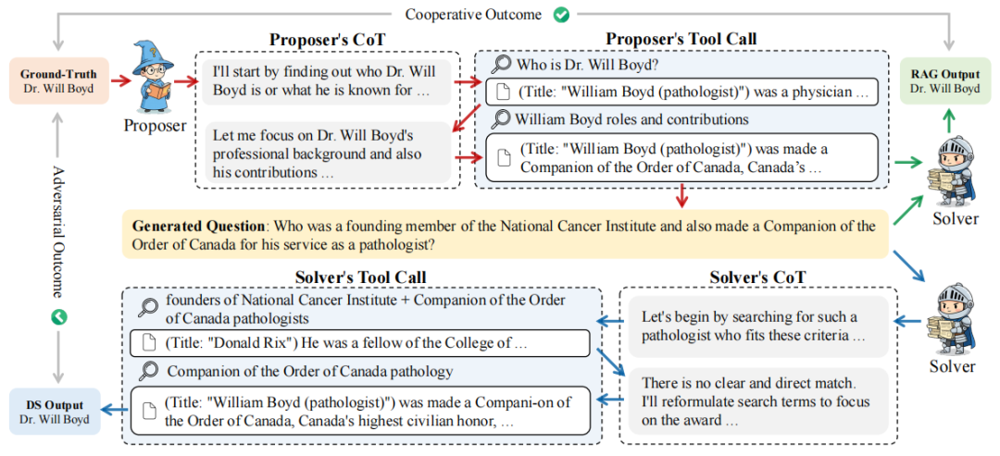image-20260202103934106

#### 详细方法和步骤：

  1. 1\. **角色定义：**
     * • **Proposer（提问者）：** 给定一个答案（Ground-truth），Proposer通过多轮搜索工具调用，逆向**构建出一个需要多跳推理才能得到该答案的问题。**
     * • **Solver（解题者）：** 目标是解决生成的问题。它通过**多轮推理和搜索引擎调用，预测答案。**
  2. 2\. **RAG验证机制（质量控制核心）：**
     * • 为了确保生成的问题是正确且可解的，系统收集Proposer在生成问题过程中搜索到的所有网页内容作为“外部知识”。
     * • 进行检索增强生成（RAG）测试：让Solver在**不使用搜索工具** 的情况下，仅根据这些提供的文档尝试回答问题。
     * • **判定逻辑：** 只有**当Solver在RAG模式下能正确回答** ，才证明该问题是“基于事实且逻辑自洽”的有效问题。这防止了Proposer生成无解或幻觉问题（Reward Hacking）。
  3. 3\. **自博弈流程（SSP Game）：** 这是一个零和博弈（Zero-sum game）的变体，既有竞争也有合作。
     * • **竞争：** Proposer生成的有效问题越难（导致Solver在全搜索模式下失败），Proposer获得的奖励越高；Solver则因正确回答获得奖励。
     * • **合作：** 为了通过RAG验证，Proposer必须生成有事实依据的问题，这迫使两者在生成阶段隐性合作。
  4. 4\. **训练算法：**

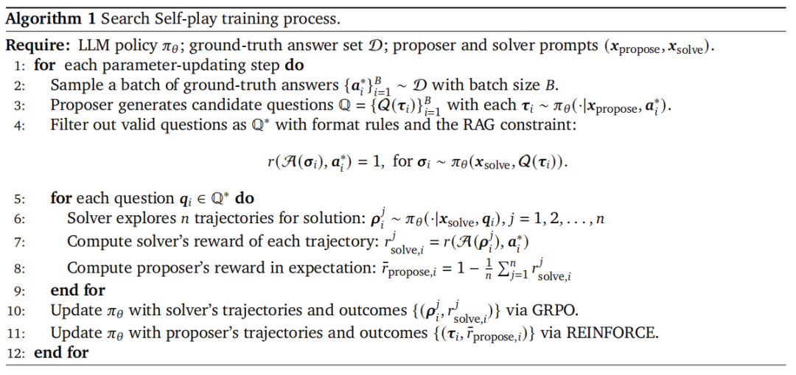 image-20260202105453193

  * • **Solver更新：** 使用GRPO（Group Relative Policy Optimization）算法，最大化回答正确率。
  * • **Proposer更新：** 使用REINFORCE算法。其奖励函数设计为：若**生成的有效问题导致Solver失败（Answer Rate低），则奖励高。这促使Proposer不断探索更复杂的搜索路径和推理陷阱。**

###  3\. Conclusion

  * • **显著的性能提升：** SSP在从零开始训练（From-scratch）和持续微调（Continual Training）设置下，均显著提升了模型在7个QA基准测试（如NQ, HotpotQA, TriviaQA等）上的表现。**例如，在Qwen2.5-7B-Base上，平均分提升了26.4分。**

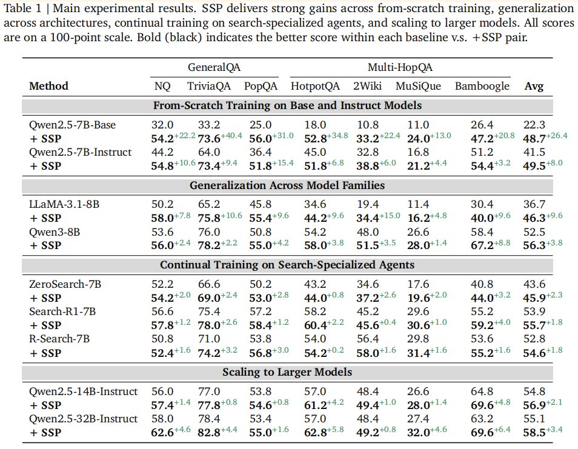 image-20260202105639824

  * • **无需人工监督：** 该方法完全移除了对人工标注数据的依赖，实现了Agent能力的自我进化。
  * • **模型通用性：** 该方法在不同架构（Qwen, LLaMA）和不同尺寸（7B, 14B, 32B）的模型上均有效，且**能超越目前的开源强基线模型（如Search-R1, ZeroSearch）。**

###  4\. Limitation

  * • **计算开销：** 相比于固定数据集训练，自博弈需要实时生成问题、进行RAG验证和多轮搜索Rollout，计算资源消耗较大。
  * • **搜索步数限制：** 为了节省资源，实验中限制了搜索步数为10步，这可能限制了模型探索更深层推理路径的能力。
  * • **奖励设计的敏感性：** 如果对格式错误给予过重的惩罚，Proposer可能会陷入“死循环”停止生成有效问题，表明奖励机制需要精细调节。

## 二、详细内容

### 1\. 训练动态曲线：自博弈训练能持续提升效果，而其他方法不能

说明：对比了SSP（完整版）、Solver-Only（固定提问者）和Proposer-Only的训练过程。结果显示只有SSP能确保持续的评估分数上升，而Solver-Only会因为过拟合固定问题导致性能先升后降。

image-20260202105838857

#### 训练方案消融测试集结果

说明：对比了SSP与固定对手训练（Solver-Only, Proposer-Only）。数据证明“共同进化（Co-evolution）”是性能提升的关键，单纯训练一方效果有限。

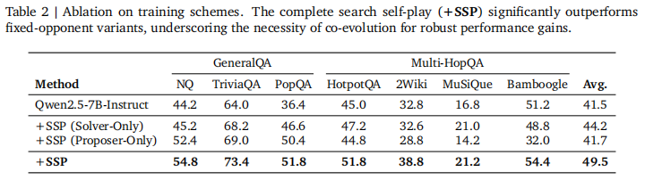image-20260202110235419

### 2 预定义答案集的分布

说明： 展示了用于生成问题的种子答案的长度和主题分布（如人物、时间、地理等），**生成问题的多样性还不错。**

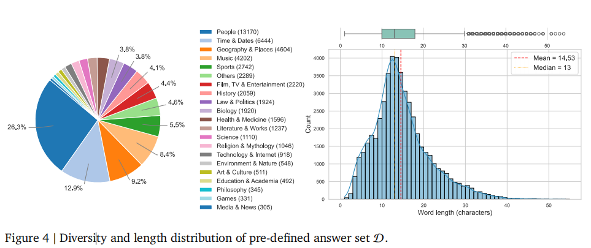 image-20260202105939980

### 3 Solver的训练动态细节

说明：随着训练进行，Solver调用搜索工具的频率增加、回复长度变长（更详细的推理），以及在验证集上的准确率稳步提升。

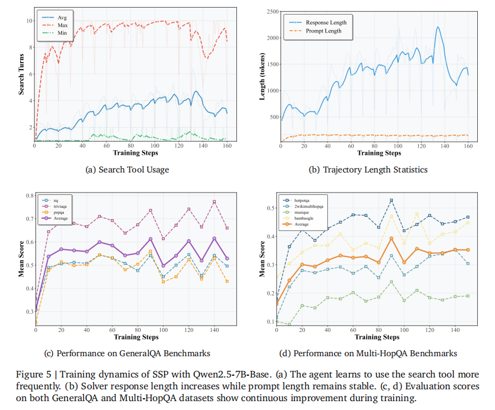image-20260202110056536

### 3 Proposer的训练动态细节

说明：Proposer生成的搜索次数变多（探索更深）、**问题通过验证的比例提高（质量变好）、问题难度逐渐上升（课程学习效应），且主题分布保持均衡。**

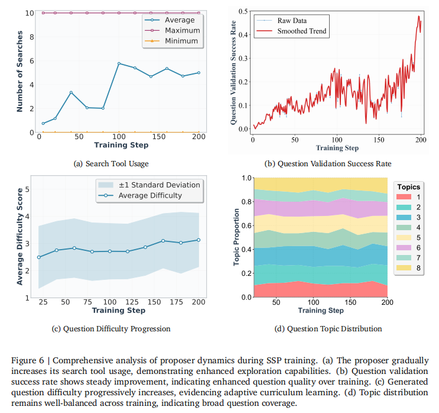 image-20260202110136068

### 4 超参数设置对实验结果的影响

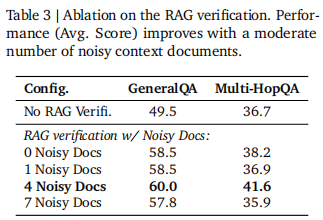image-20260202110315806

### 5 RL算法消融

说明：对比了Proposer和Solver分别使用REINFORCE或GRPO的组合。**结论是Proposer用REINFORCE，Solver用GRPO是效率和效果的最佳折中**

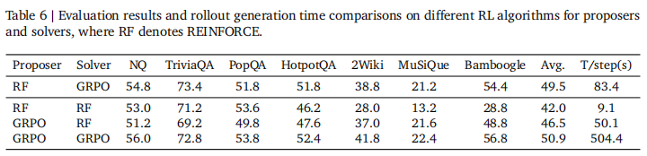 image-20260202110359953

### 6 自博弈具体的Case

#### 1 Proposer如何一步步思考构建问题？

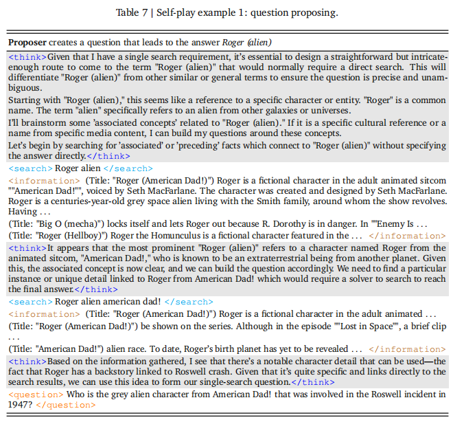image-20260202110448732

#### 2 Solver如何一步步搜索解决问题

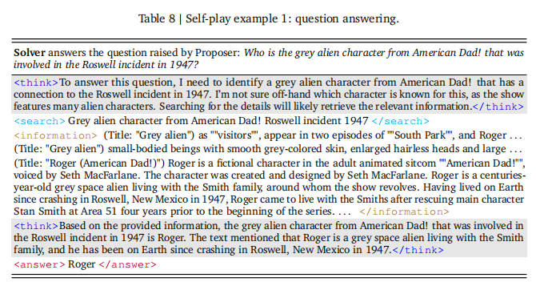image-20260202110532294

## 三、总结

其核心价值在于证明了：**复杂的Agent能力（如深度搜索、多跳推理）可以通过“自博弈”的方式，在没有任何人类监督的情况下从零涌现并持续增强。**

**结论1：自博弈学习解决了数据荒。** 传统的Agent训练受限于高质量Trajactory（轨迹）数据的稀缺。SSP通过让模型自己生成问题、自己验证、自己解答，构建了一个无限的数据飞轮。  
**结论2：RAG作为判官提升生成问题的质量（同时避免幻觉问题生成）。** 巧妙地利用RAG技术作为“自动化验证器”，解决了生成式任务中难以判断“问题质量”的难题。这种将生成任务转化为判别任务的思路非常值得借鉴。  
**结论3： 自博弈训练能引入课程学习持续提升效果：** 实验中观察到的现象——Proposer为了难住Solver，自动学会了生成需要更多跳搜索、更隐晦线索的问题，这实际上形成了一种自动化的Curriculum Learning（课程学习），这是通往AGI System 2思维的重要特征。

总的来说，SSP为Agent的大规模强化学习（Scaling Agentic RL）提供了一套完整、闭环且高效的解决方案，**未来其他场景Agent能力优化也可以尝试Self-play和Self-improvement范式。**
    
    
    👇关注公众号**NLP PaperWeekly** ，对话框输入“**Agent** ”，即可获取更多相关资料👇  
    
    
    
    进技术交流请添加我微信（FlyShines)
    
    请备注昵称+公司/学校+研究方向，否则不予通过

© THE END 

转载请联系本公众号获得授权

投稿或寻求报道：hxshineuestc@gmail.com

预览时标签不可点

微信扫一扫  
关注该公众号

继续滑动看下一个

轻触阅读原文

NLP PaperWeekly 

向上滑动看下一个

[知道了](javascript:;)

微信扫一扫  
使用小程序

****

[取消](javascript:void\(0\);) [允许](javascript:void\(0\);)

****

[取消](javascript:void\(0\);) [允许](javascript:void\(0\);)

****

[取消](javascript:void\(0\);) [允许](javascript:void\(0\);)

× 分析

__

微信扫一扫可打开此内容，  
使用完整服务

： ， ， ， ， ， ， ， ， ， ， ， ， 。 视频 小程序 赞 ，轻点两下取消赞 在看 ，轻点两下取消在看 分享 留言 收藏 听过
