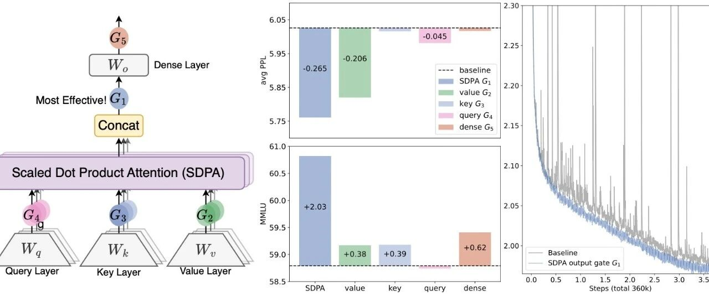
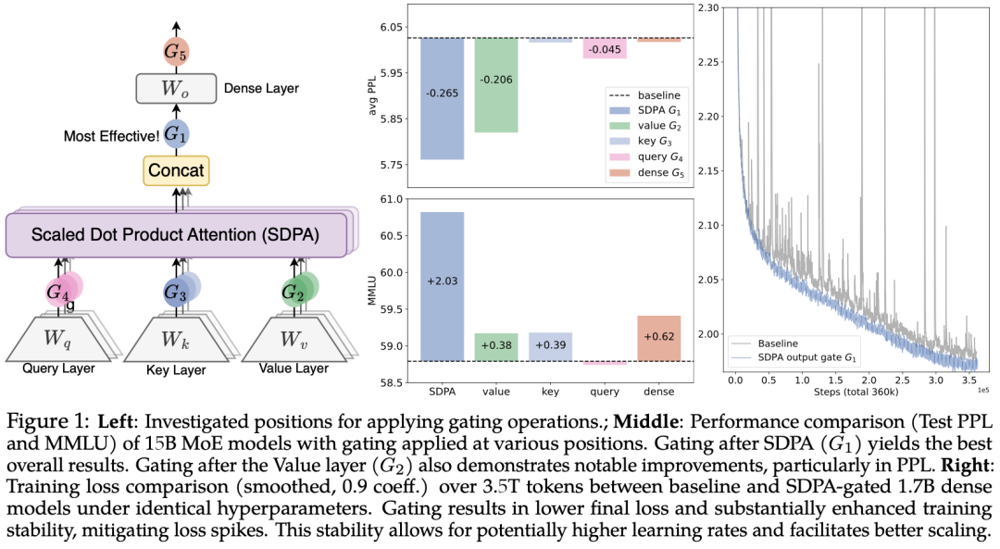
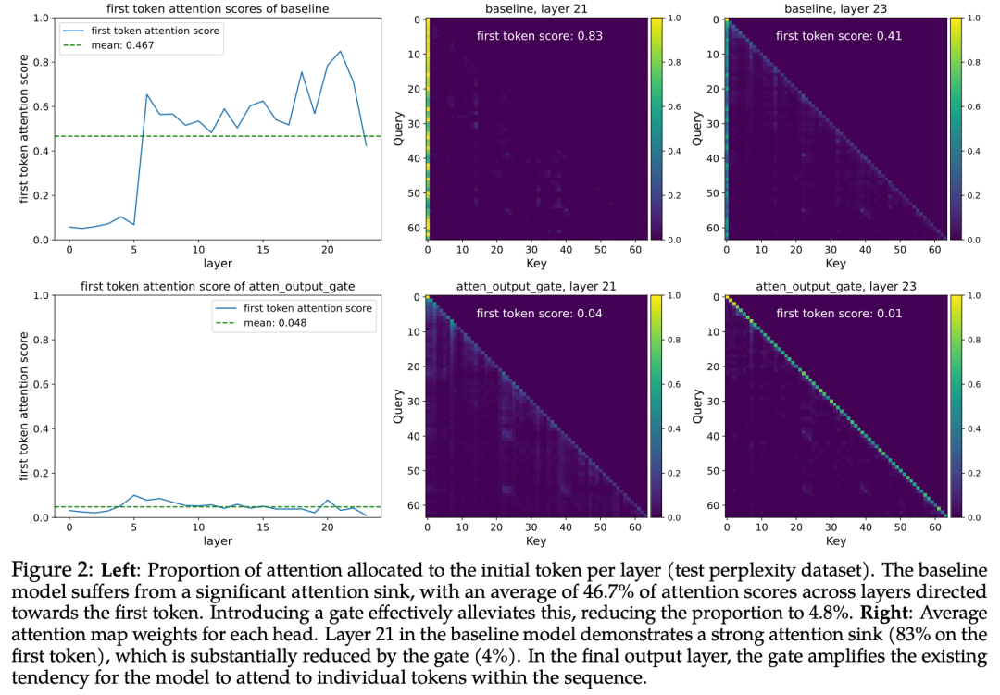
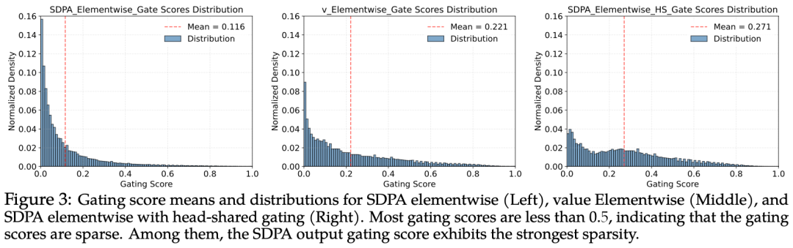
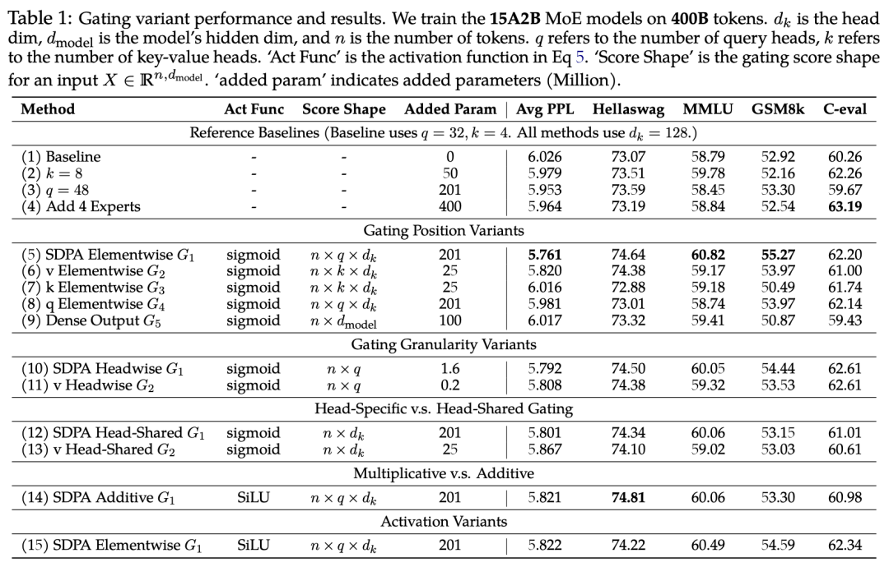
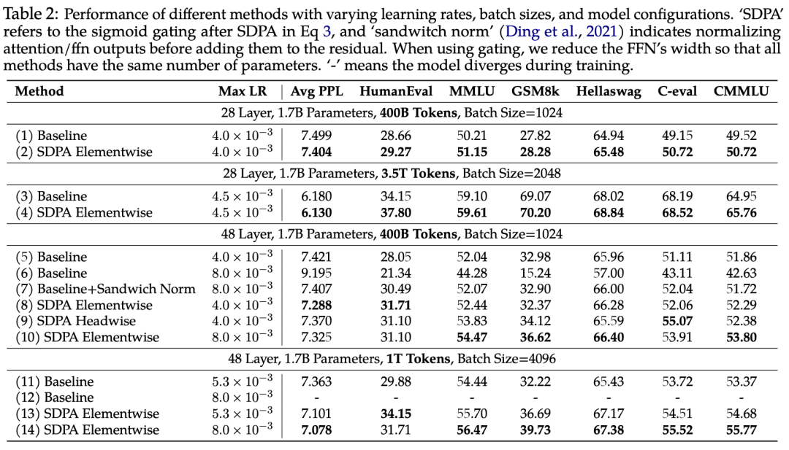
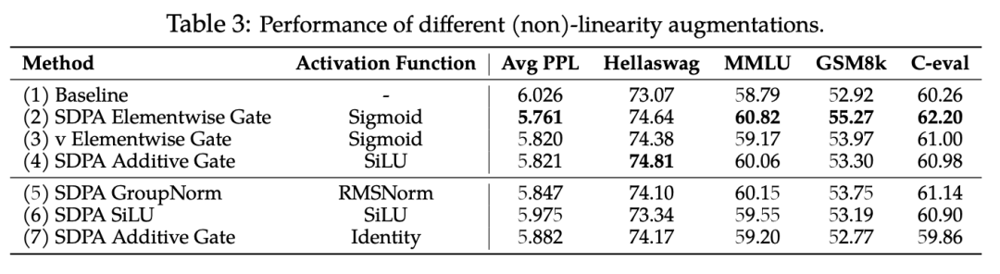
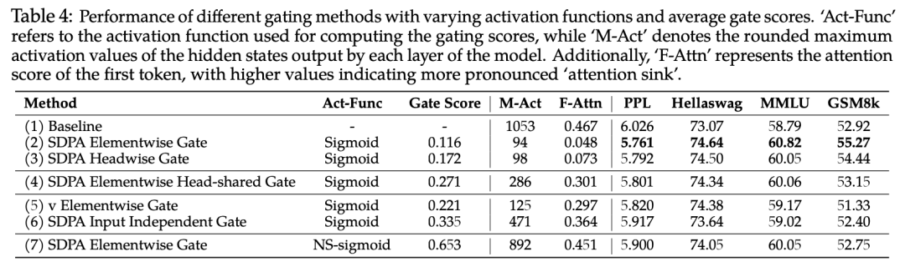
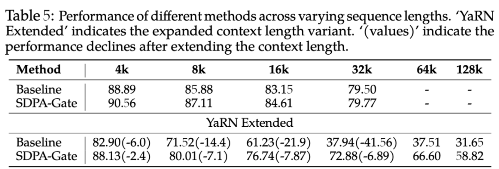

#  NIPS25最佳论文｜阿里Qwen提出「门控注意力」：极简改动，推开LLM效率与稳定新大门

原创 NLP PaperWeekly NLP PaperWeekly [ NLP PaperWeekly ](javascript:void\(0\);)

______

在小说阅读器中沉浸阅读

大家好，我是HxShine

今天分享一篇Qwen在NIPS25的Best paper，标题为 **"Gated Attention for Large Language Models: Non-linearity, Sparsity, and Attention-Sink-Free"** 。该论文**系统性地探究了门控机制在标准softmax注意力中的作用** ，发现一个简单修改——在缩放点积注意力（SDPA）输出后应用头特定的sigmoid门控——能显著提升模型性能、训练稳定性并消除"注意力沉没"现象。研究基于15B MoE模型和1.7B密集模型在3.5万亿token数据集上的大规模实验，揭示了**门控机制通过引入非线性和稀疏性提升模型能力的本质原因** 。**该方法特点总结如下：**

  1. 1\. **简单有效：** 仅需在Attention层中增加极少量的参数（在SDPA输出后乘以此前的输入变换出的门控分数），即可获得显著的性能提升（PPL降低0.2，MMLU提升2个点）。
  2. 2\. **机理解析深入：** 论文不仅给出了“怎么做”，还通过消融实验揭示了“为什么有效”：主要归功于**引入了非线性（打破了Value投影和输出投影的低秩限制）以及Query相关的稀疏性** 。
  3. 3\. **消除Attention Sink：** 发现该门控机制能自然地产生稀疏性，从而**消除了“注意力汇聚”现象（即首个token占用大量注意力的现象），这有助于模型在长上下文外推时的表现** 。
  4. 4\. **提升训练稳定性：** 该机制**几乎消除了训练过程中的Loss尖峰（Spikes），使得模型能耐受更大的学习率和Batch Size，利于大规模扩展。**

  *   

##  一、概述

  * • **Title:** Gated Attention for Large Language Models: Non-linearity, Sparsity, and Attention-Sink-Free
  * • **URL:** arXiv:2505.06708v1
  * • **Authors:** Zihan Qiu, Zekun Wang, Bo Zheng, et al.
  * • **Institution:** Qwen Team, Alibaba Group
  * • **Code:** https://github.com/qiuzh20/gated_attention

### 1 Motivation

  * • **门控机制作用不明确** ：尽管门控机制从早期LSTM、Highway Networks到现代状态空间模型、线性注意力中被广泛应用，但其在标准softmax注意力中的具体贡献和工作机制缺乏系统性研究，常与其他架构因素混淆。
  * • **需解耦门控的独立价值** ：现有工作（如Switch Heads、Native Sparse Attention）虽引入门控，但未充分分离门控本身与路由机制、稀疏注意力设计等其他因素的贡献，难以评估门控的真实价值。
  * • **注意力沉没现象亟待解决** ：长序列建模中普遍**存在的"注意力沉没"（attention sink）问题——初始token过度占据注意力分数** ——影响模型长上下文性能，需探索有效缓解机制。

### 2 Methods

主要是做了3个事情：

**1 系统分析门控该放在哪** ：在注意力层5个关键位置（G1-G5）实验30+种门控变体，发现SDPA输出后（G1）的头特定sigmoid门控效果最佳。

**2 为什么有效** ：门控通过（1）增强低秩映射的非线性表达能力；（2）引入查询依赖的稀疏门控分数，有效过滤无关上下文信息。

**3 为什么能解决注意力沉没** ：稀疏门控自然消除注意力沉没现象，显著提升长上下文外推能力。

image-20260128095832027

#### 详细方法和步骤:

  1. 1\. **门控位置系统探索** ：G1：SDPA输出后（最有效位置），G2：Value投影后，G3：Key投影后，G4：Query投影后，G5：最终输出层后。
  2. 2\. **门控变体设计空间** ：**粒度** ：头级（每头一个标量）vs 元素级（每维度独立），**头关系** ：头特定（每头独立门控）vs 头共享（跨头共享参数），**操作形式** ：乘法门控（Y' = Y ⊙ σ(XWθ)）vs 加法门控（Y' = Y + σ(XWθ)），**激活函数** ：Sigmoid（[0,1]范围）vs SiLU（无界输出）
  3. 3\. **实验设置** ：模型规模：15B MoE（2.54B激活参数）和1.7B密集模型。训练数据：3.5万亿高质量token（多语言、数学、通用知识）。上下文长度：4096（基础训练），扩展至128k（长上下文评估）评估基准：MMLU、HellaSwag、GSM8k、C-Eval、CMMLU及多领域困惑度
  4. 4\. **机制分析** ：
     * • **非线性增强** ：注意力中Value投影（WV）和输出投影（WO）构成低秩线性映射，门控在二者间引入非线性，提升表达能力
     * • **稀疏性分析** ：测量门控分数分布，发现有效门控（尤其G1位置）呈现强稀疏性（均值0.116），且为查询依赖（基于当前token隐藏状态）
     * • **注意力沉没消除** ：分析各层对首token的注意力分配比例，验证稀疏门控有效缓解该现象

### 3 Conclusion

  * • **性能显著提升** ：在SDPA输出应用头特定sigmoid门控，15B MoE模型PPL降低0.26，MMLU提升2.03分，GSM8k提升2.35分，且优于参数扩展等替代方案。
  * • **训练稳定性增强** ：门控几乎消除训练中的loss spikes，允许使用更大批次（4096→8192）和更高学习率（4e-3→8e-3），48层1.7B模型在8e-3学习率下仍稳定收敛（基线发散）。
  * • **注意力沉没消除与长上下文优势** ：门控模型首token平均注意力从46.7%降至4.8%，在128k上下文长度下RULER基准提升超10分，证明对上下文扩展的适应性更强。

### 4 Limitation

  * • **非线性动态影响未深入** ：门控引入的非线性对注意力动态和整体训练过程的更广泛影响尚未充分探索。
  * • **理论解释不足** ：虽观察到消除注意力沉没改善长上下文性能，但缺乏严格理论解释其如何影响模型序列长度泛化能力。
  * • **稀疏性-激活-沉没关系待深化** ：大规模激活与注意力沉没的因果关系复杂（Value层门控消除激活但未消除沉没），三者相互作用需更深入研究。

## 二、详细内容

### 1 Gate对注意力沉没的影响

image-20260128100120998

  * • **左图** ：各层对首token的注意力比例分布，baseline模型平均46.7%注意力集中于首token，门控模型降至4.8%
  * • **右图** ：第21层注意力热力图对比，基线模型83%注意力集中于首token（强沉没），门控模型降至4%；输出层显示**门控增强对序列内各token的精细关注**

###  2 不同级别的门控的稀疏性分数分布

image-20260128100430879

  * • 三子图分别展示SDPA元素级门控（均值0.116）、Value元素级门控（均值0.221）和SDPA头共享门控（均值0.271）的分数分布
  * • **结论：** SDPA输出门控分布高度集中在0附近（强稀疏性），且**头特定设计比头共享产生更低均值（更强稀疏性）** ，与性能提升正相关

### 3 不同门控参数的影响（基于15B MoE模型）

image-20260128100650568

  * • **实验方法涵盖5类变体：** 位置变体（G1-G5）、粒度变体（头级/元素级）、头关系变体（特定/共享）、操作形式变体（乘法/加法）、激活函数变体
  * • **结论：** G1位置元素级门控最优（PPL 5.761）；头级门控仅增加1.6M参数仍显著提升性能（行10）；头共享削弱效果（行12）；乘法优于加法（行5 vs 14）

### 4 门控对训练稳定性与扩展性的影响

image-20260128100839104

  * • **实验方法：** 对比不同深度（28/48层）、数据量（400B/1T/3.5T tokens）、batch size（1024/2048/4096）和学习率（4e-3/5.3e-3/8e-3）下的性能
  * • **结论1：** 8e-3的高学习率下baseline模型PPL显著提升（行6,12），用了门控模型后能稳定收敛且性能提升（行10,14）；
  * • **结论2:** 在深的模型中门控也能有效提升效果（48层），合适应用门控使MMLU从baseline 52.04提升到54.47（+2.43）

### 5 消融实验和对长上下文的影响

#### 1 非线性机制验证，RMSNorm（行5）和SiLU（行6）引入非线性均提升性能，证实非线性是门控有效性的关键因素之一

image-20260128103140760

#### 2 稀疏性与注意力沉没的关系，门控分数均值越低（稀疏性越强），首token注意力比例（F-Attn）越小，大规模激活（M-Act）越低

image-20260128103202128

#### 3 门控能提升长上下文的性能，128k上下文下门控模型（58.82）显著优于基线（31.65），证明对上下文长度变化的鲁棒性

image-20260128103225996

## 三、总结

**总结1：揭示门控在注意力中的双重机制。** 论文首次系统证明门控通过（1）增强低秩映射非线性；（2）引入查询依赖稀疏性——双重机制提升模型能力。特别指出，SDPA输出后（G1）的门控同时满足两条件，而Value后（G2）门控虽引入非线性但缺乏查询依赖性，效果次之。

**总结2：发现门控自然消除注意力沉没现象。** 传统方法需修改softmax计算或RoPE设计来缓解注意力沉没，而本文发现稀疏门控作为副产品自然消除该现象，且不依赖大规模激活的消除（G2门控消除激活但未消除沉没），为理解注意力动态提供新视角。

**总结3：发现门口能提升训练稳定性与扩展性。** 门控使模型能承受更大批次和学习率（8e-3），48层深模型稳定训练，这对大规模分布式训练具有实际价值。机制上，稀疏门控降低隐藏状态幅值，减少BF16训练中的数值误差。

  

    
    
    👇关注公众号**NLP PaperWeekly** ，对话框输入“**Agent** ”，即可获取更多相关资料👇  
    
    
    
    进技术交流请添加我微信（FlyShines)
    
    请备注昵称+公司/学校+研究方向，否则不予通过

© THE END 

转载请联系本公众号获得授权

投稿或寻求报道：hxshineuestc@gmail.com

  

预览时标签不可点

微信扫一扫  
关注该公众号

继续滑动看下一个

轻触阅读原文

NLP PaperWeekly 

向上滑动看下一个

[知道了](javascript:;)

微信扫一扫  
使用小程序

****

[取消](javascript:void\(0\);) [允许](javascript:void\(0\);)

****

[取消](javascript:void\(0\);) [允许](javascript:void\(0\);)

****

[取消](javascript:void\(0\);) [允许](javascript:void\(0\);)

× 分析

__

微信扫一扫可打开此内容，  
使用完整服务

： ， ， ， ， ， ， ， ， ， ， ， ， 。 视频 小程序 赞 ，轻点两下取消赞 在看 ，轻点两下取消在看 分享 留言 收藏 听过
