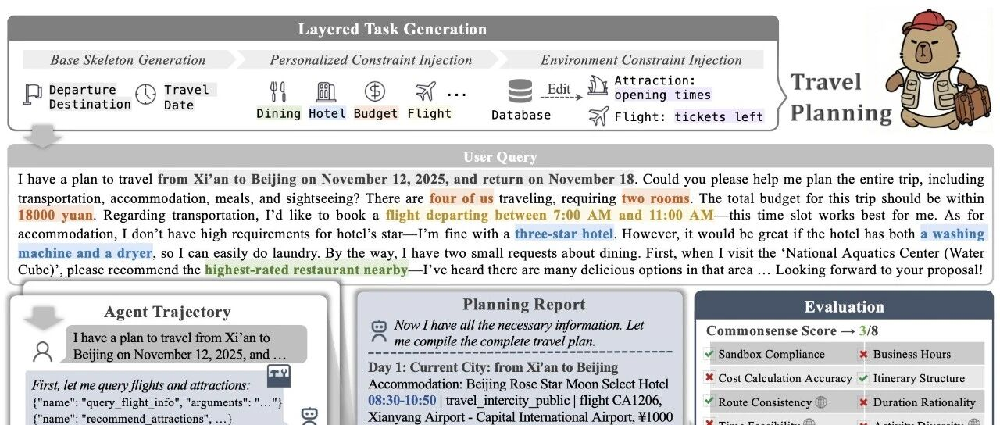
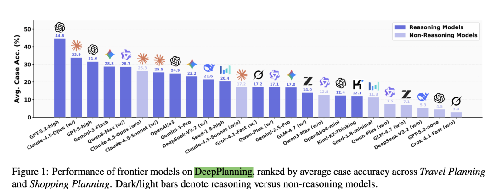
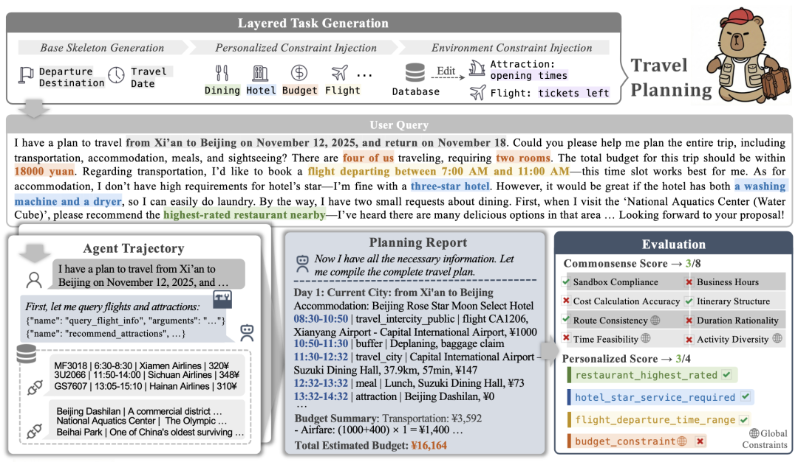
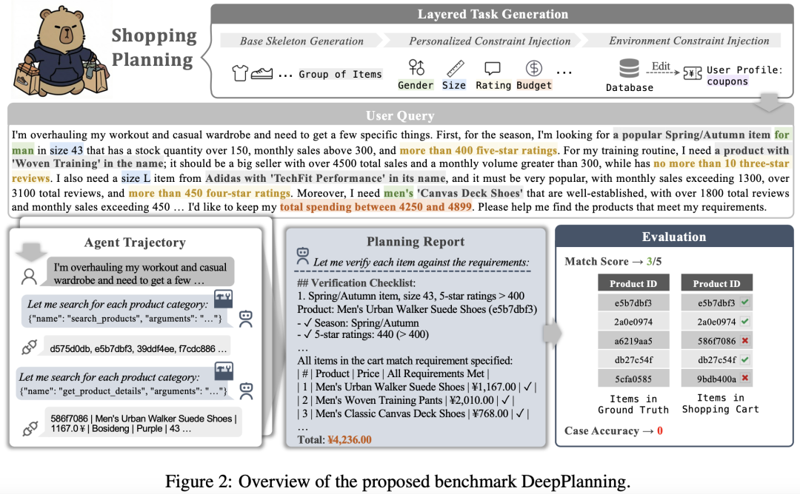
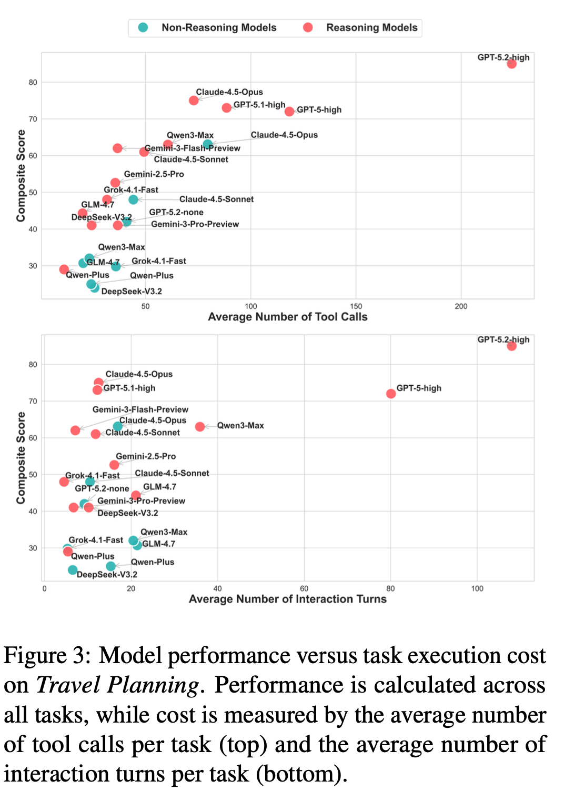
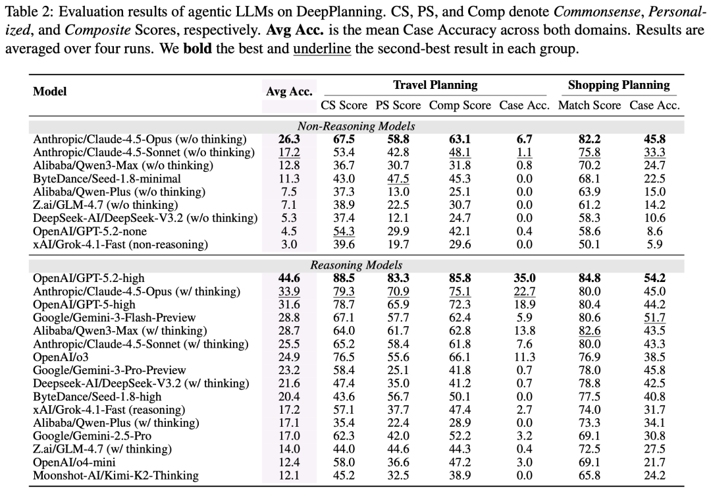

#  Qwen推出DeepPlanning Benchmark：Agent真正搞定购物和旅行规划了吗？

原创 NLP PaperWeekly NLP PaperWeekly [ NLP PaperWeekly ](javascript:void\(0\);)

______

在小说阅读器中沉浸阅读

大家好，我是HxShine，前段时间Qwen推出C端应用，跑通购物，外卖，旅行，支付等场景，但是Agent离真正跑通这些任务还差多远呢？Qwen团队推出DEEPPLANNING Benchmark进行了详细评测，来看看细节吧～

随着大模型Agent的发展，评估重点已从简单的工具调用转向复杂的、用户为中心的**长程任务** 。然而，现有的Benchmark往往局限于**单步推理，**忽略了现实世界中常见的** 全局约束优化**（如总预算、总时间限制）以及**主动信息获取** 的需求。本文推出了**DEEPPLANNING** ，针对实际长程智能体规划的挑战性基准。它包含**多日旅行规划** 和**多商品购物** 两大场景。该基准通过构建**基于数据库的沙盒环境** ，要求Agent必须具备主动**信息搜索、局部约束推理和全局约束优化** 三大能力。  
评测结果令人惊讶：即使是文中提到的前沿模型（如GPT-5.2, Claude-4.5-Opus等），在面对这些**复杂约束时也表现挣扎** 。文章还发现，可靠的显式推理模式（Reasoning/Thinking mode）和**并行的工具调用策略对于提升规划的有效性和效率至关重要** 。

## 一、概述

  * • **Title:** DEEPPLANNING: Benchmarking Long-Horizon Agentic Planning with Verifiable Constraints
  * • **URL:** https://www.arxiv.org/abs/2601.18137
  * • **Authors:** Yinger Zhang, Shutong Jiang, Renhao Li, Jianhong Tu, Yang Su, Lianghao Deng, Xudong Guo, Chenxu Lv, **Junyang Lin**
  * • **Institution:** Qwen Team, Alibaba Group
  * • **Code:** https://qwenlm.github.io/Qwen-Agent/en/benchmarks/deepplanning/

### 1 Motivation

  * • **现有评测缺乏全局视角：** 目前的Agent评测主要强调局部的、单步的约束推理（例如根据设施过滤酒店），而忽略了实际场景中需要对整个解决方案空间进行限制的全局约束优化（例如**总时间预算、累计财务成本、子任务间的依赖关系** ）。
  * • **信息获取过程被过度简化：** 现有的规划任务通常抽象掉了复杂的信息获取过程。而在现实的长程任务（如多日旅行或多商品购物）中，Agent需要主动从环境中**搜集必要的状态信息，而不是仅仅基于给定的上下文进行规划** 。
  * • **缺乏可靠的综合规划衡量标准：** 社区缺乏能够同时评估Agent在**主动信息获取、细粒度局部约束推理以及全局约束优化** 这三方面能力的综合性基准。

### 2 Methods

**DeepPlanning** 是一个包含“**旅行规划** ”和“**购物规划** ”两个领域的基准测试。其核心在于通过**逆向生成** 的方法构建任务：先**基于数据库生成唯一最优解（Golden Solution）** ，再**反推用户Query和约束条件** ，从而保证任务的可解性和答案的唯一性。评测不依赖LLM打分，而是使用**基于代码的沙盒验证** ，确保评估的准确性和可复现性。

#### 详细方法和步骤:

**1 基准构建流程 (Three-stage Data Construction Pipeline):**

  * • **阶段1：数据库与工具箱设计 (Database and Toolbox Design):**
    * • **旅行规划 (Travel Planning):** 使用真实世界数据（如飞猪、高德地图等API抓取的数据），涵盖交通、住宿、餐饮、景点等，构建7个子数据库和9个专用API。
    * • **购物规划 (Shopping Planning):** 合成细粒度的商品数据（如价格、库存、销量、优惠券规则等），构建3个子数据库和15个API。
  * • **阶段2：分层任务生成 (Layered Task Generation):** 采用“以解为中心”的逆向生成过程。image-20260131095415270
    * • 基础骨架生成： 从数据库中随机选取基础骨架（如出发地、目的地、商品主题）。
    * • 个性化约束注入： 注入用户偏好（如“评分最高的餐厅”、“必须有洗烘一体机”）。
    * • 环境约束注入： 注入隐式环境限制（如“某景点周一闭馆”、“优惠券叠加规则”）。通过调整数据库中的候选项，确保**存在且仅存在一个** 满足所有约束的最优解。
    * • 最终使用LLM将结构化约束转化为自然语言的用户Query。
  * • **阶段3：人工质量控制 (Manual Quality Control):** 专家审核并修改LLM生成的Query，确保语言自然、逻辑清晰且解可达。

**2 核心考察的三种能力:**

  * • **主动信息获取 (Proactive Information Acquisition):** Agent必须通过API主动发现关键环境状态（如跨城市交通的具体时刻、商品是否符合隐性要求），而非单纯依赖Prompt中的信息。
  * • **局部约束推理 (Local Constrained Reasoning):** 处理显式（用户提出）和隐式（环境隐含）的局部限制。
  * • **全局约束优化 (Global Constrained Optimization):** 在整体方案层面满足约束。例如旅行中的时间不重叠、空间连贯、总预算控制；购物中的优惠券组合最优解以达到总价最低。

**3 评测指标 (Task Evaluation):** 不使用LLM打分，全自动代码验证。因为有Ground Truth。

  * • **旅行规划:**
    * • Commonsense Score: 评估方案的**可行性** （如**路线连贯性、时间可行性、营业时间合规等21个检查点** ）。
    * • Personalized Score: 用户**特定需求** 是否满足。
    * • Case Accuracy: 只有当Commonsense和Personalized分数均为满分时，该Case才算通过（1分），否则为0分。
  * • **购物规划:**
    * • Match Score: 购物车中**选对商品的比例** 。
    * • Case Accuracy: 购物车商品与**Ground Truth完全一致才算通过** 。

### 3 Conclusion

  * • **现有顶级模型表现依然比较差：** 即便是GPT-5.2-high、Claude-4.5-Opus等头部模型，在DeepPlanning上的Case Accuracy依然很低（最高仅约35%）。模型往往在满足大部分单独要求的同时，因为一个致命的**全局错误（如超预算、时间冲突）**导致整个计划失败。

  * • **推理能力至关重要：** 具备内部推理（Reasoning/Thinking）能力的模型在各项指标上均优于非推理模型。推理过程有助于减少冗余试错，提高工具调用的质量。
  * • **交互模式的影响：** 并行工具调用（Parallel Tool Use）能显著提升效率，但也带来了准确性的挑战；顺序执行虽然慢但有助于验证。

### 4 Limitation

  * • **领域局限性：** 目前仅限于**旅行和购物** 两个领域，虽然经典，但若能包含更多现实场景会更全面。
  * • **Query分布偏移：** 虽然数据基于真实世界或高保真合成，但**用户Query是通过多层约束合成生成的，可能与真实用户的自然提问分布存在一定偏差。**
  * • **单轮规划限制：** 目前关注的是单轮、多步的规划任务，尚**未涉及多轮用户-智能体交互（Multi-turn interaction）的建模** 。

## 二、详细内容

### 1 整体框架：shopping场景

  * • **数据合成流程（看着和tau-bench比较像）：**
    1. 1\. **分层任务生成 (Layered Task Generation):** 从基础骨架到个性化约束，再到环境约束，最后生成用户Query。
    2. 2\. **智能体执行:** Agent接收Query，调用工具（如搜索航班、查询商品），生成规划报告（Trajectory）。
    3. 3\. **评估 (Evaluation):** 系统将Agent生成的计划与预设的规则和Ground Truth进行比对，计算常识分、个性化分和最终准确率。

### 2 模型性能与执行成本（平均工具调用次数、交互轮数）的关系（旅行规划任务）

  * • **结论1: 更多工具调用带来更高性能：** 总体趋势显示，工具调用次数越多的模型，得分越高。这说明长程规划极度依赖主动的信息获取。
  * • **结论2: 推理模式对提升性能非常重要：** 推理模型（Thinking Models）位于曲线的左上方（更优区域），**在相同的交互成本下能获得更高的分数，或者以更低的成本达到相同的效果。**

###  3 任务复杂度提升（如旅行天数增加、购物约束等级提高），模型性能的变化趋势

  * • **结论：** 随着复杂度增加性能都显著下降。特别是在旅行规划中，随着行程天数从2天增加到7天，Case Accuracy急剧下滑，说明**长程规划中的累积误差和状态空间爆炸是当前LLM的主要瓶颈。**

###  4 失败案例错误模式分析

  * • **A类：信息获取失败 :** 如未搜索必要信息、工具使用错误，在Travel上错误比例也比较高。
  * • **B类：局部推理失败 :** 如违反显式或隐式约束，错误相对少一点。
  * • **C类：全局优化失败 :** 指**无法在全局范围内平衡预算、时间和空间约束。** 错误占比非常高，在旅行任务中最为普遍（101例），

### 5 各大模型的详细评测结果（包括GPT-5系列, Claude-4.5系列, Qwen3系列等）

  * • **总结：** 即使是最强的模型，在严格的Case Accuracy指标下，通过率也非常低（Travel < 35%, Shopping < 55%）。

## 三、总结

**结论1: 当前最顶尖的Agent还不能完全搞定旅行和购物，成功率还没那么好。** 长程规划是Agent的“阿喀琉斯之踵”，即使是GPT-5.2，也无法可靠地完成多日旅行规划，往往因为顾此失彼导致全局方案不可行。

**结论2: “显式推理”与“主动搜索”是破局关键。** 单纯依靠参数知识是不够的。模型必须具备主动调用工具去“看”环境状态的能力（Proactive Information Acquisition），并且需要通过类似于Chain-of-Thought的显式推理过程来规划步骤和验证中间结果，才能在长程任务中提升成功率。

**结论3: 评测基准需向“可验证的复杂性”进化。** 传统的基于文本相似度或LLM打分的评测已不足以衡量Agent的规划能力。DeepPlanning提出的基于数据库逆向生成任务、并使用代码进行确定性验证的方法，为未来Agent Benchmarking提供了一个非常高价值的范式——既保证了任务的真实复杂性，又确保了评估的客观准确性。
    
    
    👇关注公众号**NLP PaperWeekly** ，对话框输入“**Agent** ”，即可获取更多相关资料👇  
    
    
    
    进技术交流请添加我微信（FlyShines)
    
    请备注昵称+公司/学校+研究方向，否则不予通过

© THE END 

转载请联系本公众号获得授权

投稿或寻求报道：hxshineuestc@gmail.com

预览时标签不可点

作者提示: 内容由AI生成

微信扫一扫  
关注该公众号

继续滑动看下一个

轻触阅读原文

NLP PaperWeekly 

向上滑动看下一个

[知道了](javascript:;)

微信扫一扫  
使用小程序

****

[取消](javascript:void\(0\);) [允许](javascript:void\(0\);)

****

[取消](javascript:void\(0\);) [允许](javascript:void\(0\);)

****

[取消](javascript:void\(0\);) [允许](javascript:void\(0\);)

× 分析

__

微信扫一扫可打开此内容，  
使用完整服务

： ， ， ， ， ， ， ， ， ， ， ， ， 。 视频 小程序 赞 ，轻点两下取消赞 在看 ，轻点两下取消在看 分享 留言 收藏 听过
