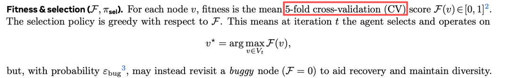
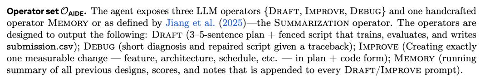
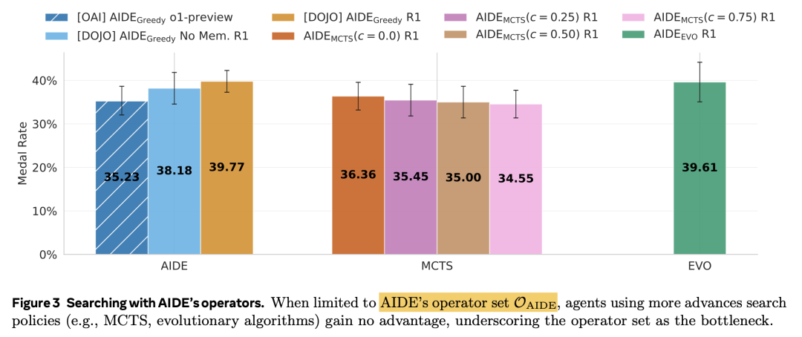
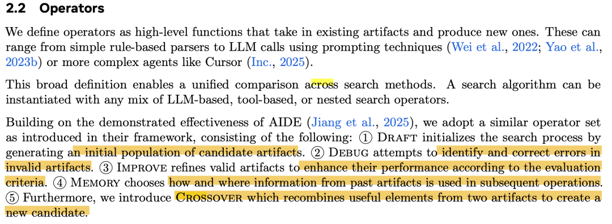
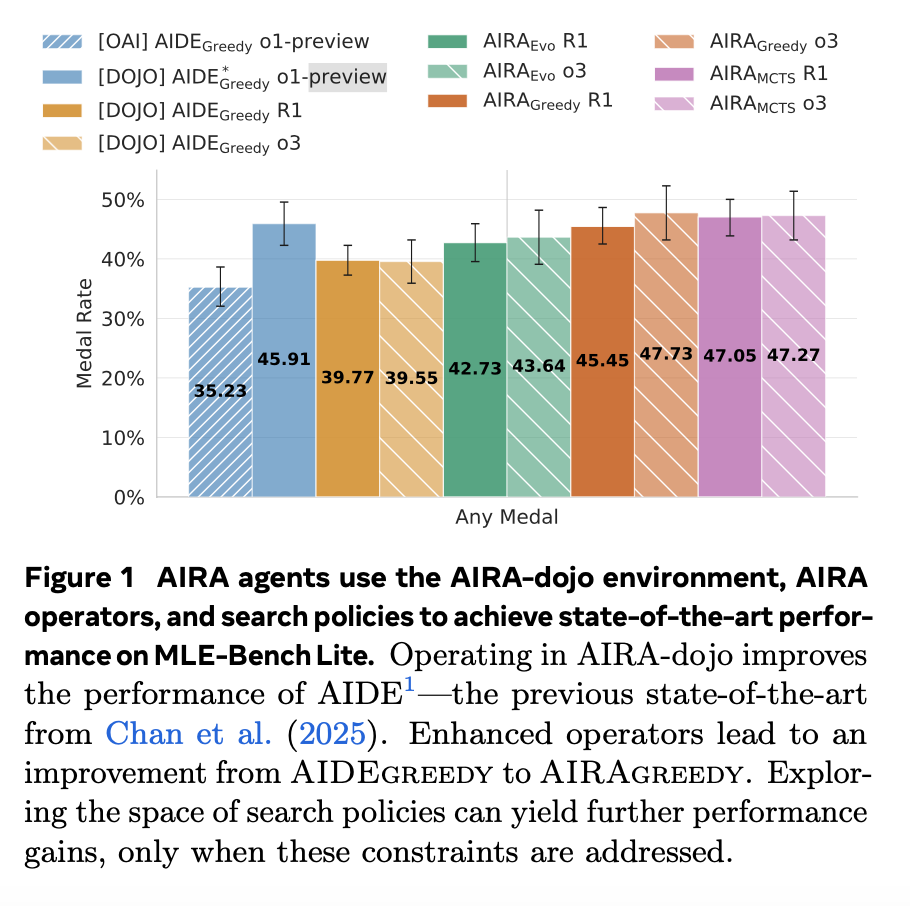
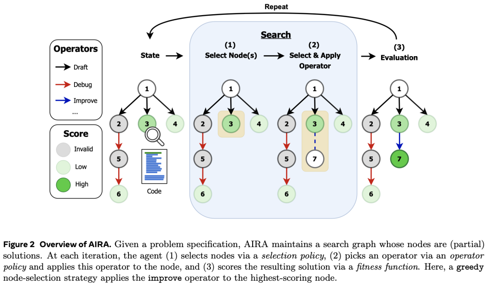
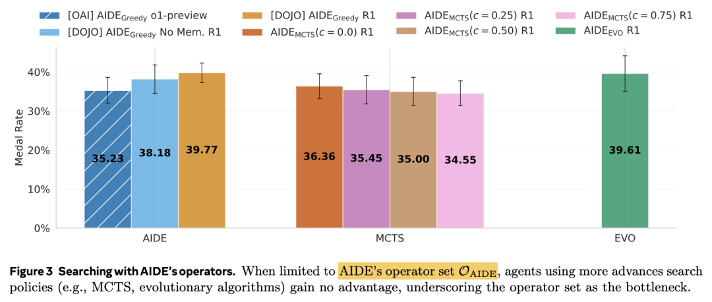
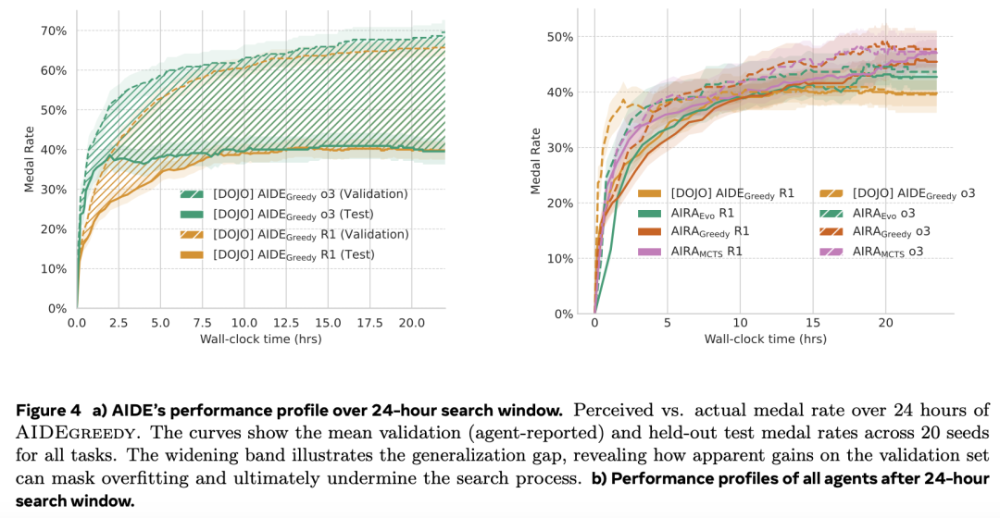
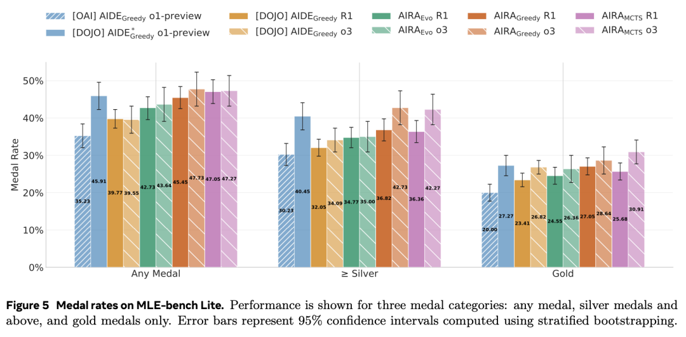
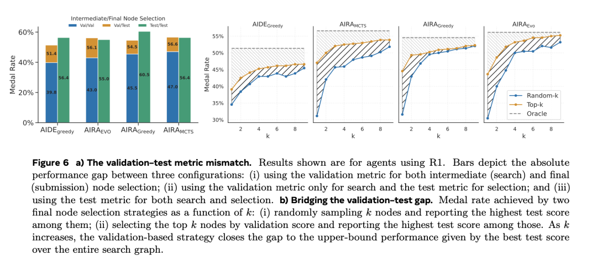

#  SOTA诞生！Meta发布AIRA-dojo框架，AI智能体Kaggle竞赛奖牌率提升至47.7%

原创 NLP PaperWeekly NLP PaperWeekly [ NLP PaperWeekly ](javascript:void\(0\);)

______

在小说阅读器中沉浸阅读

大家好，我是HxShine

今天分享一篇来自Meta FAIR、伦敦大学学院（UCL）和厄勒布鲁大学的研究人员共同发表的文章，**Title: Al Research Agents for Machine Learning: Search, Exploration, and Generalization in MLE-bench** (面向机器学习的AI科研智能体：在MLE-bench中的搜索、探索与泛化)。

这篇文章深入探讨了如何提升AI科研智能体在解决现实世界机器学习问题（**利用LLM来打Kaggle竞赛!!!** ）上的性能。研究团队将AI智能体形式化为一个搜索过程，并系统性地解构了影响其性能的两大核心要素：**搜索策略** （Search Policies）和**算子集** （Operator Sets）。通过在自研的`AIRA-dojo`框架下进行大量受控实验，文章证明了**算子集是当前先进方法的性能瓶颈** ，并基于此设计了**更强大的算子和搜索策略组合** ，在MLE-bench基准上取得了新的SOTA（State-of-the-Art）成果（拿奖牌的概率提升到接近50%）。

该方法的核心思想在于：

  1. 1\. **解耦与分析** ：将智能体设计分解为独立的**“搜索策略”**和** “算子”**组件，从而可以** 独立评估和优化每个部分，找出真正的性能瓶颈**。
  2. 2\. **算子增强** ：基于分析结果，设计了一套新的、更强大的算子（Operators），包括**动态调整复杂度的提示、范围更精确的记忆（Scoped Memory）**等，以提升智能体生成解决方案的质量和多样性。
  3. 3\. **系统性评估** ：开发了一个名为`AIRA-dojo`的可扩展、可定制的实验框架，用于**在隔离和可复现的环境中对AI科研智能体进行严谨的科学研究** 。
  4. 4\. **泛化差距分析** ：深入研究了验证集分数与测试集分数之间的 **“泛化差距”（Generalization Gap）** ，并揭示了**过拟合是限制智能体性能的一个根本性问题** 。

## 一、概述

  * • **Title:** Al Research Agents for Machine Learning: Search, Exploration, and Generalization in MLE-bench
  * • **URL:** https://arxiv.org/abs/2507.02554
  * • **Authors:** Edan Toledo, Karen Hambardzumyan, Martin Josifoski, Rishi Hazra, et al.
  * • **Code:** https://github.com/facebookresearch/aira-dojo

### 1 Motivation

  * • **性能瓶颈不明确(难以真正找到可以优化的点)** ：现有的AI科研智能体设计**将多个性能因素（如算法设计、具体实现、算力利用）纠缠在一起** ，导致很难通过**受控实验精确地定位性能提升的来源或瓶颈** 所在。
  * • **搜索与算子的相互作用被忽略** ：智能体的表现**高度依赖于其搜索策略（如贪心、蒙特卡洛树搜索）**和用于** 修改解决方案的算子（如生成初稿、调试、改进代码）之**间的相互作用。然而，这种相互作用并未得到充分研究。
  * • **评估方法不严谨（类似的kaggle竞赛很多时候要解决测试集和验证集分布不一致的问题）** ：AI智能体在机器学习任务中的一个关键挑战是验证集和测试集之间的性能差异，即泛化差距。现有方法可能在验证集上表现良好，但在最终的测试集上性能下降，这种**过拟合问题需要被更深入地研究和量化** 。

### 2 Methods

**核心框架** ：论文将AI科研智能体建模为一个**在“解决方案空间”中进行搜索的图搜索算法。智能体从一个初始节点（空的或初始的解决方案）出发，通过迭代执行以下三步来探索和优化解决方案** ：

image-20251018002519153

  1. 1\. **选择节点 (Select Node)** ：根据**搜索策略** （如贪心选择最高分节点），从**图中选择一个或多个最有潜力的节点** 。

image-20251018003315554

  1. 2\. **应用算子 (Apply Operator)** ：选择一个**算子** （如**DRAFT、` IMPROVE`、`DEBUG`**）并**应用于所选节点，生成一个新的解决方案（即新节点）** 。

image-20251018003240080

  1. 3\. **评估 (Evaluation)** ：执行新节点的代码，通过一个**适应度函数** （如5折交叉验证得分）来**评估其质量，并将新节点及其得分添加到图中。**

**关键改进** ：

  1. 1\. **构建` AIRA-dojo`环境**：这是一个专为AI科研智能体设计的**沙盒环境，提供代码执行、资源隔离（每个智能体在独立的容器中运行）和可复现的基准测试能力** 。
  2. 2\. **设计新算子集` O_AIRA`**：针对现有算子集的瓶颈，设计了新的算子。关键改进包括：
     * • **提示自适应复杂度** ：根据一个节点的**子节点数量，动态调整生成新方案的复杂度要求（简单、中等、高级）** ，避免早期过度设计。
     * • **作用域记忆（Scoped Memory）** ：`DRAFT`和`IMPROVE`算子**只参考兄弟节点的记忆，以促进多样性** ；而`DEBUG`算子则查看**整个祖先链的调试历史，避免重复犯错。**
     * • **思考Token（Think Tokens）** ：鼓励LLM在**生成最终代码前进行结构化的思考和推理** ，这部分思考过程不被其他算子看到，提升了生成质量。
  3. 3\. **探索不同搜索策略** ：在新的算子集基础上，系统地比较了三种搜索策略：
     * • **Greedy（贪心）** ：总是选**择当前验证分数最高的节点进行改进。**
     * • **MCTS（蒙特卡洛树搜索）** ：平衡了“利用”（exploitation，选择高分区域）和“探索”（exploration，**探索未充分尝试的分支** ）。
     * • **Evolutionary（演化）** ：维护一个**解决方案群体，通过选择、交叉和变异来产生新的后代。**

通过这些方法，论文系统性地评估了不同“算子集”和“搜索策略”的组合，找到了性能更优的AI智能体设计。

### 3 关键QA

#### Q1: 为什么Operator Set（算子集）是最重要的瓶颈？

简单来说，**因为算子集决定了AI智能体“思想”的广度和深度** 。

我们可以用一个比喻来理解：

  * • **搜索策略 (Search Policy)** ：就像一个项目**经理** 。他的职责是决策，比如“我们现在应该优化方案A还是方案B？”（对应贪心、MCTS等策略）。
  * • **算子集 (Operator Set)** ：就像**工程师团队** 。他们是真正动手干活的人，负责“如何把方案A变得更好？”或者“方案C出错了，怎么修复？”。

论文的核心发现是：如果你只给项目经理（搜索策略）换上更聪明的**决策（选择）方法** （从“贪心”换成更复杂的“MCTS”），但**工程师团队（算子集）的能力不变，整个项目的产出（最终性能）并不会提高** 。

image-20251020100425294

这是因为**工程师团队（算子）的能力上限，决定了整个项目可能达到的高度** 。如果你的工程师只会用砖块和水泥，那么无论经理的蓝图多么宏伟，最终也只能建出平房，永远造不出摩天大楼。

在AI智能体的世界里：

  * • **一个弱的算子集** ：只能对现有代码**做一些微小、重复性的修改。它无法提出真正有创意的新想法，也可能反复陷入同一种错误。**这导致搜索空间非常局限，即使是最高明的搜索策略，也只能在这个小圈子里打转，找不到突破口。
  * • **一个强的算子集** ：能够根据当前情况，**提出从“简单”到“高级”的不同复杂度的方案，能够从历史中吸取教训，甚至能融合不同方案的优点。这极大地扩展了可探索的解决方案空间，让更聪明的搜索策略（如MCTS）有了用武之地，去发现那些隐藏在未知角落里的更优解** 。

因此，论文得出结论：**提升工程师团队（算子集）的能力，是打破当前AI科研智能体性能瓶颈的首要任务。**

* * *

####  Q2: 为什么设计这五个算子？它们分别对应什么作用？

这套算子的设计，本质上是在**模仿人类数据科学家解决一个复杂问题的完整工作流** 。一个人类专家在打Kaggle竞赛时，通常会经历以下几个阶段，而每个算子正是对其中一个关键阶段的模拟和自动化。

image-20251020142820422

下面我们逐一解析每个部分的作用：

##### 1\. DRAFT (起草)

  * • **核心作用** ：**从零到一，生成一个完整的、可执行的初始解决方案。**
  * • **人类工作流对应** ：这是数据科学家拿到任务后的第一步——**构建一个基线模型（Baseline）** 。他会根据任务描述、数据格式等信息，快速搭建一个简单但完整的流程，比如“数据清洗 -> 简单特征工程 -> LightGBM模型训练 -> 提交结果”。
  * • **在搜索过程中的角色** ：`DRAFT`算子负责在搜索树的根节点或空旷区域**播下种子** 。没有它，搜索就无从开始。它是**“创世纪”的算子**。
  * • **本文的改进 (` AIRA`版)**：传统的`DRAFT`可能一上来就想搞个大新闻，设计得过于复杂。`AIRA`引入了**动态复杂度** ：在搜索初期，会提示LLM“提出一个简单有效的基线”，避免过早陷入过度工程；随着探索深入，再逐步提升复杂度。

##### 2\. DEBUG (调试)

  * • **核心作用** ：**修复一个无法正常运行或报错的解决方案。**
  * • **人类工作流对应** ：代码写完后，第一次运行往往会报错。这时数据科学家会根据错误信息（Traceback）去**定位并修复Bug** ，比如“库没导入”、“数据维度不匹配”、“API用法错误”等。
  * • **在搜索过程中的角色** ：`DEBUG`是**质量保证** 和**路径修复** 的算子。当一个新生成的方案（节点）因为**代码错误而无法评估（得分为0）时** ，`DEBUG`就会被激活，尝试将其修复成一个可运行的方案，让这条探索路径能够继续下去。
  * • **本文的改进 (` AIRA`版)**：为了避免在一个Bug上反复修改（例如，改了A引入了B，修复B又回到A），`AIRA`的`DEBUG`算子在工作时，会参考**整个祖先链条上的所有历史调试记录** 。这让它知道“这条路之前试过了，行不通”，从而更有效地找到正确的修复方法。

##### 3\. IMPROVE (改进)

  * • **核心作用** ：**对一个已经可以正常运行的解决方案进行优化，提升其性能得分。**
  * • **人类工作流对应** ：基线模型跑通之后，数据科学家的绝大部分时间都花在**迭代优化** 上。他会尝试各种策略来提升模型分数，比如**“换个更强大的模型”、“做一些更精细的特征工程”、“调整超参数”、“使用数据增强”**等。
  * • **在搜索过程中的角色** ：`IMPROVE`是**推动性能提升的核心驱动力** 。它是“精益求精”的算子，负责在搜索树上不断地将有潜力的节点向上推进，探索性能的极限。
  * • **本文的改进 (` AIRA`版)**：同样引入了**动态复杂度** 。如果一个方案已经被**`IMPROVE`了很多次（子节点很多），`AIRA`会提示LLM“提出一个更高级的、实质性的改进”，而不是小修小补，鼓励智能体进行更大胆的探索**。

##### 4\. MEMORY (记忆)

  * • **核心作用** ：**为其他算子提供历史上下文信息。** 它本身不直接创造新方案，而是作为一种**支持功能** 。
  * • **人类工作流对应** ：一个优秀的数据科学家会**做实验笔记** 。他会记录下“尝试了A方法，分数是0.85，优点是...，缺点是...”、“B方法因为内存溢出失败了”。在下一次迭代时，他会回顾这些笔记，以避免重复失败的尝试，并从成功的经验中获得启发。
  * • **在搜索过程中的角色** ：`MEMORY`是智能体的**“大脑”和“知识库”**。它将过去所有节点的摘要信息（**设计思路、分数、成功或失败的原因** ）整理好，注入到提示（Prompt）中，供`DRAFT`、`IMPROVE`、`DEBUG`等算子参考。
  * • **本文的改进 (` AIRA`版)**：最大的创新是**作用域记忆 (Scoped Memory)** 。
    * • 对于`IMPROVE`和`DRAFT`，只提供**兄弟节点** 的记忆。这好比一个团队里的两个工程师，A去优化方案时，主要参考和自己平级的B、C、D的方案，这样可以激发更多样化的思路，避免所有人都挤在一个方向上内卷。
    * • 对于`DEBUG`，则提供**祖先节点** 的记忆，帮助它理解错误的来龙去脉。

##### 5\. CROSSOVER (交叉) - 论文中新增的算子

  * • **核心作用** ：**融合两个不同父节点的优点，创造一个全新的子节点。**
  * • **人类工作流对应** ：这对应着更高级的**“集思广益”**。比如，数据科学家发现方案** A的特征工程很巧妙，方案B的模型结构很新颖，他可能会尝试将两者结合起来，创造一个“方案C”，**期望能集两家之所长。
  * • **在搜索过程中的角色** ：`CROSSOVER`是**促进全局探索和跳出局部最优** 的强大工具。它在**演化（Evolutionary）搜索策略中是核心算子** ，能够连接搜索树中两个不相关的分支，创造出全新的、有潜力的解决方案。

综上所述，这五个算子构成了一个分工明确、互相协作的“工程师团队”，系统地模拟了**从创意萌发、落地实现、调试修复到迭代优化和集思广益的全过程** ，为AI智能体提供了强大而全面的问题解决能力。

### 4 Conclusion

  * • **算子集是性能瓶颈** ：研究发现，对于之前的SOTA方法（AIDE），其性能瓶颈在于算子集的能力，而非搜索策略。即使换用更复杂的MCTS或演化算法，性能也几乎没有提升。

image-20251020100425294

  * • **新算子与新策略结合效果显著** ：论文提出的新算子集`O_AIRA`显著优于基线。当与先进的搜索策略（特别是MCTS）结合时，`AIRA-MCTS`智能体在MLE-bench lite基准上取得了新的SOTA成绩，将Kaggle竞赛的奖牌成功率从39.6%提升至47.7%。

image-20251020112624277

  * • **泛化差距是普遍且严重的问题** ：所有智能体都表现出系统性的过拟合。验证集上的分数持续提升，但测试集上的真实性能很早就达到瓶颈甚至下降。如果能用测试集分数来指导搜索（作为理想上限），性能可以提升9%到13%（绝对值），这表明了改进最终方案选择策略的巨大潜力。

image-20251020112754194

### 5 Limitation

  * • **算子能力依赖于LLM** ：实验中使用的算子是基于LLM的。算子的有效性受限于底层LLM的能力。更复杂的、本身就是智能体的“智能体算子”可能会带来更好的效果，但这在本文中未作探索。
  * • **LLM微调的潜力未开发** ：本文没有对LLM进行微调。未来的工作可以通过监督微调或强化学习来增强算子的效果。
  * • **计算资源限制** ：为了与基准保持一致，实验限制在24小时和单个GPU内。解决更复杂的问题可能需要更长的运行时间和更多的资源，智能体在这些条件下的扩展性行为有待研究。
  * • **数据污染风险** ：和许多LLM研究一样，实验结果可能受到LLM训练数据中包含Kaggle任务相关信息的影响。

## 二、详细内容

### 1 AIRA智能体在MLE-Bench Lite上达到SOTA性能

image-20251018002417978

  * • **蓝色柱子(虚线)** 代表基线AIDE的性能。
  * • **蓝色柱子（实线）** 显示了在本文搭建的`AIRA-dojo`环境中复现AIDE，性能有显著提升（从35.2%到45.9%），说明了实验环境的重要性。
  * • **绿色和紫色系柱子** 展示了使用新的`AIRA`算子和不同搜索策略（Greedy, MCTS, Evolutionary）后的性能，均优于AIDE的算子。其中`AIRA-MCTS` (`R1`模型) 达到了47.7%的最高奖牌率。

**总结** ：此图清晰地展示了本文的贡献来自三个层面：**更好的环境** (`AIRA-dojo`)、**更强的算子** (`AIRA Operators`) 和 **更优的搜索策略** (`MCTS`, `Evo`)能持续提升效果。

### 2 AIRA框架概览

image-20251018002519153

  * • **核心** ：智能体维护一个搜索图，**每个节点是一个（部分）解决方案。**
  * • **步骤** ：迭代过程包括：(1) **选择节点** （例如，贪心策略选择分数最高的绿色节点）；(2) **选择并应用算子** （例如，应用`Improve`算子, Debug算子，Draft算子等）；(3) **评估** 新生成的节点，**并根据其分数（高、中、低）更新图。**

**总结** ：此图将AI科研智能体的工作流程形式化为一个清晰的、由“状态-选择-操作-评估”组成的循环搜索过程。

### 3 直接使用AIDE算子进行搜索会遇到性能瓶颈

此图旨在验证“算子集是瓶颈”这一核心假设。

image-20251018002719188

  * • **左侧 (AIDE)** ：是基准的贪心搜索策略。
  * • **中间 (MCTS)** ：将AIDE的算子与MCTS搜索策略结合。
  * • **右侧 (EVO)** ：将AIDE的算子与演化搜索策略结合。

结果显示，无论MCTS的探索参数`c`如何设置，其奖牌率（约35%）与贪心策略相比都没有显著提升。EVO策略也同样没有带来优势。

**总结** ：此图有力地证明了，当算子能力不足时，再高级的搜索策略也无法提升性能。这为后续改进算子集提供了明确的动机。

### 4 性能曲线与泛化差距（竞赛会非常考察测试集和验证集分布的不一致性）

这张图包含两个子图，展示了智能体在24小时内的动态性能。

image-20251018002846772

  * • **(a) AIDE的性能曲线** ：虚线是智能体在验证集上看到的奖牌率，它随时间持续上升。实线是其在测试集上的真实奖牌率，在约10小时后就已饱和，甚至略有下降。两条线之间的差距就是**泛化差距** 。
  * • **(b) 所有智能体的性能曲线** ：展示了所有不同AIRA智能体在24小时内的真实（测试集）性能演变。

**总结** ：此图揭示了过拟合是AI科研智能体面临的严重问题。智能体以为自己一直在进步（验证分变高），但实际上早已陷入了对验证集的过拟合，真实能力不再提升。

### 5 在MLE-bench Lite上的详细奖牌率

这张图是核心实验结果的详细展示，比较了所有智能体在三种奖牌等级（任意奖牌、银牌及以上、金牌）上的表现。

image-20251018002932587

  * • **结论1** : 所有使用`AIRA`算子（`AIRAGreedy`, `AIRAMCTS`, `AIRAEVO`）的智能体在“任意奖牌”指标上都全面超越了使用`AIDE`算子的智能体。
  * • **结论2** : 在`R1`模型上，`AIRA-MCTS`在综合奖牌率上表现最好。在`o3`模型上，`AIRA-MCTS`和`AIRA-Greedy`表现相当，但在金牌率上`AIRA-MCTS`更高。

**总结** ：这张图从多个维度证实了本文提出的新算子和搜索策略的优越性，并展示了不同模型（R1, o3）和策略之间的细微差异。

### 6 验证-测试指标不匹配分析

这张图深入探究了泛化差距的来源和弥补方法。

image-20251018003017852

  * • **(a) 验证-测试不匹配的影响** ：
    * • **Val/Val (蓝色)** ：标准做法，搜索和最终提交都用验证分，这是基线性能。
    * • **Val/Test (橙色)** ：搜索用验证分，但最终提交时“作弊”选测试分最高的。性能大幅提升。
    * • **Test/Test (绿色)** ：搜索和提交都“作弊”用测试分，这是性能的理论上限。
  * • **(b) 通过提交多个候选项弥补差距** ：横轴`k`表示从验证分最高的候选中选出`k`个，然后提交其中测试分最好的一个。结果显示，即使只选`k=3`个候选，性能也能获得显著提升。

**总结** ：此图量化了泛化差距的影响，并指出大部分性能损失发生在**最终节点选择** 阶段。同时，它提出了一个简单有效的策略来缓解这个问题：提交多个排名靠前的解决方案。

## 三、总结

**总结1: 算子集才是性能提升的瓶颈（再好的搜索算法还是依赖算子集的能力）** ：首次将AI智能体明确解耦为“搜索策略”和“算子集”，并用实验证明了后者是当前技术的瓶颈。

**总结2: 提出了有效的` AIRA-dojo`框架框架解决环境，资源等问题，方便进行大规模试验**：`AIRA-dojo`框架为社区提供了一个强大、可复现的AI智能体研究平台。它解决了环境隔离、资源控制等工程难题，使得进行大规模、严谨的智能体研究成为可能。

**总结3:` AIRA-dojo`框架在MLE-Bench取得了SOTA性能**：通过改进算子和结合先进搜索策略，论文中的`AIRA-MCTS`智能体在具有挑战性的MLE-bench上取得了当前最佳性能，证明了其方法的有效性。

**总结4: 过拟合问题要千万小心，模型刷榜可能很快过拟合** ：论文不仅指出了AI智能体存在严重的过拟合问题，还通过实验量化了泛化差距的巨大影响，并提出了实用的缓解策略（提交top-k方案）。这对所有从事自动化机器学习和科学发现的研究者都是一个重要的提醒。
    
    
    👇关注公众号**NLP PaperWeekly** ，对话框输入“**Agent** ”，即可获取更多相关资料👇  
    
    
    
    进技术交流请添加我微信（FlyShines)
    
    请备注昵称+公司/学校+研究方向，否则不予通过

© THE END 

转载请联系本公众号获得授权

投稿或寻求报道：hxshineuestc@gmail.com

  

预览时标签不可点

微信扫一扫  
关注该公众号

继续滑动看下一个

轻触阅读原文

NLP PaperWeekly 

向上滑动看下一个

[知道了](javascript:;)

微信扫一扫  
使用小程序

****

[取消](javascript:void\(0\);) [允许](javascript:void\(0\);)

****

[取消](javascript:void\(0\);) [允许](javascript:void\(0\);)

****

[取消](javascript:void\(0\);) [允许](javascript:void\(0\);)

× 分析

__

微信扫一扫可打开此内容，  
使用完整服务

： ， ， ， ， ， ， ， ， ， ， ， ， 。 视频 小程序 赞 ，轻点两下取消赞 在看 ，轻点两下取消在看 分享 留言 收藏 听过
