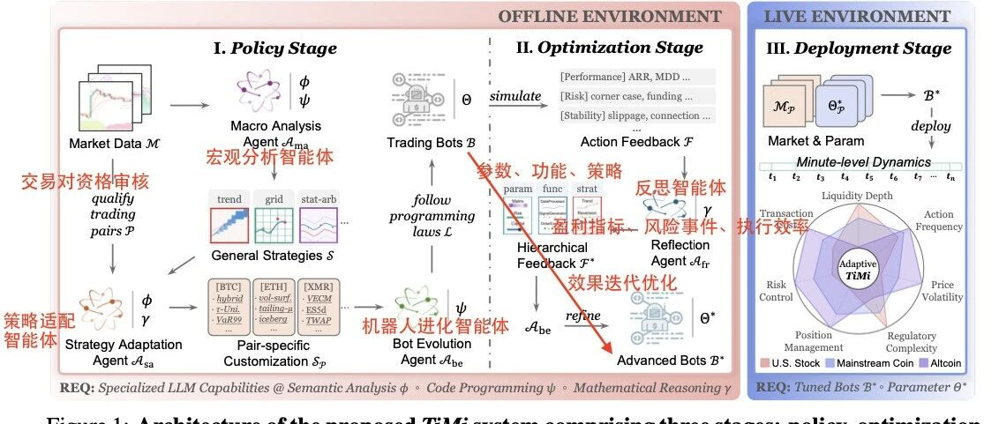
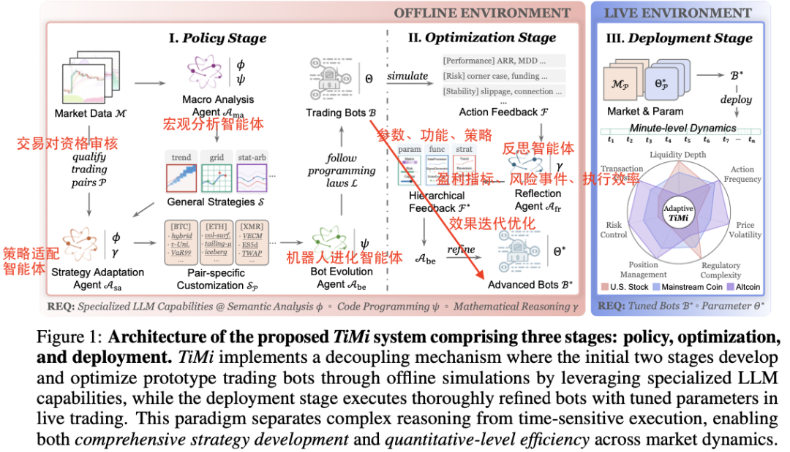
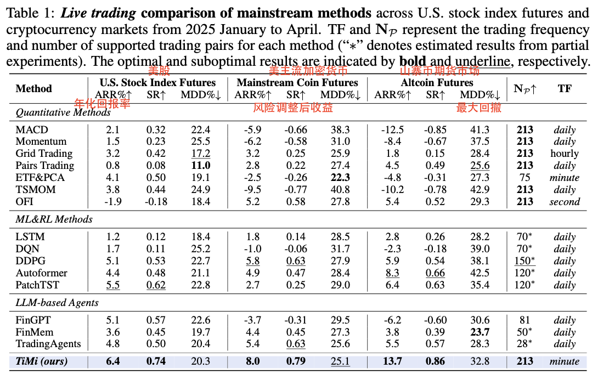
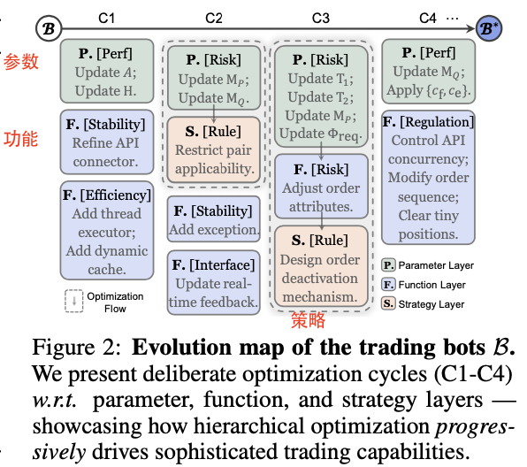
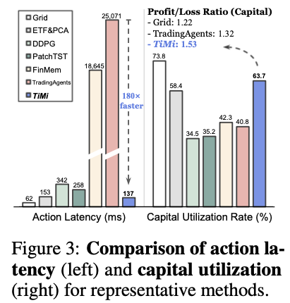
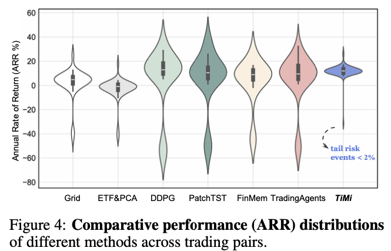
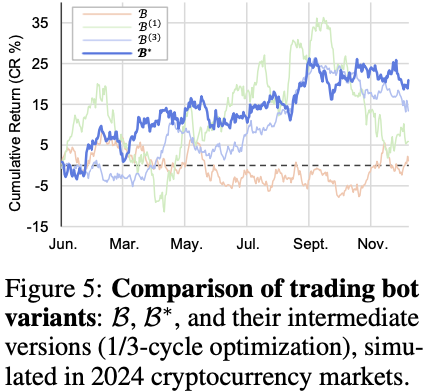
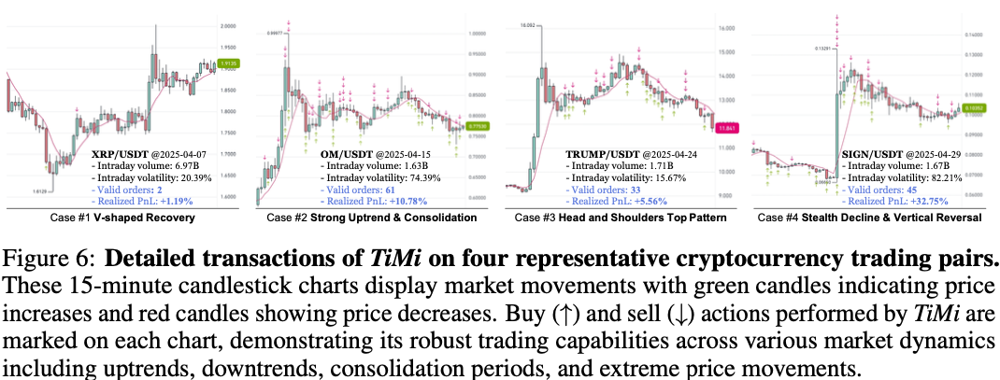
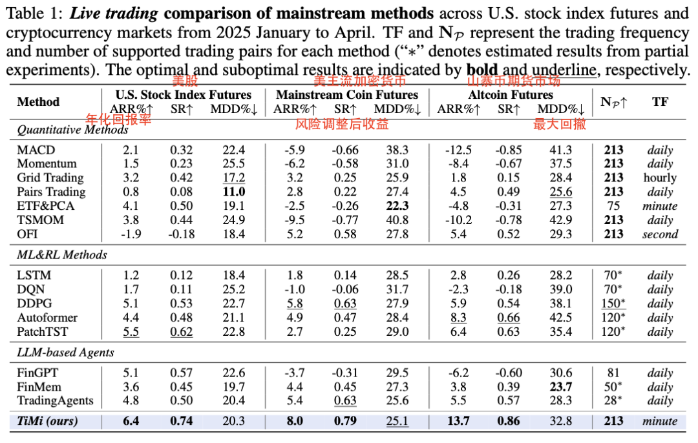
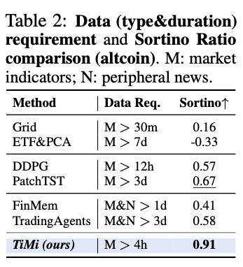

#  Trade in Minutes! 揭秘首个将策略与执行完全分离的量化交易Agent

NLP PaperWeekly NLP PaperWeekly [ NLP PaperWeekly ](javascript:void\(0\);)

______

在小说阅读器中沉浸阅读

今天分享一篇来自**同济大学** 与**微软亚洲研究院** 等机构的文章，题为 **《TRADE IN MINUTES! RATIONALITY-DRIVEN AGENTIC SYSTEM FOR QUANTITATIVE FINANCIAL TRADING》** （分钟级交易！理性驱动的量化金融交易智能体系统）。

这篇文章开创性地提出了一个名为 **TiMi (Trade in Minutes)** 的多智能体（Multi-Agent）量化交易系统。其核心思想是将复杂的**策略制定与优化** 过程与对时间极其敏感的**交易执行** 过程进行“解耦”。系统在离线环境下，**利用大语言模型（LLM）在语义分析、代码编程和数学推理方面的强大能力，协同设计、开发并迭代优化出程序化的交易机器人（Trading Bots）。然后，将这些经过充分优化的、轻量级的机器人部署到线上进行分钟级的实时交易。** 这种架构既利用了LLM的“大脑”进行深度策略思考，又避免了在瞬息万变的市场中进行高成本、高延迟的实时推理，从而实现了在真实金融市场中的高效、稳定盈利。

## 一、概述

  * • **Title:** TRADE IN MINUTES! RATIONALITY-DRIVEN AGENTIC SYSTEM FOR QUANTITATIVE FINANCIAL TRADING
  * • **URL:** https://arxiv.org/abs/2510.04787
  * • **Authors:** Zifan Song, Kaitao Song, Guosheng Hu, Ding Qi 等
  * • **Institutions:** Tongji University, Microsoft Research Asia, University of Bristol, Fudan University
  * • **Code:** 论文在“可复现性声明”中承诺将开源TiMi的部署实现。

### 1 Motivation

当前LLM驱动的金融交易智能体存在的几个核心痛点：

  * • **情感偏见与信息依赖：** 现有交易智能体大多模仿人类角色（如分析师），容易引入模拟的情感偏见，并且过度依赖新闻等非结构化文本信息，这些信息往往具有误导性或时效性滞后。
  * • **高昂的实时推理成本：** 在交易过程中持续调用大型语言模型进行推理，计算成本高昂，并且会导致显著的决策延迟。在毫秒必争的金融市场中，这种延迟（Slippage，滑点）可能导致错失交易良机或造成额外亏损。
  * • **传统方法的局限性：** 经典的量化策略（如基于规则的策略）虽然稳定，但难以适应非线性、突发的复杂市场动态（如“黑天鹅”事件）。而现有的LLM金融应用又较少关注其在代码生成和数学推理方面的潜力，未能实现真正的“机械理性”。

### 2 Methods

**TiMi系统的核心是“三阶段解耦架构”** ：

  1. 1\. **策略阶段 (离线):** 利用多个专业化的LLM智能体，从宏观市场分析到微观交易对适配，设计出初步的交易策略。
  2. 2\. **优化阶段 (离线):** 将策略编程为交易机器人，在模拟环境中运行以收集反馈。然后由“反思智能体”将反馈转化为数学优化问题，驱动机器人进行多层次、闭环式的迭代进化，最终产出成熟的交易机器人。
  3. 3\. **部署阶段 (线上):** 将轻量级、预优化好的交易机器人部署到真实市场。它们无需再进行LLM推理，只需根据预设逻辑和参数执行交易，从而实现极低的延迟和成本。

image-20251030114336330

#### 详细方法和步骤:

TiMi系统通过一个由四个专业智能体协作的精巧工作流来实现其功能：

  1. 1\. **策略阶段 (Policy Stage - Offline):**
     * • **宏观分析智能体 (Macro Analysis Agent,` Ama`):** 负责分析宏观市场数据（如技术指标），识别市场模式，并形成普适性的交易策略。
     * • **策略适配智能体 (Strategy Adaptation Agent,` Asa`):** 接收通用策略，并针对特定的交易对（如BTC/USDT）的独有特性（如波动率、流动性）进行微观定制，生成带有初始参数的、具体化的交易规则。
     * • **机器人进化智能体 (Bot Evolution Agent,` Abe`):** 这是一个精通代码的LLM智能体。它将`Asa`生成的具体策略，“翻译”并编写成结构化的、可执行的程序化交易机器人原型。
  2. 2\. **优化阶段 (Optimization Stage - Offline):**
     * • 将原型机器人在历史或模拟市场中进行回测，收集详细的行动反馈（Action Feedback），包括**盈利指标、风险事件、执行效率** 等。
     * • **反馈反思智能体 (Feedback Reflection Agent,` Afr`):** 这是系统的“大脑”。它利用LLM的数学推理能力，分析反馈数据，将交易中的问题（如“**在市场暴跌时因买单过于密集导致巨额亏损** ”）**形式化为数学问题** （如一个带约束的线性规划问题）。
     * • `Afr`求解这些数学问题，得到优化的参数配置，或者提出对机器人功能甚至策略逻辑的修改建议。
     * • 这些优化方案被送回给`Abe`，由`Abe`对交易机器人的代码进行**分层（参数层 - > 功能层 -> 策略层）**的修改和完善。这个过程会循环往复，形成一个** 闭环优化系统**，直到机器人表现得足够稳健。
  3. 3\. **部署阶段 (Deployment Stage - Live):**
     * • 经过多轮优化后，最终版的“高级机器人” (`B*`) 被部署到真实的交易环境中。
     * • 由于所有复杂的逻辑和参数都已在离线阶段固化，**线上机器人只需执行计算量很小的任务（如检查价格、下单）** ，因此响应速度极快，延迟极低。

### 3 Conclusion

  * • **卓越的真实市场表现:** 在对**美国股指期货和加密货币（主流币及山寨币）**三大类市场、超过200个交易对的实盘测试中，TiMi系统在** 年化回报率（ARR）**和** 夏普比率（SR）**等关键指标上显著优于传统的量化方法、机器学习/强化学习方法以及其他的LLM智能体方法。

image-20251030114623417

  * • **极致的行动效率:** 得益于解耦架构，**TiMi的交易延迟与最高效的传统量化方法** 相当，比需要连续推理的LLM智能体快了**180倍** 以上，从根本上**解决了LLM在量化交易中的应用瓶颈** 。
  * • **强大的风险控制和稳定性:** TiMi的收益分布方差更小，**极端亏损（尾部风险）事件罕见** 。这得益于其由**数学理性驱动的闭环优化过程，使系统能够在最大化回报和最小化风险之间取得更好的平衡** 。

### 4 Limitation

  * • **缺乏零样本能力:** TiMi的强大性能依赖于离线优化阶段。当进入一个全新的、缺乏历史数据的市场时，它无法立即“开箱即用”，需要一定时间的模拟和数据积累来完成优化过程。
  * • **潜在的市场影响和伦理问题:** 任何高效的自动化交易系统都可能影响市场动态和流动性。此外，这类先进技术也可能加剧机构投资者与散户之间的信息和技术鸿沟。

## 二、详细内容

### 1 TiMi三阶段解耦系统架构图

image-20251030114329582

这张图是论文的核心，直观展示了TiMi系统的工作流程。它清晰地划分了**离线环境** （策略阶段和优化阶段）和**线上环境** （部署阶段）。图中详细描绘了四个智能体（Ama, Asa, Abe, Afr）如何协同工作，将原始的市场数据（Market Data）一步步转化为线上环境中可执行的、经过优化的交易机器人（Tuned Bots），并强调了不同智能体依赖的LLM核心能力（语义分析、代码编程、数学推理）。

### 2 交易机器人的进化图谱

image-20251030113118467

此图展示了交易机器人B在C1到C4四个优化周期中的进化路径。它形象地说明了**分层优化** 的思想：优化首先从最简单的**参数层(P)** 开始调整；如果参数调整无法解决问题，则升级到修改**功能层(F)** 的算法；最根本的改变则是调整**策略层(S)** 的决策逻辑。这种由浅入深的优化方式保证了系统的稳定性和迭代效率。

### 3 行动延迟与资本利用率对比

image-20251030113258339

**1）延时非常低：** TiMi的行动延迟（Action Latency）非常低，与传统的网格交易（Grid）策略在同一水平，远低于需要持续推理的FinMem和TradingAgents。

**2）资本利用率高：** 右侧图表则展示了TiMi拥有极具竞争力的资本盈利/亏损比（1.53），说明其资本利用效率非常高。

### 4 年化回报率（ARR）分布对比

image-20251030113321439

这是一组小提琴图，展示了不同方法在所有交易对上的年化回报率分布。TiMi的“提琴”形状更“瘦高”，且中位数靠上，表明其**回报率不仅平均更高，而且在不同交易对上的表现更稳定** 、一致性更强。相比之下，**DDPG（一种强化学习方法)的分布非常“胖”，意味着其表现极不稳定，高收益与巨额亏损并存** 。

### 5 不同版本交易机器人的性能对比

image-20251030113413392

这条曲线图是优化阶段有效性的直接证明。原型机器人B（无优化）的累计回报率在0附近徘徊。**经过优化的最终版机器人B*则实现了超过20%的稳定增长。**中间版本（如B(1)）虽然一度达到高点，但随后出现大幅回撤，说明了** 浅层优化（如仅调整参数）的局限性和深层、分层优化的必要性。**

### 6 TiMi在四种典型市场行情下的交易记录

image-20251030113452397

这四张K线图展示了TiMi在真实交易中的决策点。无论是在**V型反转、持续上涨、顶部形态还是暴跌反弹** 等不同市场动态下，TiMi都能通过其**自适应的下单策略进行买入(↑)和卖出(↓)操作** ，尤其是**在高波动性的交易对上（如SIGN/USDT）表现出更高的交易频率和盈利能力，验证了模型的鲁棒性** 。

### 7 主流方法在真实交易中的性能对比

image-20251030113949022

这是论文最核心的成果表。数据显示，无论是在**美股股指期货、主流加密货币还是高风险的山寨币期货市场** ，TiMi在年化回报率（ARR%）和风险调整后收益（SR）上均名列前茅，并且最大回撤（MDD%）控制在有竞争力的水平。

### 8 数据需求与索提诺比率（Sortino Ratio）对比

image-20251030114025844

此表显示，**TiMi仅需4小时以上的市场指标数据（M >4h）即可进行有效交易**，而其他一些智能体方法还需**依赖新闻数据（N）** 。更重要的是，**TiMi的索提诺比率（一种衡量下行风险的指标）高达0.91，远超其他所有方法，再次证明了其卓越的风险管理能力** 。

## 三、总结

**结论1: “解耦”是解决LLM Agent在量化交易中落地困难的关键。**  
本文最大的亮点在于提出了“策略-执行解耦”的架构。它巧妙地将**LLM的“慢思考”（策略制定、代码生成、数学反思）放在离线环境** ，将 **“快执行”（交易下单）放在线上环境** 。这不仅解决了实时推理带来的高延迟和高成本问题，也使得复杂、深度的策略优化成为可能，是LLM Agent在时效性要求极高的领域落地的一个范式级解决方案。

**结论2: 专业化、协同工作的多智能体系统远胜于单一通用模型。**  
TiMi没有试图用一个“万能”的LLM解决所有问题，而是设计了四个各司其职的智能体。**`Ama` 和`Asa`负责“看”市场（语义分析），`Abe`负责“写”代码（代码编程），`Afr`负责“想”问题（数学推理）**。这种模块化、专业化的设计充分利用了当今LLM在不同能力维度的优势，形成了一个高效、强大的策略生成与优化流水线。

image-20251030114217833

**结论3: “数学理性”驱动的闭环优化是实现策略持续进化的核心。**  
TiMi最精髓的部分在于`Afr`智能体的“反馈反思”机制。它能 **将模糊的交易表现（“亏钱了”）转化为精确的数学约束问题，然后求解出更优的策略参数。** 这种基于数学理性的闭环优化，而非简单的试错或黑盒模型，使得交易策略能够持续、稳健地进化，并有效控制风险，是系统能够长期稳定盈利的根本保障。在产业应用上，这意味着可以构建一个能自我迭代、越用越强的自动化交易系统。
    
    
    👇关注公众号**NLP PaperWeekly** ，对话框输入“**TradingAgent** ”，即可获取更多相关资料👇  
    
    
    
    进TradingAgent技术交流请扫码
    
    

© THE END 

转载请联系本公众号获得授权

投稿或寻求报道：hxshineuestc@gmail.com

预览时标签不可点

微信扫一扫  
关注该公众号

继续滑动看下一个

轻触阅读原文

NLP PaperWeekly 

向上滑动看下一个

[知道了](javascript:;)

微信扫一扫  
使用小程序

****

[取消](javascript:void\(0\);) [允许](javascript:void\(0\);)

****

[取消](javascript:void\(0\);) [允许](javascript:void\(0\);)

****

[取消](javascript:void\(0\);) [允许](javascript:void\(0\);)

× 分析

__

微信扫一扫可打开此内容，  
使用完整服务

： ， ， ， ， ， ， ， ， ， ， ， ， 。 视频 小程序 赞 ，轻点两下取消赞 在看 ，轻点两下取消在看 分享 留言 收藏 听过
