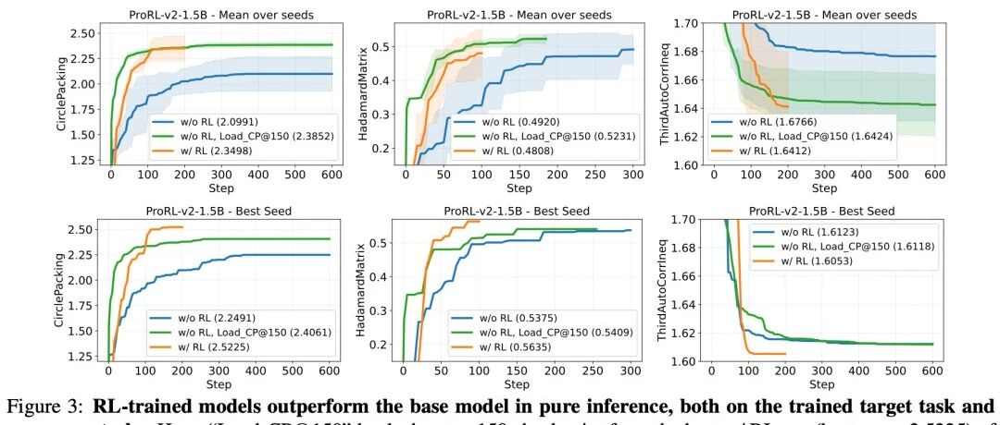
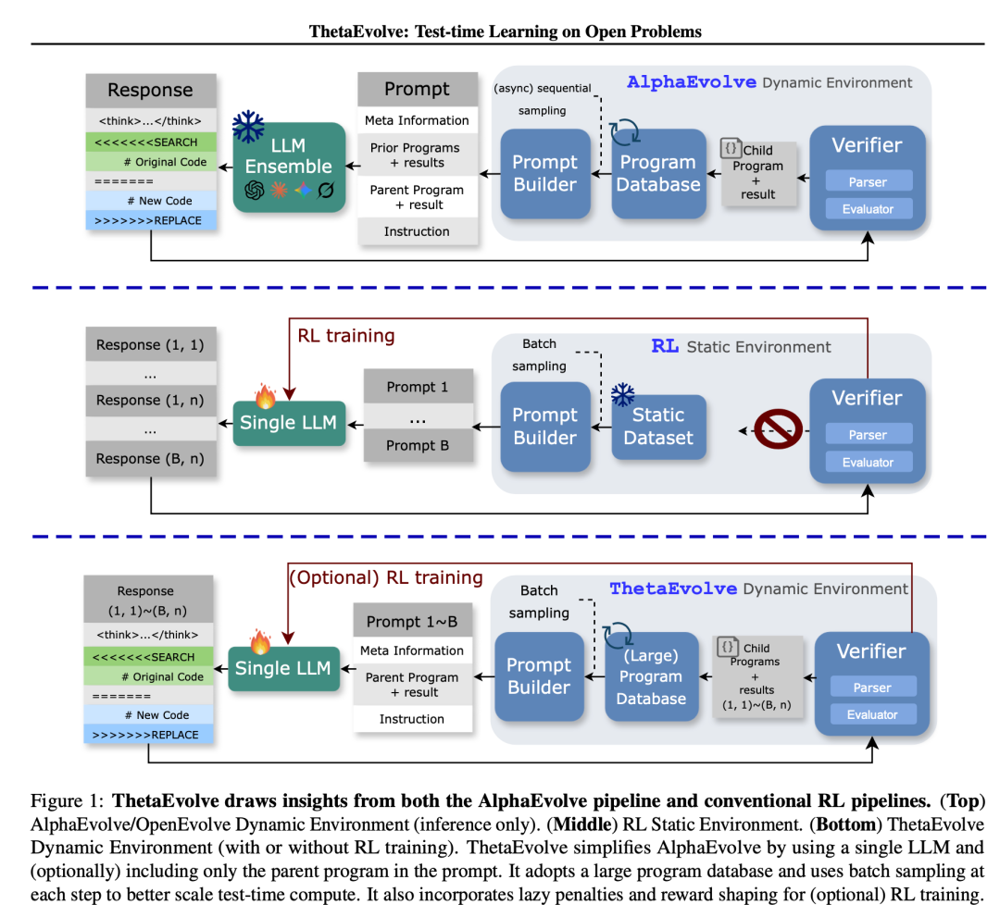
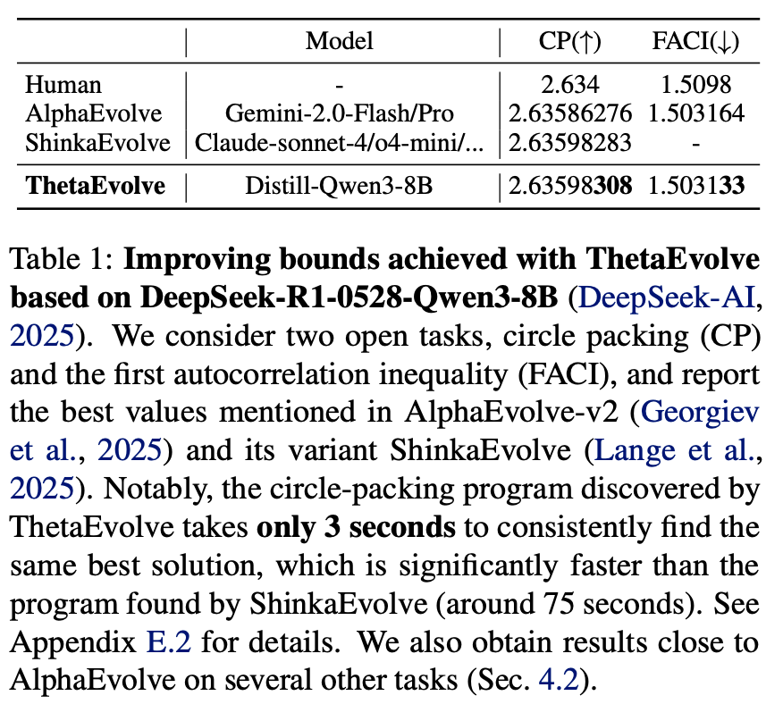
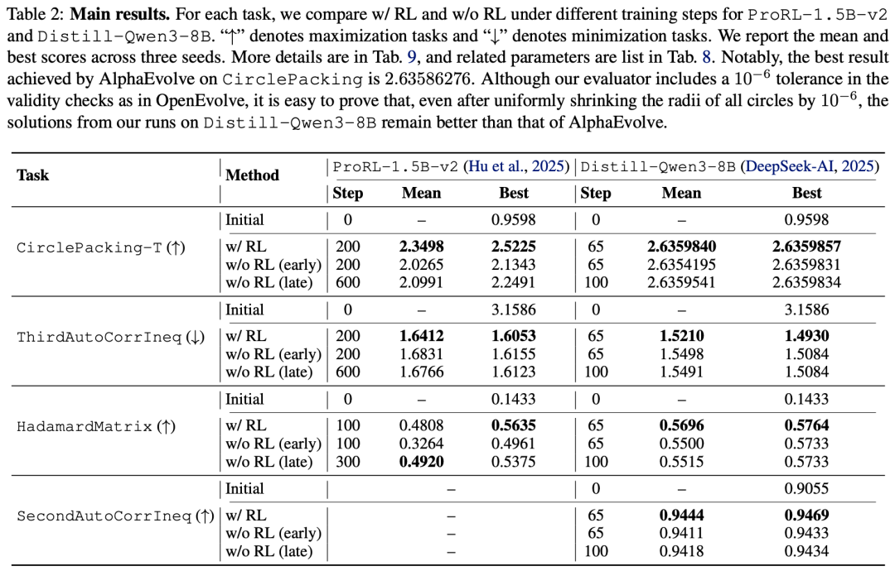
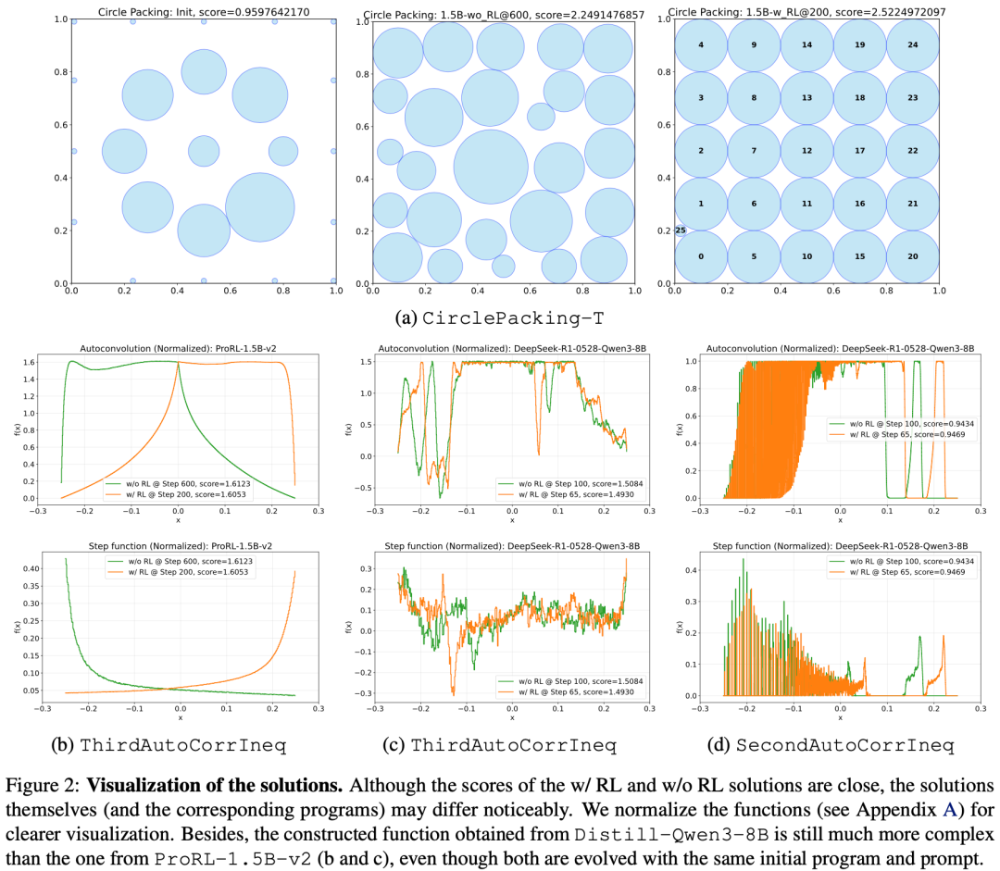
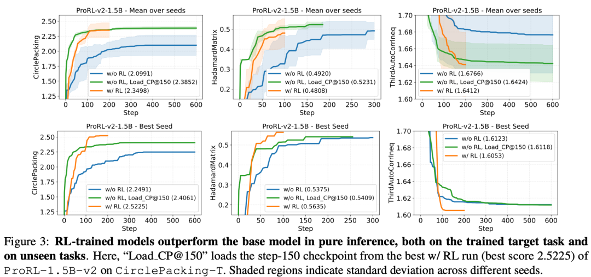
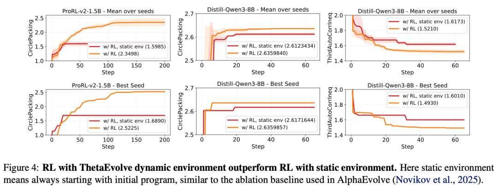

#  从AlphaEvolve到ThetaEvolve：开源小模型如何通过“进化”掌握高深数学技巧？

原创 NLP PaperWeekly NLP PaperWeekly [ NLP PaperWeekly ](javascript:void\(0\);)

______

在小说阅读器中沉浸阅读

大家好，我是HxShine，好久不见～

今天分享一篇来自微软（Microsoft）和华盛顿大学（University of Washington）等机构合作的最新论文，Title: **ThetaEvolve: Test-time Learning on Open Problems** 。  
这篇文章针对近期DeepMind发布的AlphaEvolve进行了开源复现与改进，提出了一种结合**进化策略** 与**测试时强化学习（Test-time RL）**的新框架。  
该方法的核心突破在于：它不再依赖大规模闭源模型（如Gemini/Claude），而是通过引入**RL训练**、**大容量程序数据库** 和**批量采样** ，使一个仅**8B参数的开源模型** （DeepSeek-R1-Distill-Qwen-8B）在经典的数学开放问题（如圆装填问题）上打破了人类和闭源SOTA模型的最佳纪录。  
该方法特点总结如下：1）**开源与简化** ：将复杂的AlphaEvolve简化为单模型系统，并开源了完整代码；2）**测试时学习** ：不仅仅是推理时的搜索，而是引入RL（GRPO算法）让模型在解决问题过程中真正“学习”进化策略；3）**效率提升** ：利用Batch采样和Lazy Penalty机制，**在Circle Packing问题上，ThetaEvolve仅需3秒即可找到最佳解，而之前的ShinkaEvolve需要75秒。**

##  一、概述

  * • **Title:** ThetaEvolve: Test-time Learning on Open Problems
  * • **URL:** https://arxiv.org/abs/2511.23473v1
  * • **Authors:** Yiping Wang, Shao-Rong Su, Zhiyuan Zeng, et al.
  * • **Institution:** University of Washington, Microsoft, Carnegie Mellon University, etc.
  * • **Code:** https://github.com/ypwang61/ThetaEvolve

### 1 Motivation

  * • **现有方法的局限性：** 近期的AlphaEvolve虽然利用LLM进化程序来解决数学难题，但它依赖于前沿闭源大模型的集成（Ensemble），且是一个纯推理系统（Inference-only），模型本身无法内化进化策略，且计算成本高昂。
  * • **开源模型能力的探索：** 现有的思维定势认为只有闭源大模型才能挑战这些数学难题，小型的开源模型（如8B量级）通常被认为不具备突破SOTA的能力。
  * • **RL在推理侧的潜力：** 虽有AlphaProof等工作，但**如何在开放且极具挑战的数学优化问题上，结合动态环境（Dynamic Environment）进行有效的测试时强化学习（Test-time RL）仍未被充分探索。**

###  2 Methods

**核心框架:** 基于AlphaEvolve的进化算法流程，但将其改造为**单模型（Single LLM）**驱动，并引入** 大容量程序数据库（Large Program Database）**。  
**测试时强化学习（RL）:** 使用**GRPO算法** 在解决问题的过程中直接对模型进行微调。为了防止模型“偷懒”（输出重复结果），引入了**Lazy Penalty** ；为了应对分值密集的任务，引入了**Reward Shaping** 。  
**动态环境:** 不同于在静态数据集上训练，ThetaEvolve在维护一个不断更新的“程序数据库”的环境中进行RL训练，这构建了一个隐式的课程学习路径。

image-20251219111438477

#### 详细方法和步骤:

**1 架构简化与增强 (Direct Adjustment):**

  * • **单模型策略:** 放弃AlphaEvolve的复杂多模型集成，仅使用单个开源LLM（如DeepSeek-R1-Distill-Qwen-8B）。
  * • **超大程序数据库:** 将程序数据库容量从常规的几十个扩展到10,000个（Population Size）。实验证明，随着测试时计算量的增加，更大的数据库能显著提升最终性能。
  * • **批量采样 (Batch Sampling):** 为了提升推理效率，利用vLLM/SGLang等框架，每次从数据库中采样一批父程序，并行生成多个子程序。

**2 测试时强化学习 (RL at Test-time):**

  * • **算法:** 使用GRPO (Group Relative Policy Optimization) 算法。
  * • **奖励设计与Lazy Penalty:**
    * • 如果生成的代码无法运行或无效，给予负分（如 -0.2, -0.4）。
    * • **Lazy Penalty:** 关键点在于，如果生成的程序不仅与父程序相同，而且与**数据库中任何历史程序** 逻辑等价（去注释后相同），则给予惩罚。这迫使模型不断探索新的解，防止陷入局部最优。
  * • **Reward Shaping:** 对于分值变化范围极小的问题（如自相关不等式），通过归一化和指数缩放将奖励映射到[0, 1]区间，以提供更强的梯度信号。

**3 动态环境交互:**

  * • 模型不是在固定的题目上训练，而是与一个动态变化的“程序数据库”交互。
  * • 随着进化过程推进，数据库中的程序质量越来越高，模型通过RL学习如何基于这些高质量程序进一步改进，从而实现“自我进化”。

### 3 Conclusion

  * • **SOTA性能：** ThetaEvolve利用DeepSeek-R1-Distill-Qwen-8B在Circle Packing（圆装填）和First Auto-Correlation Inequality（第一自相关不等式）任务上刷新了已知的最佳界限（Best-known bounds）。
  * • **效率极高：** 在Circle Packing任务上，ThetaEvolve仅需3秒即可找到最佳解，比ShinkaEvolve（使用GPT-4等集成）快25倍。
  * • **RL优于纯推理：** 在所有测试任务中，结合RL的ThetaEvolve一致优于纯推理（Scaling test-time compute）的基线，并且训练后的模型具备了一定的迁移能力。

### 4 Limitation

  * • **依赖Verifiers：** 目前仍需要为每个任务手动设计不可破解的评估器（Verifier）和初始程序，这限制了其通用的自动化程度。
  * • **部分任务比较困难：** 由于AlphaEvolve原文中对某些数学问题的定义存在代码与公式的偏差（如Third AutoCorrIneq），导致直接比较存在一定困难（本文修正了这些定义）。
  * • **计算资源：** 虽然是8B模型，但大规模的RL探索和数据库维护仍需要一定的GPU资源支持（实验使用了8x A100）。

### 5 Future Work

  * • **多任务联合训练：** 实验发现RL训练的模型具有迁移性，未来可以尝试同时在多个数学问题上训练，甚至结合不同参数的任务实例。
  * • **后训练流程（Post-training）：** 这种单任务的RL进化流程有潜力扩展为通用的后训练（Post-training）配方，提升模型的通用推理能力。

## 二、详细内容

### 1 ThetaEvolve 架构对比

image-20251219111438477

  1. 1\. (Top) AlphaEvolve/OpenEvolve：纯推理，维护动态程序数据库。
  2. 2\. (Middle) RL with Static Environment：传统的RL，总是从初始程序开始训练（AlphaEvolve中的消融实验设置）。
  3. 3\. (Bottom) **ThetaEvolve** ：结合了**动态程序数据库的RL训练** 。单模型 + 大数据库 + 批量采样 + 懒惰惩罚。  
**结论：** 动态环境下的RL（ThetaEvolve）**结合了进化的探索能力和RL的参数更新能力。**

###  2 主要实验结果

image-20251219111959321

  * • **Table 1:** 核心SOTA对比。ThetaEvolve (8B模型) 在Circle Packing (CP) 和 FACI 任务上击败了 Human、AlphaEvolve (Gemini-2.0) 和 ShinkaEvolve (Claude/GPT-4)。特别是**CP任务，精度达到了2.63598308。**

 image-20251219112101629

  * • **Table 2:** 详细消融实验。在四个任务上，对比了 `w/ RL` (有强化学习) 和 `w/o RL` (无RL，仅推理)。  
**结论：** RL版本**在所有任务上都优于纯推理版本，且达到最佳结果所需的步数更少。**

###  3 Circle Packing的圆排列图和不等式任务的函数曲线

image-20251219113136525

**亮点：** 尽管ProRL-1.5B和Distill-Qwen-8B的分数相近，但8B模型生成的函数结构（图b vs 图c）明显更复杂，说明**模型容量影响了解的结构复杂度。**

###  4 RL训练效能分析

image-20251219113344647

**内容：** 展示了训练曲线。对比了：1. 纯推理；2. 完整RL流程；3. 加载RL训练中途的Checkpoint再进行推理。  
**结论：** 加载RL训练过的Checkpoint进行推理，**性能提升速度比原始模型快得多，证明模型确实“学会”了如何更好地进化程序，而不仅仅是记住了答案。**

###  5 RL动态环境 vs 静态环境效果对比

image-20251219113447514

**内容：** 对比RL训练时使用动态数据库（ThetaEvolve）与使用静态环境（每次从头开始）。  
**结论：** 静态环境下的RL效果极差，甚至不如不做RL。这验证了在开放问题上，**Curriculum（课程）式的动态环境至关重要，模型需要基于当前的最佳解去探索，而不是每次都从零开始。**

###  6 数据库大小消融

image-20251219135901795

**内容：** 对比Small (70), Medium (1000), Large (10000) 三种数据库大小对性能的影响。  
**结论：** 当扩大Test-time Compute（生成更多程序）时，**更大的数据库（Large）能维持性能的持续增长，而小数据库会过早饱和。**

###  7 效率与Pipeline对比

image-20251222085707204

**内容：** 对比OpenEvolve（异步串行）和ThetaEvolve（同步批量）的速度。  
**结论：** ThetaEvolve在相同计算量下性能相当，但速度快了10倍以上（OpenEvolve需63.6小时，ThetaEvolve仅需5.4小时）。

## 三、总结

**结论1: 小模型逆袭，RL + 进化策略威力巨大。** 本文打破了只有闭源超大模型才能解决复杂数学开放问题的迷信。通过精心设计的ThetaEvolve框架（RL + 动态环境 + 大规模搜索），8B的开源模型也能超越GPT-4和Gemini在特定领域的表现。

**结论2: "Test-time Learning" 实际上是针对特定问题的在线微调。** 文章的核心洞察在于，**对于极难的探索性问题，单纯的Sampling（推理）效率太低。让模型在搜索过程中利用RL更新权重（学习），能显著加速发现SOTA解的过程。** 这种“边做边学”的模式比“只做不想”的推理模式更高效。

**结论3: 动态环境是RL解决推理问题的关键。** 传统的RL容易在稀疏奖励中迷失。ThetaEvolve通过维护一个进化的程序数据库，为RL提供了一个自然的、难度递增的“脚手架”，这对于未来利用RL解决科学发现问题具有重要的指导意义。

  

    
    
    👇关注公众号**NLP PaperWeekly** ，对话框输入“**Agent** ”，即可获取更多相关资料👇  
    
    
    
    进技术交流请添加我微信（FlyShines)
    
    请备注昵称+公司/学校+研究方向，否则不予通过

© THE END 

转载请联系本公众号获得授权

投稿或寻求报道：hxshineuestc@gmail.com

  

预览时标签不可点

微信扫一扫  
关注该公众号

继续滑动看下一个

轻触阅读原文

NLP PaperWeekly 

向上滑动看下一个

[知道了](javascript:;)

微信扫一扫  
使用小程序

****

[取消](javascript:void\(0\);) [允许](javascript:void\(0\);)

****

[取消](javascript:void\(0\);) [允许](javascript:void\(0\);)

****

[取消](javascript:void\(0\);) [允许](javascript:void\(0\);)

× 分析

__

微信扫一扫可打开此内容，  
使用完整服务

： ， ， ， ， ， ， ， ， ， ， ， ， 。 视频 小程序 赞 ，轻点两下取消赞 在看 ，轻点两下取消在看 分享 留言 收藏 听过
