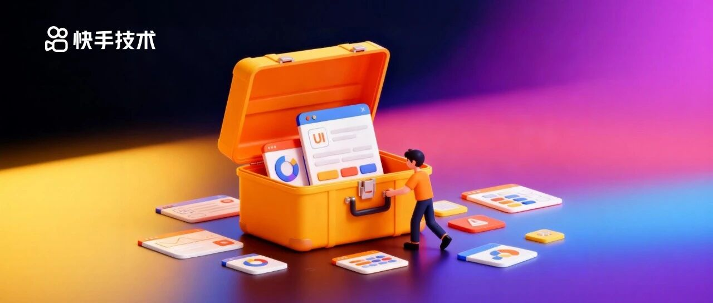
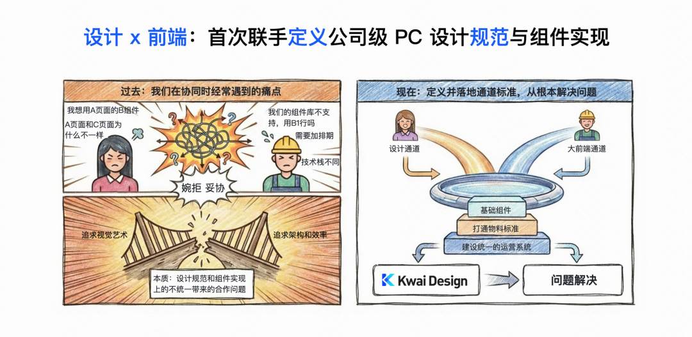
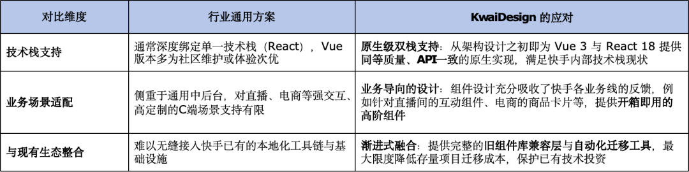
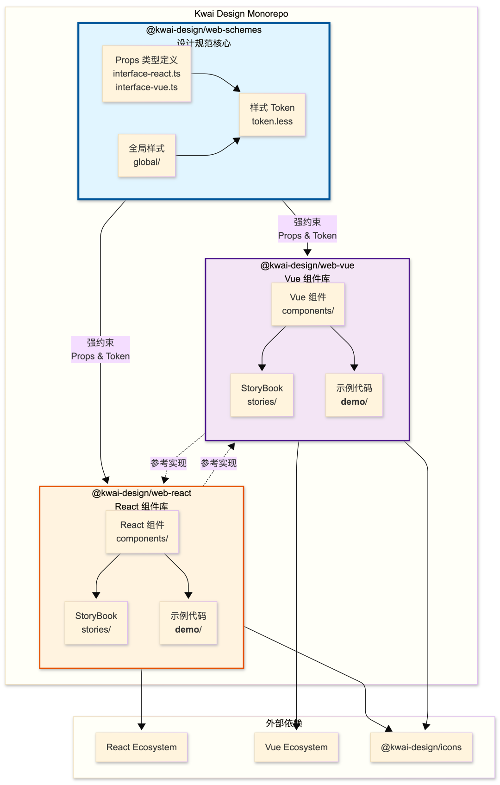
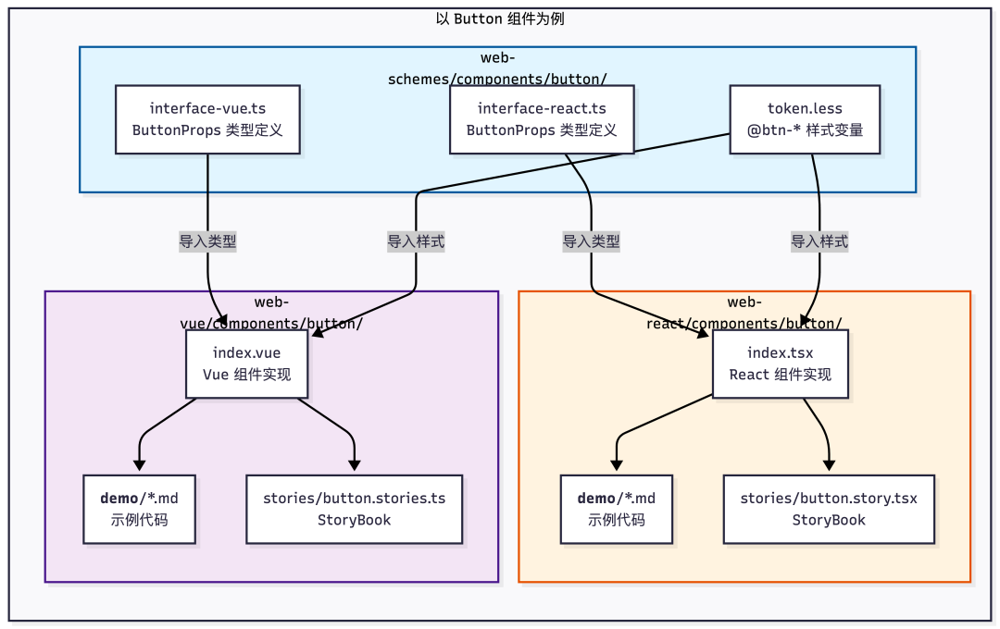
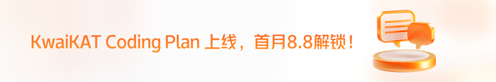

#  双栈一致、业务驱动，揭秘快手KwaiDesign企业级UI组件库背后的技术实践

快手技术 快手技术 [ 快手技术 ](javascript:void\(0\);)

______

在小说阅读器中沉浸阅读

**导读**

  

为应对多业务线体验碎片化、双技术栈难以复用等研发痛点，快手构建了一套能够统一设计语言、打破技术栈鸿沟、并支撑业务灵活定制的企业级UI组件库KwaiDesign，本文将为你详细介绍其建设背景，技术架构和落地路径。  

  
  

**一、项目背景**

  

  
  
  

作为一家覆盖短视频、直播、电商等多领域的平台，快手业务场景复杂且产品迭代迅速。过去，各业务线基于快速响应需求，逐渐形成了多套独立的前端组件库，这套模式在业务高速增长阶段能够适配需求、提供有效支撑，但在当前发展节点来看，其潜藏的问题已愈发凸显，主要核心问题为以下三点：

  * 体验碎片化：不同BU的产品在交互细节、视觉风格上存在差异，不仅造成商家、创作者等 B 类用户的使用体验不一致，也削弱了“快手”品牌在这类用户群体中的整体性认知。

  * 研发效率瓶颈：Vue与React技术栈长期并存，导致组件无法跨技术栈复用，相似功能需重复开发；同时，跨团队协作也因技术栈差异而产生额外的学习与沟通成本。

  * 维护成本高：分散的组件库带来重复的维护投入，且技术债务随着版本分化而日益沉重。

面对上述挑战，我们需要的不是对单一旧体系的修补，而是一套能够从根源上统一标准、打破技术栈壁垒、并支撑业务灵活定制的现代化设计工程体系。

**二、为什么是KwaiDesign：直面业务现实的差异化设计**

  

  
  
  

立项之初，我们对直接引入的业界优秀设计方案进行了深入评估。这些方案虽在通用场景下表现优秀，却难以完全适配快手独特的业务与技术生态。因此，我们决定从真实场景出发，构建一套完全贴合快手需求、并能伴随业务共同演进的设计与研发体系——KwaiDesign 由此诞生。

  

2.1 核心差异：为何不能直接使用现有方案？  

行业主流设计系统大多诞生于工具型或标准化内容产品，其设计范式与快手所面临的多元、高互动、强定制的业务场景存在较大差异，具体来说：  

  

2.2 KwaiDesign 的四大差异化能力

基于以上差异，我们构建了KwaiDesign的核心能力矩阵，这些能力共同构成了我们区别于外部方案的护城河：

  

能力一：双栈一致性引擎

这并非两套独立的实现。我们通过共享的Design Token层、统一的TypeScript类型定义中心（@kwai-design/web-schemes）、以及抹平框架差异的适配器模式，确保了Vue和React组件在API、行为、视觉表现上完全一致。开发者仅需学习一次，即可在两个技术栈中高效开发。

  

能力二：企业级主题与设计工程化我们借鉴先进实践，将设计系统本身工程化。在实现全量Token的可配置的基础上，构建了具备主题版本管理、灰度发布、多主题并存能力的可视化平台。设计团队可以可借此独立完成主题的创作、测试与分发，真正实现了“设计与研发解耦，但通过标准无缝协作”。  
能力三：AI增强的质量与效率保障体系为应对双栈开发带来的质量保障挑战，我们针对性引入了AI能力：

  * 在测试侧：基于Playwright和AI图像识别，构建了智能可视化回归测试，能自动对比双栈组件渲染差异，精准定位非预期变更，将视觉BUG拦截在上线前。
  * 在配置侧：通过DSL协议和AI辅助，将主题配置从繁琐的手工编码变为高效的智能生成与质检，使定制化工作的效率提升超过80%。

  
能力四：以迁移成本为核心的设计思想我们从一开始就将“如何让业务方用起来”作为最高优先级。通过完整的兼容层方案、自动化代码转换工具以及清晰的分阶段迁移指南，将技术升级的阻力降到最低，确保整个统一进程平滑、可控。

**三、实现路径：KwaiDesign 的系统性构建四步法  
**

  

KwaiDesign 的建设是一项环环相扣的系统工程，我们遵循“基础统一 -> 体验一致 -> 平滑迁移 -> 灵活定制”的路径，攻克了双栈统一这一核心挑战。

  

3.1 第一步：奠定基石 — 构建跨技术栈的统一架构

为了从根源上确保Vue与React技术栈在视觉与API基础上达成一致。为此，我们首先建立了统一设计变量（Design Tokens）层，将颜色、间距、字体等所有视觉变量统一定义，供@kwai-design/web-vue和@kwai-design/web-react共同引用，从而在源头上保障了视觉一致性。同时，我们创建了独立的TypeScript定义包@kwai-design/web-schemes，作为双技术栈组件API的统一入口，并通过工具链实现强制对齐，彻底杜绝了API层面的分叉。历时三个月，我们最终攻克了双技术栈底层样式与类型系统隔离的难题，成功构建出API同源、视觉同构的React与Vue组件库基础框架。  

工程组织概览  

单组件双技术栈栈Token、Props对齐约束示范

  

3.2 第二步：精益对齐 — 实现开发者体验的无缝一致

让使用不同技术栈的开发者获得近乎一致的编码体验，并将学习成本降至最低，我们制定了双栈对齐四原则，确保Props命名完全统一、共享TypeScript类型定义、实现交互逻辑与状态管理的表现相同，以及保障视觉输出无差异。同时，我们通过适配层设计，攻克了框架原生的三大核心差异：

  * 双向绑定：在 Vue 中兼容 React 的 value/onChange 模式，在 React 中实现类 v-model 的简易API

  * 插槽机制：统一为灵活的 children 与 props 渲染模式

  * 事件处理：统一采用 onXxx 的命名规范

  

最终，开发者得以无需关注底层框架差异，在不同技术栈的项目间切换时无需改变思维模式，从而极大提升了跨团队的协作效率。

  

#### 3.3 第三步：平滑过渡 — 提供完备的存量业务迁移方案

#### 为了最大限度降低业务线迁移成本与风险，让技术升级“无痛”发生。首先，我们通过提供兼容层（Bridge）方案——发布 @kwai-design/mui-compatible 等适配包，使得存量项目仅需替换引入路径即可无缝替换旧组件，支持新旧混用，且无需修改业务代码。
    
    
    # 安装适配层  
    npm install @kwai-design/mui-compatible  
    # 或  
    npm install @kwai-design/kwai-ui-compatible  
      
    # 在代码中使用适配层，无需修改业务代码  
    import { Button } from '@kwai-design/mui-compatible';  
    // 内部自动映射到 @kwai-design/web-react 或 @kwai-design/web-vue  
    

####   

#### 其次，我们打造了自动化迁移工具链，包括能够自动扫描、识别并批量替换旧组件引用的代码转换工具，以及用于静态分析潜在兼容问题并生成详细报告的迁移检查工具。最后，我们设计了清晰的分阶段迁移策略：从使用兼容层实现“无痛接入”，到利用工具逐步替换为原生 KwaiDesign 组件的“渐进升级”，最终进入移除兼容层、完成彻底升级的“优化清理”阶段。这一系列举措将技术选型升级从高风险、高成本的“推翻重来”，转化为可规划、可控制、可回滚的渐进式现代化进程，充分尊重并保护了各业务线的历史投入与发布节奏。

  

#### 3.4 第四步：赋能业务 — 打造企业级主题定制与质量保障体系

赋予业务方品牌定制自主权，并通过工程化手段保障双栈交付质量，具体实现路径包括两大举措：一方面构建可视化主题配置平台，既实现覆盖所有设计变量的全量 Token 可配置，支持业务方自主定义品牌主题，又提供可视化配置、实时预览、版本管理、多主题继承等企业级平台化运营能力，打通设计与研发的协作闭环；另一方面创新 AI 增强的质量与效率体系，通过集成 Playwright 与 AI 图像识别技术实现智能视觉回归测试，对 Vue/React 双版本组件进行自动化截图对比与智能分析，结合人工走查确保双栈表现绝对一致，同时依托 DSL 协议与 AI 能力实现 AI 辅助主题配置，将主题配置从手工编码转变为智能生成与自动化质检，使定制效率提升 85% 以上，并确保零配置错误。

  

最终 KwaiDesign 不仅是一套组件，更是一个包含标准化物料、可视化工具链、智能质量引擎的完整解决方案，为快手的多元化业务提供了从 “统一” 到 “定制”、从 “开发” 到 “质效” 的全方位支持。

  

总结而言，KwaiDesign 的实现路径清晰地回答了四个关键问题：如何统一？如何对齐？如何迁移？如何保障？ 这套方法论确保了项目既能攻克核心技术难题，又能真正落地到业务场景中，实现其提效与统一的终极目标。

**四、未来展望  
**

  

KwaiDesign 的发布，初步构建了统一协作的基础框架，目前已实现：

  * 技术栈融合：通过双栈一致的原生实现，让 Vue 与 React 团队能基于同一套设计语言高效协作。

  * 协作流程优化：依托Design Token 与主题配置平台，让设计与开发围绕统一的标准进行对话，降低还原成本。

  * 研发效率提升：提供高质量的基础组件、完备的迁移工具链，将开发者从重复劳动和兼容性困扰中解放出来。

  

这并非终点，而是一个坚实且可持续演进的起点。同时，KwaiDesign 不是一个一蹴而就的封闭项目，而是一个将伴随业务共同成长的开放体系。未来，我们将通过持续的迭代来完善这一基础设施。

  

  * 扩展场景支持：与各业务线协同，丰富组件能力，更好支持直播、电商等特色交互场景。

  * 深化工具能力：优化迁移工具体验，完善主题平台、图标库等配套工具，提升全链路研发效率。

  * 增强组件功能：逐步推出ProTable、ProForm等高级业务组件，提升复杂场景开发效率；持续完善质量保障机制。

  

我们相信，有效的标准体系在于持续的统一与演进。KwaiDesign致力于成为支撑快手业务创新的基础模块，通过可复用、可扩展的组件与工具，为包括低代码平台在内的未来研发模式提供高质量支持。

\- END -

  

【相关阅读】

预览时标签不可点

微信扫一扫  
关注该公众号

继续滑动看下一个

轻触阅读原文

快手技术 

向上滑动看下一个

[知道了](javascript:;)

微信扫一扫  
使用小程序

****

[取消](javascript:void\(0\);) [允许](javascript:void\(0\);)

****

[取消](javascript:void\(0\);) [允许](javascript:void\(0\);)

****

[取消](javascript:void\(0\);) [允许](javascript:void\(0\);)

× 分析

__

微信扫一扫可打开此内容，  
使用完整服务

： ， ， ， ， ， ， ， ， ， ， ， ， 。 视频 小程序 赞 ，轻点两下取消赞 在看 ，轻点两下取消在看 分享 留言 收藏 听过
