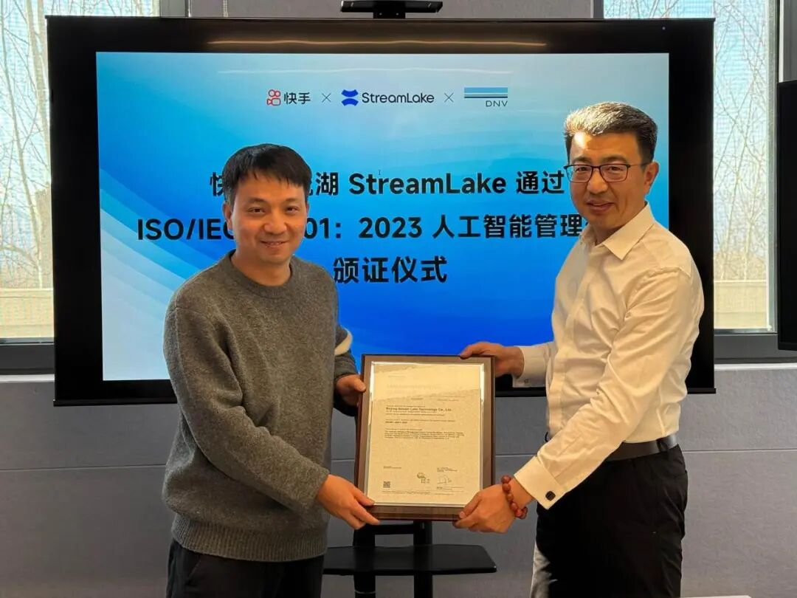

#  快手溪流湖StreamLake获ISO/IEC 42001国际人工智能管理体系认证

快手技术 快手技术 [ 快手技术 ](javascript:void\(0\);)

______

在小说阅读器中沉浸阅读

近日，快手溪流湖StreamLake成功通过国际权威认证机构DNV审核，获得由RvA（荷兰认可委员会）认可的ISO/IEC 42001:2023人工智能管理体系认证。该认证是全球首个专门针对人工智能管理体系的国际标准，标志着快手在AI技术管理方面达到国际领先水平，为其AI业务的全球化发展与负责任创新奠定了坚实根基。

  

  

据悉，RvA（荷兰认可理事会）是国际公认的权威认可机构，也是国际认可论坛（IAF）和国际实验室认可合作组织（ILAC）的创始成员之一。其认可服务覆盖全球多个国家和地区，以严格的评审标准和公正的评估过程著称。获得RvA认可的认证证书，意味着相关认证结果具备国际互认性，能够为企业在全球市场的合规运营提供有力背书，是企业技术能力与管理水平达到国际标准的重要证明。

  

其中，ISO/IEC 42001是全球首个针对人工智能管理体系的国际标准，由国际标准化组织（ISO）和国际电工委员会（IEC）于2023年12月联合发布，被视作人工智能治理的“国际通行证”。该标准旨在为开发或使用AI系统的组织提供一个结构化框架，聚焦人工智能领域的特殊风险，涵盖人工智能方针、数据管理、算法透明度、伦理合规、第三方关系等核心控制域，帮助企业构建覆盖AI全生命周期的管理体系。

  

通过该认证，表明快手已建立多学科协同的管理机制，融合技术、法务、风险管理、隐私保护等多领域协作，并通过规范化的体系建设、内审与持续改进，确保AI系统的开发与应用过程安全、可靠、可信。

  

在颁奖仪式上，快手研发副总裁、基础平台部负责人叶霖表示：“过去几年，特别是2025年以来，AI应用进入爆发式增长阶段。快手溪流湖很早就布局AI基础设施，推出的端到端AI平台‘万擎’（Vanchin），致力于助力企业实现AI场景的快速落地与规模化应用。此次获得认证，不仅是国际标准对快手溪流湖技术与管理体系的认可，更代表了我们构建负责任AI平台的初心与承诺。以此为起点，我们将持续推动AI技术安全、可靠、透明地赋能行业。”

  

DNV管理服务集团中国区副总经理运营总监陈立在发言中提到：“很荣幸与快手共同见证这一里程碑时刻。在审核过程中，我们深切感受到快手溪流湖团队在建立和实施AI管理体系过程中展现出的专业性、严谨性与持续努力。从高层战略部署到每一位员工的贯彻执行，整个体系体现出的成熟度令人印象深刻。自2021年起，DNV已为快手多个业务主体提供ISO系列认证服务，期待未来在信息安全、隐私保护、人工智能治理及可持续发展等领域持续深化合作。”

  

据了解，作为快手自研的一站式大模型开发与服务平台，万擎集成了AI基础设施、高性能网络、弹性调度、算力推理引擎等核心能力，提供性能卓越、成本优化、稳定安全的AI推理服务。平台已支持内部多个核心业务场景，周均百万Token级应用超900个，模型Token周调用量达近2万亿。目前，快手万擎正逐步对外输出模型层能力，助力更多企业实现AI场景的快速落地与规模化应用，推动产业智能化升级。

  

未来，快手将继续强化跨部门协同与全过程风控，推动AI技术在创新与规范中平衡发展，为用户、合作伙伴与社会创造真正可信、可持续的AI价值。

\- END -

预览时标签不可点

微信扫一扫  
关注该公众号

继续滑动看下一个

轻触阅读原文

快手技术 

向上滑动看下一个

[知道了](javascript:;)

微信扫一扫  
使用小程序

****

[取消](javascript:void\(0\);) [允许](javascript:void\(0\);)

****

[取消](javascript:void\(0\);) [允许](javascript:void\(0\);)

****

[取消](javascript:void\(0\);) [允许](javascript:void\(0\);)

× 分析

__

微信扫一扫可打开此内容，  
使用完整服务

： ， ， ， ， ， ， ， ， ， ， ， ， 。 视频 小程序 赞 ，轻点两下取消赞 在看 ，轻点两下取消在看 分享 留言 收藏 听过
