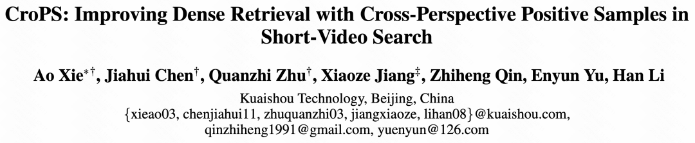
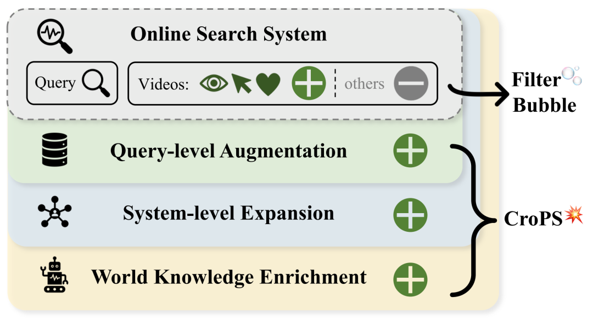
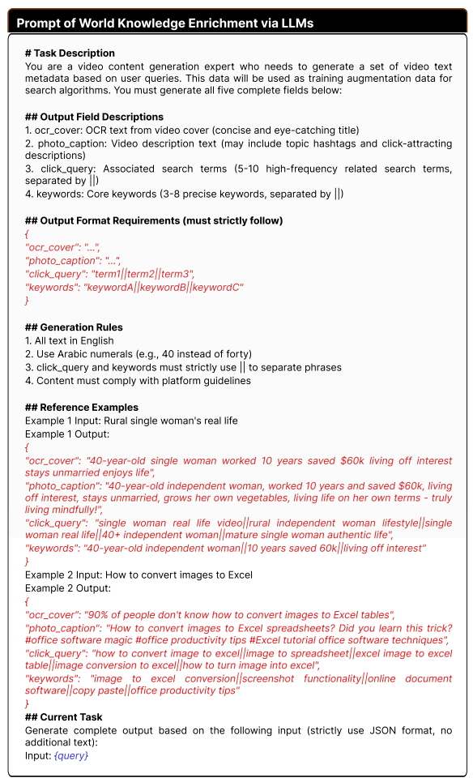
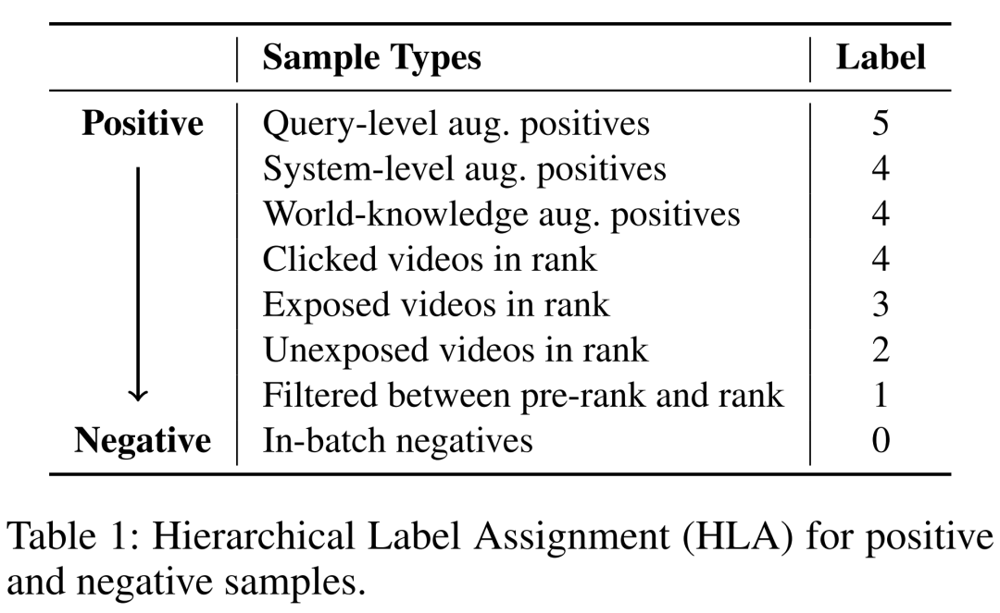
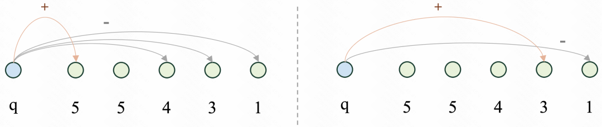
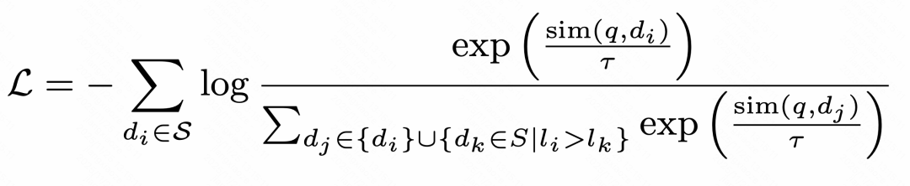
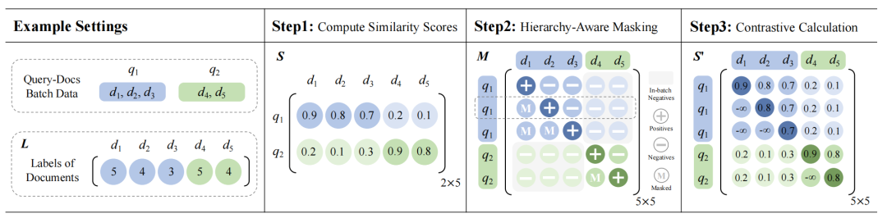
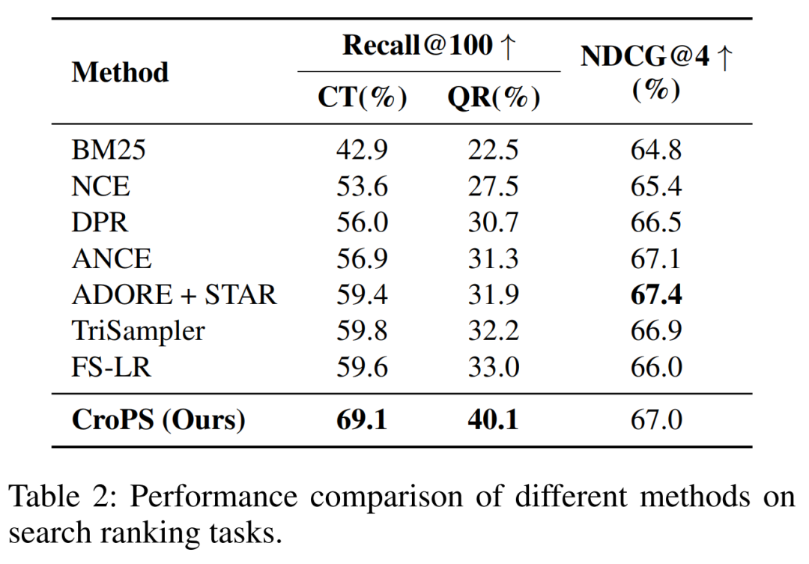
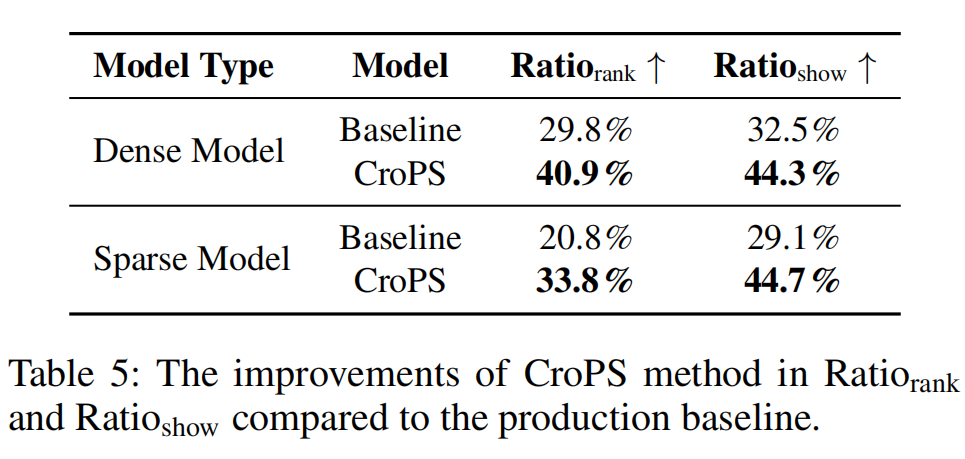
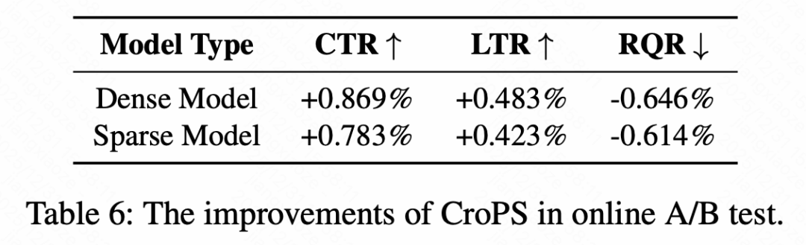

#  打破信息茧房！快手搜索多视角正样本增强引擎 CroPS 入选 AAAI 2026 Oral

快手技术 快手技术 [ 快手技术 ](javascript:void\(0\);)

______

在小说阅读器中沉浸阅读

短视频搜索业务是向量检索在工业界最核心的应用场景之一。然而，当前业界普遍采用的“自强化”训练范式过度依赖历史点击数据，导致系统陷入信息茧房，难以召回潜在相关的新鲜内容。

  

针对这一问题，快手搜索团队提出了一套全新的检索数据引擎 CroPS（Cross-Perspective Positive Samples）。该方法通过引入用户换 Query 数据、推荐流数据以及大模型生成的世界知识，多视角丰富了正样本信号，并结合层次化标签分配（HLA）策略和 H-InfoNCE 损失函数，实现了对相关性的精细化建模。

  

目前，CroPS 已在快手搜索业务中实现全量部署，服务亿级用户。实测表明，该方案在具备极强的架构普适性的同时，显著提升了 CTR 与长播率，并有效降低用户换 Query 率，优化用户搜索体验。

  

目前，本工作相关成果《CroPS: Improving Dense Retrieval with Cross-Perspective Positive Samples in Short-Video Search》已被人工智能顶级会议 AAAI 2026 Oral 接收。[🔮 论文链接]：https://arxiv.org/pdf/2511.15443v1  

**一、背景**

  

  
  
  

当前工业界主流的向量检索模型通常采用对比学习范式进行训练，拉近 Query 与正样本在向量空间中的距离，同时推远与负样本的距离，从而学习内容相关性。

  

然而，在绝大多数工业系统中，训练数据的正样本高度依赖历史曝光日志中的用户交互行为（如点击），导致“自强化”循环发生。具体而言，模型倾向于检索与历史高频点击内容相似的视频，用户受限于展示结果，只能在有限内容中选择和反馈，而这些反馈又再次作为正样本进入下一轮训练，进一步强化了模型原有的偏好。

  

这种机制不可避免地引发了严重的样本偏差。一方面，大量潜在相关但从未获得曝光机会的优质长尾内容，被系统性地排除在正样本之外，甚至在随机负采样过程中被错误标记为负样本。这种偏差使模型的检索视野逐渐狭窄，搜索结果变得保守且单一。另一方面，由于缺乏对新颖内容的探索能力，用户的搜索体验逐渐固化，难以在结果中获得惊喜或满足探索性需求。

以往的学术研究多致力于改进模型结构（如引入交互更复杂的 Poly-Encoder）或优化负采样策略（如挖掘困难负样本），从而提升检索性能。虽然这些方法在一定程度上增强了对已知内容的判别能力，但始终在历史曝光数据的界限内打转，无法从根本上缓解正样本来源单一所带来的“信息茧房”效应。

  

针对这一挑战，快手搜索团队提出了 CroPS 框架，从根源上打破数据闭环。CroPS 首次在业界引入“跨视角”的正样本信号，重塑了检索模型的训练图景。

  

**二、方法**

  

  
  
  

** _2.1 多视角正样本增强引擎 CroPS_**

为了打破数据边界，CroPS 框架构建了一个包含三个维度的正样本增强引擎，分别利用用户换 Query 行为、推荐系统反馈以及大语言模型（LLM）的世界知识，来全方位地丰富语义空间。

  

2.1.1 基于用户换Query行为的查询级增强

在真实的搜索场景中，用户往往难以一次性精准表达意图。当用户输入查询词 A 却未能找到满意结果时，通常会进行查询重构，输入语义相关但表述不同的查询词 B。如果用户在查询词 B 的结果下产生了深度交互，那么该交互视频在语义上极有可能是查询词 A 的理想正样本，尽管它从未在 A 的结果中获得足够的曝光。

  

CroPS 敏锐地捕捉到了这种“意图连续性”。通过分析用户在短时间窗口内的改写序列，并利用轻量级语义判别器进行过滤，系统能够将改写后获得的成功点击“回流”给原始查询，利用用户的修正行为来纠正模型的语义偏差。

  

2.1.2 打破搜推壁垒的系统级增强

推荐系统拥有海量用户消费数据，并且其算法机制天然倾向于发散和探索，因此推荐流中的视频往往具有更丰富的多样性。CroPS 建立了一套跨系统的信号桥接机制：对于同一个用户，如果他在推荐信息流中深度消费了某个视频，且该视频在语义上与用户近期的搜索词高度相关，该视频就会被引入作为搜索模型的正样本。  
通过这种跨系统的信号融合，搜索模型能够利用推荐系统的探索能力，将用户感兴趣但未主动搜索到的内容纳入召回视野，从而有效缓解单一系统带来的位置偏差和曝光偏差。  
2.1.3 引入大模型的知识级增强当平台现有的内容库或日志无法覆盖某些长尾、复杂查询时，单纯依赖内部数据是无解的。为此，CroPS 引入了大语言模型（LLM）作为“虚拟检索器”和“内容生成器”，利用 LLM 蕴含的丰富世界知识生成高质量合成样本。  
具体而言，系统采用单样本提示（One-shot Prompting）策略，让 LLM 扮演视频内容专家，针对特定查询生成包含标题、描述和标签的虚拟视频元数据。将这些合成数据作为正样本，训练双塔模型，相当于将外部世界的常识与逻辑“蒸馏”进检索模型中。  
这一方法使得模型在面对“冷门”或“从未见过”的搜索 query 时，仍能够凭借语义理解能力找到相关内容，从而彻底突破平台存量数据的限制。  

** _2.2 层次化标签分配 (HLA)_**

HLA 的核心是解决 CroPS 多源正样本的“可靠性差异”问题。不同来源的正样本（比如：用户换 Query 后产生互动的视频、推荐流中的视频）与用户真实需求的契合度各不相同。如果一视同仁进行训练，模型可能难以抓住重点。  
因此，HLA 为样本分配“分层标签”，让模型能够识别样本的重要程度，从而学习更细粒度的相关性，更好地契合系统优化目标。具体来说，HLA 将样本划分为“正样本相关层级”和“负样本层级”，为后续训练提供“细粒度监督信号”，不同类型样本对应固定标签，具体如下：

** _2.3 H-InfoNCE 损失函数_**

传统的语义召回采用的是 InfoNCE 进行优化，默认“样本只有正/负两种标签”，会逐个对比 “单个正样本” 和 “对应的负样本”，无法区分 HLA 里“高标签正样本（如上图Table 1 的标签 5）”和“低标签正样本（如上图Table 1 的标签 3）”的层次化差异。

  

而H-InfoNCE 在训练时，将“当前样本”与“标签严格低于它的所有样本”进行对比。这不仅突显了高优先级样本的重要性，也使学习目标与 HLA 的层级逻辑完全对齐，实现细粒度的语义区分。例如：

  * 若当前样本是“用户换 Query（标签 5）”，H-InfoNCE 会将其与“标签 ≤4 的所有样本（包括推荐正例、曝光未点击样本、负样本等）”一起对比，强制模型学习“标签 5 样本与查询的相似度，必须高于所有低标签样本”。

  * 若当前样本是“曝光未点击样本（标签 3）”，则只需对比“标签 ≤2 的样本”。

  

通过这种方式，模型能够逐步掌握“高标签样本更重要”的排序逻辑。

  

H-InfoNCE 在这里通过样例标签矩阵、样本 mask 矩阵等得到了高效实现。

  

**三、实验结果  
**

  

为了验证这一框架的有效性，团队构建了两类测试集，来衡量模型的召回Recall@100：

  * CT：用户点击测试数据集，即用户点击的视频作为正例；

  * QR：用户换 Query 测试数据集，即用户换 Query 后消费的视频作为正例。

  

同时也引入了相关性标注测试数据集，以 NDCG@4 为监测指标，作为模型的相关性表征能力度量。

** _3.1 离线实验_**

论文中主要比较了三类主流方法：

  * 经典方法：BM25（概率排序基线）、NCE（传统对比学习）；
  * 神经网络方法：DPR（双编码器稠密检索）、ANCE（动态难负样本采样）、ADORE+STAR（NN模型引入筛选负例）；
  * 负采样策略：TriSampler（基于样本的空间位置进行的负例采样）、FS-LR（多级别负标签策略）。

  

在离线实验测试中，CroPS相较于最强基线 FS-LR 在 CT 数据集上提升 9.5%，在换 Query 测试集 QR 上提升 7.1%。同时 NDCG@4 和 最强基线相当（67.4%->67.0%）。

** _3.2 在线实验_**

在快手搜索的大规模 A/B 测试中，CroPS 带来了全方位的业务增长：

  * 点击率（CTR）显著提升了 0.869%，长播放率（LPR）提升了 0.483%，表明召回的内容不仅相关度高，而且内容质量足以吸引用户长时间驻留。
  * 用户换Query率（RQR）下降了 0.646%，意味着用户“一次搜对”的概率大幅增加，不再需要频繁更换搜索词来找到想要的内容，直接反映了用户搜索体验的质变。

**四、总结与展望  
**

  

CroPS 证明了在工业检索系统中，正样本增强是缓解“信息茧房”问题的有效钥匙，能够提升系统上限。通过跨视角引入多样化信号，并结合精细化优化策略，CroPS 成功打破了自强化训练的边界。未来，快手搜索团队将进一步探索 CroPS 与生成式检索（Generative Retrieval）方法的融合，持续挖掘大规模语言模型在搜索全链路中的潜力。

\- END -

”

欢迎加入

【我们是谁】

我们是快手社科线-搜索技术部，作为快手算法核心部门，始终站在大数据与人工智能技术发展的前沿，致力于将大模型（LLM）技术与海量数据深度融合，打造行业领先的智能搜索平台，持续推动用户体验与技术能力的协同进化。部门业务覆盖电商搜索、视频搜索与AI搜索等多个核心方向，聚焦于构建精准、高效、智能的新一代搜索系统。  

  

【招聘岗位】

  * 搜索算法工程师

  * 电商搜索算法工程师  

  * 搜索推荐算法工程师

  * AI搜索算法工程师

  

（1）参与综合短视频，直播，电商，本地，社交和AI搜等搜索业务，用大规模机器学习，强化学习，多模态预训练等技术提升搜索质量，用户留存和点击率等核心业务指标；

（2）负责搜索query 意图分类，query 表征，query推荐，视频内容理解&多模态表征，多模态语义召回和相关性等搜索核心技术，提升搜索用户渗透率和相关性；（3）负责搜索用户行为分析，语义和行为混合检索，多序列&多任务粗排，精排，重排等搜索排序技术，提升搜索质量和内容消费指标；（4）负责搜索生态和机制，参与搜索混排，多目标优化，异构内容混排，短期和长期目标平衡，冷启动等搜索机制和算法。

  

【任职要求】

1、硕士及以上学历；2、熟悉自然语言处理、数据挖掘、机器学习等，有较强数据分析能力；3、熟练使用C/C++或Python。加分项：1、有搜索、推荐、广告、大数据等大型项目经验优先；2、熟悉大语言模型、强化学习相关技术3、国内和国际顶级会议发表论文的作者优先。  

【投递方式】

投递简历至邮箱：  

HR直投 xiaoyubo03@kuaishou.com 或 relevance@kwai.com

”

【相关阅读】

预览时标签不可点

微信扫一扫  
关注该公众号

继续滑动看下一个

轻触阅读原文

快手技术 

向上滑动看下一个

[知道了](javascript:;)

微信扫一扫  
使用小程序

****

[取消](javascript:void\(0\);) [允许](javascript:void\(0\);)

****

[取消](javascript:void\(0\);) [允许](javascript:void\(0\);)

****

[取消](javascript:void\(0\);) [允许](javascript:void\(0\);)

× 分析

__

微信扫一扫可打开此内容，  
使用完整服务

： ， ， ， ， ， ， ， ， ， ， ， ， 。 视频 小程序 赞 ，轻点两下取消赞 在看 ，轻点两下取消在看 分享 留言 收藏 听过
