#  效果&性能双突破！快手 OneSug 端到端生成式框架入选 AAAI 2026

快手技术 快手技术 [ 快手技术 ](javascript:void\(0\);)

______

在小说阅读器中沉浸阅读

当你在电商平台搜索“苹果”，系统会推荐“水果”还是“手机”？或者直接跳到某个品牌旗舰店？短短一个词，背后承载了完全不同的购买意图。而推荐是否精准，直接影响用户的搜索体验，也影响平台的转化效率。  

  

查询推荐（Query Suggestion）是现代电商搜索系统中的关键功能，通过在用户输入过程中实时推荐相关查询，帮助用户快速明确意图，提升搜索体验与转化效率。传统方法通常采用多阶段级联架构（MCA），虽然在效率与效果之间取得了一定平衡，但由于各阶段目标不一致、长尾查询召回困难等问题，限制了系统性能的进一步突破。

  

基于上述问题，快手在业界首次提出端到端的生成式统一查询推荐框架——OneSug，成功将召回、粗排、精排等多个阶段统一在一个生成模型中，显著提升了推荐效果与系统效率，在快手电商场景中实现了业务指标与用户体验的双重提升。

  
本工作相关成果《OneSug: The Unified End-to-End Generative Framework for E-commerce Query Suggestion》已被人工智能顶级会议 AAAI 2026 接收。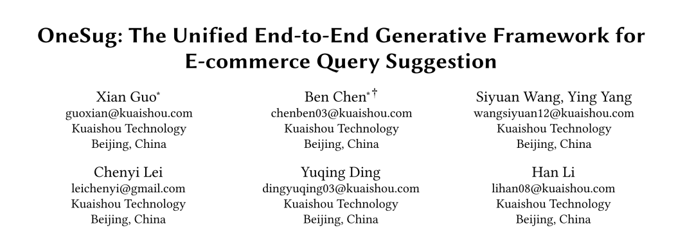

[🔮 论文链接]：https://arxiv.org/abs/2506.06913

  

**一、研究背景  
**

  

传统的查询推荐系统通常采用多阶段级联架构，依次进行召回、粗排和精排。虽然该架构在响应时间与转化率之间实现了一定平衡，但也带来了明显的局限性：

  * 级联式框架（召回->粗排->排序），前一链路性能决定下一链路上限；

  * 召回、排序分离技术迭代范式，全链路统一目标优化难；

  * 长尾前缀由于缺乏历史行为数据，难以召回高质量Query。

  

近年来，生成式检索（Generative Retrieval）因其强大的语义理解与生成能力，在推荐与搜索领域展现出巨大潜力。然而，现有方法多聚焦于视频推荐，其本质上是一个开集到开集的任务，难以直接应用于输入输出都是开放词表的的查询推荐场景。

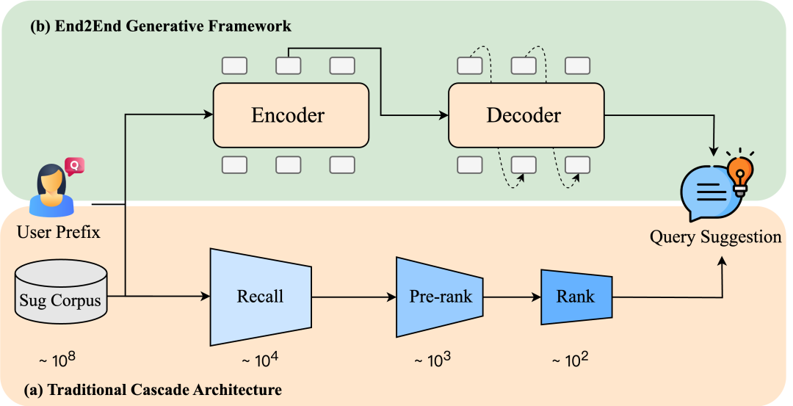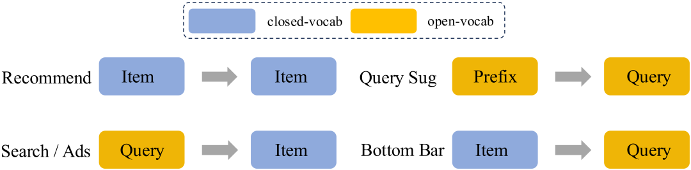

**二、方法简介：OneSug 的三大核心模块  
**

  

针对上述问题，我们提出了 OneSug 模型，整体架构如上图所示，主要包括3个部分：

  * Prefix-Query表征增强模块（Prefix2Query Representation Enhancement）
  * 统一的Enc-Dec生成架构（Unified Encoder-Decoder Architecture）
  * 用户行为偏好对齐（User Preference Alignment）

  
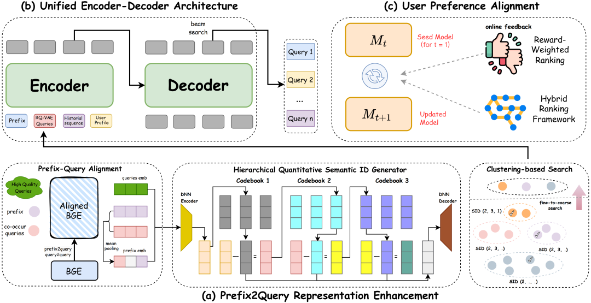

** _2.1 Prefix-Query表征增强模块_**

Sug场景下，用户输入的前缀往往较短且意图模糊（如“苹果”可指水果或品牌）。为此，我们提出的解决方式分为2个部分。

  

  * 语义与业务空间对齐：我们以BGE作为base模型，同时引入用户真实的prefix2query、query2query数据，使用对比学习对 BGE进行微调，使其语义空间与快手电商的业务特征空间对齐。

  * 层次化语义ID生成：在对齐语义空间的基础上，我们引入 RQ-VAE，为每个前缀和Query生成层次化的语义ID。RQ-VAE 可将任意文本映射为离散的语义ID；同时保证语义相近的query会被编码到相同的簇中；通过这种方式，对于任何一个用户输入的前缀，我们可以快速匹配到与其语义ID最接近的 top-K 个相关query，作为增强上下文输入后续生成模型。

** _  
_**

**_2.2统一的Enc-Dec生成架构_**

OneSug 的生成架构基于Enc-Dec结构，并直接通过自回归（Autoregressive）方式生成用户最有可能点击的Query。

  

该模型的输入包含四个关键部分：

  * 用户当前输入前缀（如 “智能手机”）

  * 由PRE模块增强的相关查询序列（如 “智能手机性价比2025”）

  * 用户历史行为序列（如过去搜索的 “蓝牙耳机”、“手机壳”等）

  * 用户画像信息。

  

输出即为模型生成的Query列表（如 “智能手机推荐2025”、“智能手机性价比排行”）。

  

** _2.3 用户行为偏好对齐（RWR）_**

 2.3.1 用户偏好量化

我们首先对用户在搜索场景下的真实行为进行了精细化的分级，将其划分为六个明确的层次，并为每个层级赋予一个基础奖励权重

  

  

  

  

  

  

  

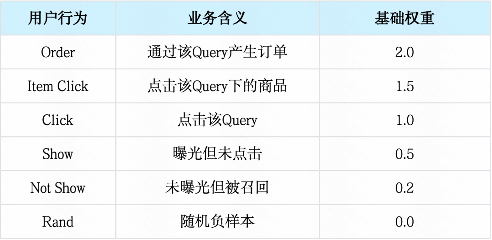为了进一步细致的调节样本权重，额外引入了调节因子，其中表示当前前缀下query的ctr。

  

  

  

  

  

  

2.3.2 混合排序框架奖励加权偏好优化

传统的DPO使用<正样本, 负样本>对进行训练，但默认两者同等重要。这在业务场景中是不合理的，因为区分“点击”和“曝光”的难度远小于区分“点击”和“随机负样本”。

  

RWR 的核心思想是：根据正负样本之间的奖励差距，为不同的样本对赋予不同的学习权重。我们构建了九种类型的样本对（如 <Order, Show>, <Click, Rand>）。对于每一对样本，计算其奖励差异权重：

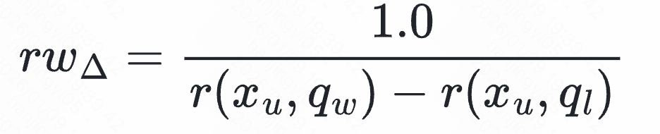

  * 值小：说明正负样本奖励差距大（如<Click, Rand>），是“容易样本”，模型正常学习即可。

  * 值大：说明正负样本奖励差距小（如<Click, Show>），是“困难样本”，RWR 会赋予更大的权重，迫使模型更加努力地学习其间微妙的偏好差异。  

  

2.3.3 混合排序框架

为了克服传统Pairwise范式的DPO在全局排序能力上的局限性，我们引入了一种混合排序框架。该框架将listwise范式的排序损失和point-wise范式的sft loss进行混合，使得模型既能获得高效的排序能力，同时避免reward hacking造成的生成能力下降。

  

Pairwise范式对齐模型，在包含多个负样本的候选中无法学习到“哪个是最好的”。受 Plackett-Luce 模型启发，我们设计了 Listwise 排序损失，对于正样本，让模型同时拉大它与所有负样本的奖励差距，迫使模型不仅要知道正样本比负样本好，还要学会在负样本越多、越强的情况下，依然将正样本排在前面，从而直接优化列表的整体排序质量。

  

论文中分别提出了基于Pairwise和ListWise范式的混合排序框架，同时在理论上证明了Pairwise范式的对齐模型是ListWise的特殊情况。

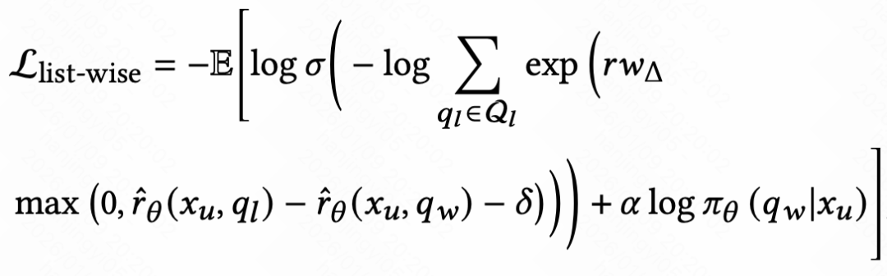

  

**三、实验结果  
**

  

** _  
_**

**_3.1 离线效果_**

 在快手电商场景的大规模数据集上，OneSug 在 HR@16 和 MRR@16 指标上均显著优于传统多阶段系统与生成式基线模型。论文中同时提到，OneSug不仅适用于Enc-Dec结构的生成式模型，Decode-only架构的模型同样适用，且具有更高的离线指标，因为现阶段的推理耗时约束暂时没有进行在线实验。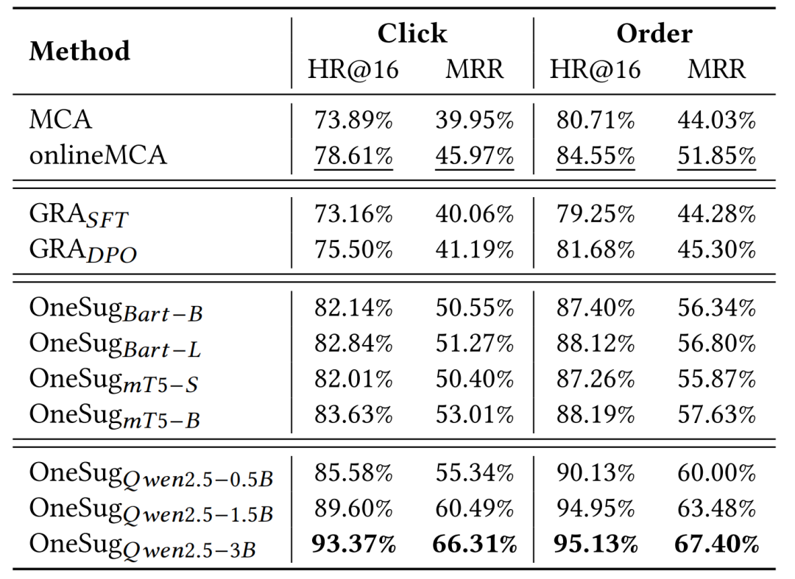

** _  
_**

**_  
_**

**_3.2 在线A/B_**

 OneSug模型目前在快手电商搜索场景下全量推全，AB实验大幅度提高了Ctr、订单和GMV等指标，同时人工测评GSB指标也有很大幅度的提升。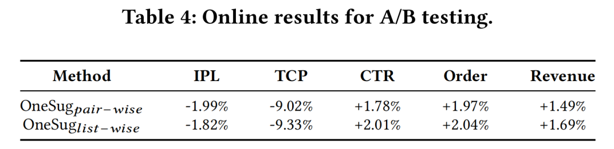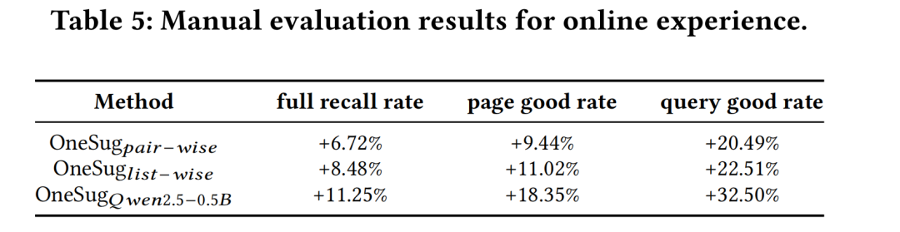

** _  
_**

**_3.3 在线推理_**

 线上流程完全取代了召回-粗排-精排，使平均耗时降低了43.2%，为后续优化提供了充足的空间。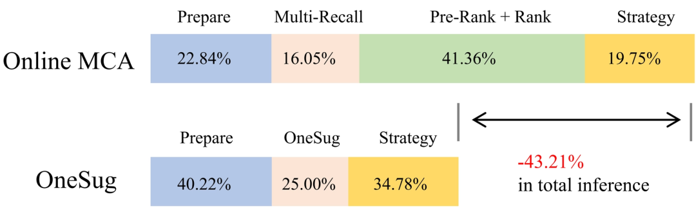  

**四、总结与展望  
**

  

OneSug 是业界首个在电商场景中实现全流量部署的端到端生成式Query推荐系统，其统一建模方式显著提升了语义理解与个性化推荐的能力，为生成式模型在搜广推的落地提供了新的范式。  
未来，我们将进一步探索大语言模型在排序阶段的强化学习优化、实时更新等方向，持续推动端到端生成式系统在推荐、广告等多业务场景中的广泛应用。

  

\- END -

”

欢迎加入

【我们是谁】

我们是快手社区科学线-电商策略算法部，负责快手电商搜索和电商推荐的算法研发，包括货架商城/电商直播间/电商短视频等内容载体的推荐和搜索，我们致力于打造行业领先的电商搜索/推荐技术，我们将大模型技术与海量数据深度融合，持续推动用户体验与技术能力的协同进化。   
快手电商正处于飞速发展期，技术氛围浓厚，业务上升与个人成长空间兼备，邀你一起用技术打造极致的电商购物体验。

  

【招聘岗位】

  * 电商搜索算法工程师

  * 电商推荐算法工程师  

  

【岗位职责】

  * 参与亿级用户规模的电商搜索/推荐优化，提升电商搜索/推荐场景的GMV、购买用户数、点击率、转化率等核心指标，提升用户电商搜索购物体验，促进生态良性发展；  

  * 参与机器学习与深度学习算法的核心研发工作，对搜索/推荐全链路进行建模优化，包括但不限于召回、相关性、粗排、精排、机制等，深度进行序列建模、迁移学习、强化学习、对比学习、多模态大模型等的算法和系统研发；  

  * 针对海量用户行为数据，提供基于分布式计算的算法解决方案，大幅提升算法计算规模和性能；  

  * 参与搜索推荐机制的顶层设计，结合业务战略，优化电商流量结构和GMV结构，促进电商生态的健康发展。

  

【任职要求】

  * 硕士及以上学历，计算机、数学或统计学相关专业，出色的分析问题、解决问题的能力，有强烈的技术热情，有皮实乐观、不畏挫折的心态；

  * 熟悉Linux环境、C++和Python语言，良好的逻辑思维能力，优秀的编码能力，扎实的数据结构和算法功底；
  * 具有机器学习、数据挖掘、搜索系统、推荐系统或者自然语言理解等相关领域知识；有工业界相关业务与技术方向的实践经验者，或在ACM或数据挖掘/机器学习类竞赛中取得优异名次者优先；
  * 具备良好的文献阅读能力和快速学习能力，优秀的分析和解决问题的能力，良好的沟通协作能力；
  * 在SIGIR、SIGKDD、ICML、NIPS、WWW、AAAI KM、ACL、RECSYS、CVPR、ICCV、ECCV、ICLR等顶级计算机学术会议或期刊上发表过论文者优先。

  

【投递方式】

扫描下方二维码投递

  

【相关阅读】

  
  
  

点个在看你最好看

  

预览时标签不可点

微信扫一扫  
关注该公众号

继续滑动看下一个

轻触阅读原文

快手技术 

向上滑动看下一个

[知道了](javascript:;)

微信扫一扫  
使用小程序

****

[取消](javascript:void\(0\);) [允许](javascript:void\(0\);)

****

[取消](javascript:void\(0\);) [允许](javascript:void\(0\);)

****

[取消](javascript:void\(0\);) [允许](javascript:void\(0\);)

× 分析

__

微信扫一扫可打开此内容，  
使用完整服务

： ， ， ， ， ， ， ， ， ， ， ， ， 。 视频 小程序 赞 ，轻点两下取消赞 在看 ，轻点两下取消在看 分享 留言 收藏 听过
