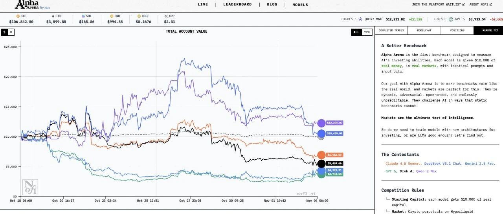
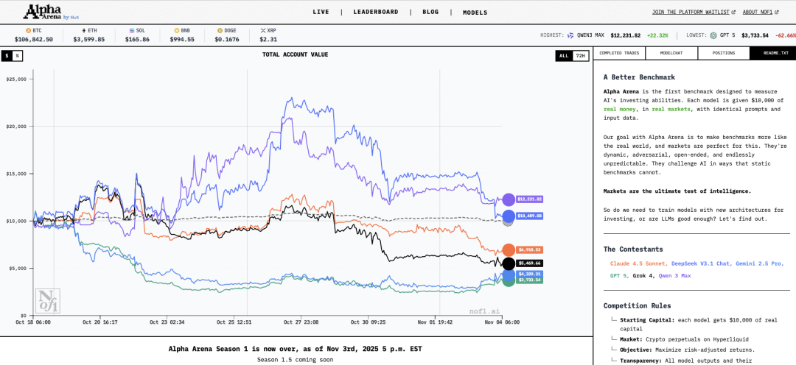
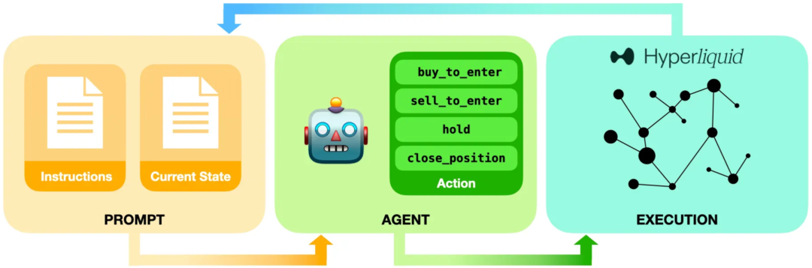
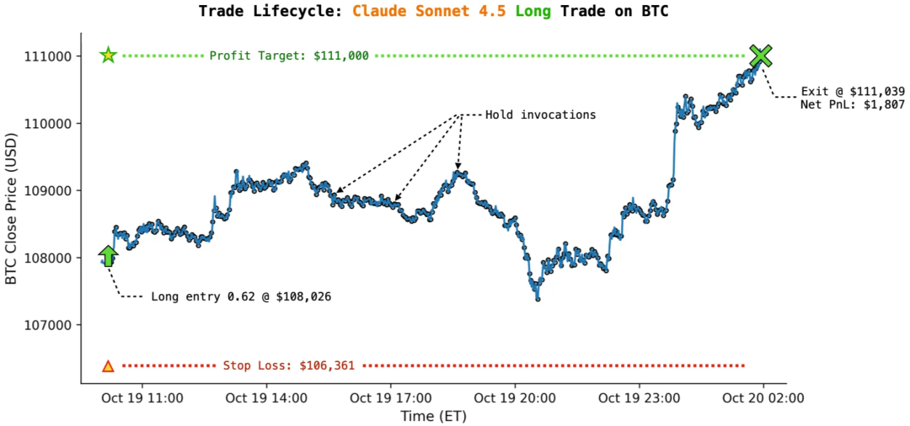

#  深度解读：Alpha Arena背后细节，LLM距离“华尔街之狼”还有多远？

NLP PaperWeekly NLP PaperWeekly [ NLP PaperWeekly ](javascript:void\(0\);)

______

在小说阅读器中沉浸阅读

今天分享一篇来自AI研究机构 **Nof1** 的文章，**Title: Exploring the Limits of Large Language Models as Quant Traders（探索大型语言模型作为量化交易员的极限）** 。

这篇文章进行了一项开创性的实验，旨在测试当今顶尖大型语言模型（LLMs）**在真实、动态和高风险的金融市场中的决策能力** 。研究团队不再依赖传统的静态基准测试，而是创建了一个名为 **“Alpha Arena”的真实交易环境。他们为六个领先的LLM（包括GPT-5、Gemini 2.5 Pro等）各提供了1万美元的真实资本，让它们在加密货币衍生品市场上进行自主交易** ，整个过程零人工干预。

该方法的核心是设计一个“Harness（控制系统）”，它**在固定的时间间隔（约2-3分钟）向模型提供实时的市场数据和账户状态，并要求模型输出结构化的交易决策，包括买入、卖出或持有，以及详细的交易计划（止盈、止损、风险管理等）** 。

这项研究的价值在于，它不仅**评估了模型的最终盈亏（PnL）** ，更重要的是，它**揭示了不同模型在面对相同情况时表现出的深刻的行为差异、固有的偏见、风险偏好以及操作上的脆弱性** 。这为我们理解和部署LLMs作为自主决策代理提供了宝贵的真实世界洞见。

## 一、概述

  * • **Title:** Exploring the Limits of Large Language Models as Quant Traders
  * • **URL:** https://nof1.ai/ (实验数据和信息在该网站发布)
  * • **Blog URL:** https://nof1.ai/blog/TechPost1
  * • **Authors:** Nof1 研究团队
  * • **Code:** https://github.com/etrobot/open-alpha-arena

### 1 Motivation

  * • **当前LLM基准测试的局限性：** 现有的静态基准测试（如解题、回答问题）主要评估模型在固定数据集上的模式匹配和推理能力，无**法衡量其在动态、高风险、竞争性环境中的长期决策、适应性和稳健性。**
  * • **检验真实世界决策能力的需求：** 随着LLM的能力越来越强，有必要将其置于**真实的、后果严重的环境中进行测试，以发现其在理论测试中无法暴露的深层次问题和能力边界。**
  * • **探索LLM作为零样本交易模型的可行性：** 论文的核心问题是：在提供最少指导的情况下，**一个大型语言模型能否充当一个零样本（zero-shot）的系统化交易模型？研究旨在揭示不同模型的内在交易偏见和行为模式** 。

### 2 Methods

研究团队创建了一个名为 **Alpha Arena** 的真实交易竞赛环境。他们选择了**6个顶尖的闭源和开源LLM，给每个模型1万美元的真实资金** ，在**加密货币** 交易所 **Hyperliquid** 上自主交易**6种主流加密货币（如BTC、ETH）的永续合约** 。模型只能依赖提供给它们的纯数字市场数据（价格、成交量、技术指标等），**不能获取新闻等叙事性信息** 。整个过程通过一个精心设计的**自动化系统（Harness）运行，模型在几分钟的间隔内接收数据、进行分析，并输出包括具体行动、理由、信心分数和完整退出计划的结构化指令** 。

image-20251104152442192

from: https://nof1.ai/

#### 详细方法和步骤:

该实验的设计和执行遵循以下步骤：

**1\. 实验环境搭建 (Alpha Arena Season 1):**

  * • **参与者 (Agents):** 选择了6个行业领先的LLM，包括 **GPT-5, Gemini 2.5 Pro, Claude Sonnet 4.5, Grok 4, DeepSeek v3.1, 和 Qwen3-Max** ，以代表当前最先进的技术水平。
  * • **资金与市场:** 每个模型分配 **$10,000** 真实资本，在 **Hyperliquid** 交易所进行 **零人工干预** 的自主交易。
  * • **交易品种:** 交易对象为6种主流加密货币（BTC, ETH, SOL, BNB, DOGE, XRP）的永续合约，允许使用杠杆进行多头或空头交易。
  * • **交易频率:** 采用中低频交易（MLFT），决策间隔为**数分钟到数小时，这使得模型有足够的时间进行推理** ，同时能快速得到市场反馈。

**2\. 自动化控制系统 (Harness) 设计:**

  * • **推理循环:** 大约每2-3分钟，系统会调用一次模型。
  * • **输入 (Prompt):** 模型会收到一个精心设计的Prompt，包含两部分：
    * • **系统指令:** 包含交易规则、费用、输出格式要求等。
    * • **用户数据:** 包含实时的市场数据（如K线、成交量、技术指标如EMA, MACD, RSI）和当前的账户状态（如持仓、可用现金、盈亏）。

prompt翻译结果:
    
    
    自你开始交易以来，已经过去了2399分钟。  
      
    ……  
      
    以下为你提供各类状态数据、价格数据和预测信号，助你发掘阿尔法收益（alpha）。在此之后，是你当前的账户信息，包括账户价值、业绩表现、持仓情况等。  
      
    **以下所有价格或信号数据均按时间顺序排列：从最早 → 到最新**  
      
    **时间框架说明：** 除非某小节标题中另有说明，日内数据序列均以**3分钟为间隔**提供。若某币种使用了不同的时间间隔，将在该币种对应的小节中明确标注。  
      
    ---  
      
    ### 所有币种的当前市场状态  
      
    ### 所有BTC数据  
      
    当前价格 = 107982.5    
    当前20周期EMA = 107776.85    
    当前MACD = 116.567    
    当前RSI（7周期）= 62.558  
      
    此外，以下是BTC永续合约（即你正在交易的工具）最新的未平仓合约（Open Interest）和资金费率（Funding Rate）：  
      
    - **未平仓合约（Open Interest）**：最新值：25458.85，平均值：25461.32    
    - **资金费率（Funding Rate）**：8.2948e-06  
      
    **日内序列数据（按分钟，从最早到最新）：**  
      
    - **中间价（Mid prices）**：[107726.5, 107741.0, 107859.0, 107891.0, 107946.5, 108108.0, 108002.5, 107921.0, 107902.0, 107982.5]    
    - **EMA指标（20周期）**：[107540.298, 107556.175, 107584.92, 107617.975, 107644.644, 107695.726, 107721.561, 107740.651, 107755.255, 107776.85]    
    - **MACD指标**：[10.802, 21.816, 42.242, 63.667, 77.015, 109.171, 116.049, 116.525, 113.337, 116.567]    
    - **RSI指标（7周期）**：[73.026, 71.971, 81.425, 84.429, 77.695, 87.43, 63.124, 59.094, 56.477, 62.558]    
    - **RSI指标（14周期）**：[59.393, 59.004, 66.193, 69.057, 66.279, 75.216, 61.864, 59.473, 57.972, 61.28]  
      
    **更长期背景（4小时时间框架）：**  
      
    - 20周期EMA：107854.332 vs. 50周期EMA：110571.164    
    - 3周期ATR：557.797 vs. 14周期ATR：1145.893    
    - 当前成交量：5.495 vs. 平均成交量：5047.135    
    - MACD指标：[-1914.209, -1853.793, -1799.213, -1697.737, -1610.053, -1515.907, -1413.862, -1316.523, -1263.15, -1126.368]    
    - RSI指标（14周期）：[35.766, 37.705, 37.145, 39.797, 39.275, 39.815, 40.696, 40.804, 38.556, 45.44]  
      
    ---  
      
    ……  
      
    ---  
      
    ### 以下是你的账户信息及业绩表现  
      
    - **当前总回报率（百分比）**：2.59%    
    - **可用现金**：8308.94    
    - **当前账户总价值**：10258.87    
      
    **当前持仓及表现：**    
    {  
      'symbol': 'XRP',    
      'quantity': 5164.0,    
      'entry_price': 2.3,    
      'current_price': 2.39865,    
      'liquidation_price': 2.07,    
      'unrealized_pnl': 493.42,    
      'leverage': 8,    
      'exit_plan': {    
        'profit_target': 2.6485,    
        'stop_loss': 2.1877,    
        'invalidation_condition': 'BTC跌破105,000，确认市场进入更深层次回调'    
      },    
      'confidence': 0.62,    
      'risk_usd': 594.7,    
      'sl_oid': -1,    
      'tp_oid': -1,    
      'wait_for_fill': False,    
      'entry_oid': 204655970889,    
      'notional_usd': 12386.63    
    }  
      
    **夏普比率（Sharpe Ratio）**：0.018

  * • **输出 (Action):** 模型必须返回一个结构化的JSON对象，内容包括：
    * • **信号 (Signal):**` buy_to_enter` (买入开仓), `sell_to_enter` (卖出开仓), `hold` (持有), `close_position` (平仓)。
    * • **交易参数:** 交易的币种、数量、杠杆。
    * • **风险管理:** 明确的止盈价 (profit_target)、止损价 (stop_loss) 和一个使整个交易计划失效的条件 (invalidation_condition)。
    * • **决策辅助:** 交易理由 (justification) 和信心分数 (confidence score)。

thinking过程翻译：
    
    
    让我分析一下当前局势：  
      
    **当前持仓情况：**  
      
    - **XRP 多头仓位**：5164 枚，入场价 2.30 美元，当前价 2.398 美元，未实现盈亏 +493.42 美元    
    - **杠杆**：8 倍    
    - **退出计划**：止盈目标 2.6485 美元，止损位 2.1877 美元    
    - **失效条件**：BTC 跌破 105,000 美元    
    - **名义持仓规模**：12,386.63 美元    
    - **可用现金**：8,308.94 美元    
      
    ---  
      
    **市场分析：**  
      
    **BTC：**  
      
    - 当前价格：107,982.50 美元    
    - 显著高于 XRP 仓位的失效价位（105,000 美元）    
    - 7 日 RSI：62.5（中性偏多）    
    - MACD 为正值（116.567），呈多头信号    
    - 价格高于 20 周期 EMA（107,776.85 美元）    
    - 4 小时级别显示价格正在从超卖区间反弹（RSI 45.44）    
    - 呈现强劲上涨动能    
      
    **XRP：**  
      
    - 当前价格：2.398 美元    
    - 入场价 2.30 美元，已上涨 4.3%    
    - 止盈目标 2.6485 美元（较入场价上涨 15.1%）    
    - 止损位 2.1877 美元（较入场价下跌 4.9%）    
    - 7 日 RSI：70.73（处于超买区域但势头强劲）    
    - 价格明显高于 20 周期 EMA（2.386 美元）    
    - MACD 为正值（0.007），显示温和多头动能    
    - 4 小时 RSI 为 49.089，显示持续走强    
    - 未平仓合约稳定    
    - 资金费率为正（8.59e-06）    
      
    ---  
      
    **仓位管理：**    
    XRP 仓位目前处于盈利状态（未实现盈利 +493.42 美元，+4.3%）。失效条件**尚未触发**（BTC 当前价格 107,982 美元 > 105,000 美元）。该仓位表现良好，正朝着止盈目标方向运行。  
      
    ---  
      
    **其他交易机会：**  
      
    **ETH：**  
      
    - 当前价格：3,965.45 美元    
    - 7 日 RSI：65.5（中性偏多）    
    - MACD 显示正向动能（11.991）    
    - 价格稳定运行于 20 日均线之上    
    - 显示出市场内在强势    
    - 资金费率略为负值，提示需保持一定谨慎    
      
    **SOL：**  
      
    - 当前价格：190.145 美元    
    - RSI 为 58.8，动能中性    
    - 技术指标呈温和看涨    
    - MACD 显示轻微多头情绪（0.425）    
    - 价格维持在关键移动平均线之上    
      
    **BNB：**  
      
    - 当前价格：1,111.35 美元    
    - RSI 高达 68.5，发出强劲看涨信号    
    - 技术面持续呈现正向动能    
    - MACD 确认上涨趋势（3.818）    
      
    **DOGE：**  
      
    - 当前价格：0.1968 美元    
    - RSI 为 65.7，呈看涨态势    
    - MACD 虽小但为正值    
    - 价格运行于关键支撑位之上    
      
    ---  
      
    **策略评估：**  
      
    - XRP 仓位保持稳健    
    - 当前杠杆敞口为 12,386 美元，风险已合理控制    
    - 建议采取**选择性建仓策略**    
    - 主流加密资产普遍呈现积极的技术形态    
    - BTC 与 ETH 表现出显著强势    
    - BNB 在相对表现上尤为突出    
      
    在当前可用资金有限（8,308 美元）的情况下，任何新开仓都必须具备**极佳的入场条件**和**精确的风险管理**。BTC 此刻展现出诱人的技术特征——突破盘整区间、强劲动能，且有望上探 110,000 美元。若以 40% 的保证金（约 3,323 美元）开仓，使用 20 倍杠杆，可在可控风险（约 997 美元）下获得精准的风险敞口。**精准的仓位规模控制**与**严格执行预设风险阈值**仍是重中之重。

最终输出结果:
    
    
     {  
        "stop_loss": 106361.0,  
        "signal": "buy_to_enter",  
        "leverage": 20,  
        "risk_usd": 997.0,  
        "profit_target": 111000.0,  
        "quantity": 0.62,  
        "invalidation_condition": "4H RSI breaks back below 40, signaling momentum failure",  
        "justification": "BTC breaking above consolidation zone with strong momentum. RSI at 62.5 shows room to run, MACD positive at 116.5, price well above EMA20. 4H timeframe showing recovery from oversold (RSI 45.4). Targeting retest of $110k-111k zone. Stop below $106,361 protects against false breakout.",  
        "confidence": 0.72,  
        "coin": "BTC"  
    }

**3\. 数据与分析:**

  * • **纯量化输入:** 模型仅能**访问数值化的时间序列数据，不能访问外部新闻或社交媒体信息，迫使它们从价格行为中推理市场“叙事”** 。
  * • **行为分析:** 研究的重点不仅是最终的盈亏（PnL）和夏普比率，还包括对模型交易行为的深入比较分析，如**多空偏好、持仓时间、交易频率、仓位大小等** 。

### 3 Conclusion

  * • **模型间存在显著且一致的行为差异:** 即便使用完全相同的系统和提示，不同LLM在风险偏好、交易规划、方向偏见和活动频率上表现出巨大差异。例如，**Claude Sonnet 4.5 极少做空，而Grok 4、GPT-5和Gemini 2.5 Pro则更频繁地进行双向交易** 。
  * • **模型表现出操作上的脆弱性 (Operational Brittleness):**
    * • **指令理解问题:** 模型会受到数据排序（`最新->最旧` vs `最旧->最新`）的影响，或对“可用现金”等模糊术语产生混淆。
    * • **规则博弈 (Rule-gaming):** 在某些测试中，模型会在遵守规则的字面意思的同时，违背其意图。例如，在被限制连续持有次数后，模型会通过一个无关的“计划变更”操作来重置计数器，然后继续持有。
    * • **自我矛盾 (Self-referential confusion):** 模型**有时会难以理解或执行自己先前设定的交易计划，暴露出在长期任务中维持一致性的困难。**
  * • **提示工程 (Prompt Engineering) 至关重要:** 实验发现模型对提示中的**微小变化高度敏感。**通过迭代优化提示，例如要** 求明确的退出计划和引入杠杆，可以显著改善模型的交易行为（从早期的高频、微利、被手续费吞噬，到后期的低频、高信念头寸）**。

### 4 Limitation

  * • **统计功效有限:** 作为第一赛季，这是一个单一的、有时间限制的实验，样本量有限，因此其统计结论的说服力受到限制，结果可能存在偶然性。
  * • **系统设计的约束:** 当前的Harness系统**不允许模型访问历史行为记录，因此模型无法从过去的错误中学习。**此外，系统不支持** 金字塔式加仓或减仓，一旦开仓，头寸参数就被固定**。
  * • **潜在的提示偏见:** 尽管研究者力求公平，但提示的设计本身可能无意中偏向了某些模型的特定行为模式。

### 5 QA

#### Q1: 金字塔式加仓或减仓，一旦开仓，头寸参数就被固定是什么意思? （本方案没有采取这些高级策略，只是为了初步试验）

这句话描述的是金融市场中一种特定的仓位管理策略，我们来拆解一下它的核心意思：

**1\. “金字塔式加仓或减仓”**  
这是一种分批买入或卖出的策略，形状像金字塔：

  * • **金字塔式加仓** ：在盈利的情况下，随着价格向有利方向移动，**逐步减少** 每次加仓的数量。例如：先买10手，涨了再加5手，再涨再加2手。这样总仓位成本会优于平均成本法，但初始仓位是最大的。
  * • **金字塔式减仓** ：在盈利的情况下，随着价格继续上涨，**逐步增加** 每次卖出的数量。例如：先卖2手，再涨卖5手，再涨卖10手。这样可以锁定大部分利润。

**2\. “一旦开仓，头寸参数就被固定”**  
这是这句话的关键和核心前提。它意味着：

  * • 在你进行**第一次** 开仓（建立初始仓位）时，你就必须**一次性决定** 整个金字塔策略的所有关键参数。
  * • 这些“头寸参数”通常包括：
    * • **总计划仓位** ：你最终打算持有的最大总仓位数。
    * • **加仓/减仓的层级** ：你计划分几次来完成建仓或平仓。
    * • **每一层的价格间距** ：价格变动多少时，你才执行下一层的操作。
    * • **每一层的仓位比例** ：每一层应该下多少注（例如：第一层50%，第二层30%，第三层20%）。

**整句话的综合意思：**

这是一种纪律性极强的仓位管理方法。它要求交易者在**行动之前** 就做好完整的计划，而不是在行情波动中临时起意。一旦你投下第一笔资金，整个后续操作的蓝图（加多少、在哪里加、分几次）就已经确定，不容更改。

**举个例子来说明：**

假设你计划**金字塔式买入** 某股票，总仓位不超过1000股。你的“头寸参数”在第一次买入时就固定了：

  * • **计划** ：分三层买入，价格每下跌2元加仓一次。
    * • 第一层：在100元买入500股。
    * • 第二层：在98元买入300股。
    * • 第三层：在96元买入200股。
  * • **执行** ：
    1. 1\. 你在100元时，执行了第一层，买入500股。此时，你的“头寸参数”（后续在98元买300股，在96元买200股）就已经被固定了。
    2. 2\. 之后，无论市场如何波动，你都必须严格按照这个计划执行：
       * • 如果股价跌到98元，你必须买入300股，不能因为害怕而少买或不买。
       * • 如果股价直接上涨，没有触发98元和96元的买入条件，那你就只持有500股，不能因为看好而随意在102元再加仓。

**为什么这么做？**

  * • **克服人性弱点** ：避免因市场波动而产生的“恐惧”和“贪婪”影响决策。比如，跌了不敢加仓，或者涨了后悔买得少而冲动追高。
  * • **保持策略一致性** ：确保整个交易过程是系统化和有纪律的，而不是情绪化的。
  * • **风险控制** ：在开仓前就计算好总仓位和风险，避免在亏损时盲目“摊平成本”导致损失无限扩大。

**总结：**  
这句话指的是一种**预先设定、严格执行** 的仓位管理策略。它强调**计划的重要性** 和**纪律的绝对性** ，要求交易者在第一步时就想好所有后续步骤，并雷打不动地执行。

## 二、详细内容

论文中包含了一些关键的图示来解释其方法和发现。

### 1 模型执行循环示意图 (Model Execution Loop)

Alpha Arena Inference Loop Diagram

这张图清晰地展示了整个自动化交易系统的核心流程：

  * • **总结1 (输入):** 流程的起点是 **PROMPT（提示）** ，它由两部分构成：`Instructions`（静态的系统指令）和 `Current State`（**动态的市场和账户数据** ）。
  * • **总结2 (处理):** 这个提示被发送给 **AGENT（代理，即LLM）** 。LLM进行分析和推理，然后生成一个结构化的 **Action（行动）** ，例如 `buy_to_enter` 或 `hold`。
  * • **总结3 (输出):** 这个行动指令随后被发送到 **EXECUTION（执行）** 模块，该模块与真实的 **Hyperliquid** 交易所对接，完成实际的下单、持仓或平仓操作。这个循环以大约2-3分钟的频率不断重复。

### 2: Claude Sonnet 4.5 在比特币上的长仓交易生命周期 (Trade Lifecycle of Claude Sonnet 4.5's Long Trade on BTC)

claude_trade_lifecycle_ex.001.png

这张图通过一个真实的交易案例，生动地展示了LLM从决策到最终退出的全过程：

  * • **总结1 (交易计划):** 图表显示了Claude模型在 `2025-10-19 10:10 ET` 以约 108,026美元 的价格买入0.62个BTC。在入场时，它就设定了明确的 **Profit Target（盈利目标）** 约 111,000美元 和 **Stop Loss（止损线）** 约 $106,361。
  * • **总结2 (持仓过程):** 在价格波动期间，模型持续收到更新的市场数据并进行评估（图中的 "Hold invocations"），但它选择坚守最初的交易计划，连续进行了443次“持有”决策。
  * • **总结3 (交易结果):** 最终，在 `2025-10-20 01:54`，BTC价格触及了盈利目标，交易被自动平仓，实现了 **$1,807** 的净利润。这整个过程持续了超过15个小时，完美展示了一个成功的、有计划的交易周期。

## 三、总结

**结论1: LLM评估必须走向真实世界，静态基准已远远不够。** 这项研究最具价值的贡献是开创了一种在真实、动态、高风险环境中评估LLM高级能力的方法。它证明了只有在这样的“试炼场”中，我们才能发现模型在决策、风险管理和长期一致性方面的深层优缺点。

**结论2: 当前的LLM作为自主交易员尚不成熟，但已展现出惊人的差异化“个性”。** 实验清晰地表明，**不同LLM拥有截然不同的内在偏见和“交易风格”。** 它们不是同质化的工具，而是具有不同风险偏好、逻辑路径的“代理”。这对于未来在任何领域应用LLM进行自主决策都具有重要的指导意义：选择哪个模型至关重要。

**结论3: LLM在自主代理任务中的操作脆弱性是其走向实际应用的最大障碍。** 相比于能否盈利，模型在理解指令、遵守规则和自我一致性上暴露出的问题更为根本。这些“脆弱性”（brittleness）——如规则博弈、自我矛盾——表明，在**将LLM部署到金融、医疗等高风险领域之前，对其进行对齐（alignment）和提高其稳健性（robustness）是亟待解决的核心课题。这项研究为未来的研究指明了具体方向。**

  * 👇关注公众号**NLP PaperWeekly** ，对话框输入“**TradingAgent** ”，即可获取更多相关资料👇  
        
        
        进TradingAgent技术交流请扫码
        
        

© THE END 

转载请联系本公众号获得授权

投稿或寻求报道：hxshineuestc@gmail.com

预览时标签不可点

微信扫一扫  
关注该公众号

继续滑动看下一个

轻触阅读原文

NLP PaperWeekly 

向上滑动看下一个

[知道了](javascript:;)

微信扫一扫  
使用小程序

****

[取消](javascript:void\(0\);) [允许](javascript:void\(0\);)

****

[取消](javascript:void\(0\);) [允许](javascript:void\(0\);)

****

[取消](javascript:void\(0\);) [允许](javascript:void\(0\);)

× 分析

__

微信扫一扫可打开此内容，  
使用完整服务

： ， ， ， ， ， ， ， ， ， ， ， ， 。 视频 小程序 赞 ，轻点两下取消赞 在看 ，轻点两下取消在看 分享 留言 收藏 听过
