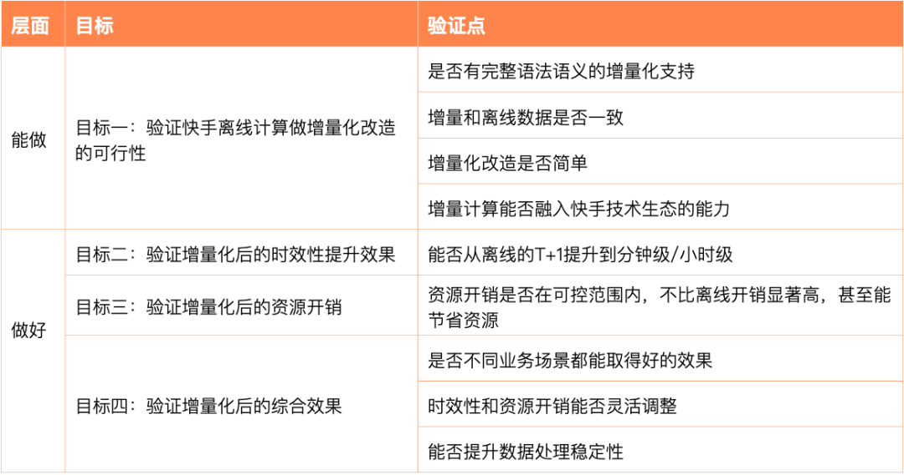
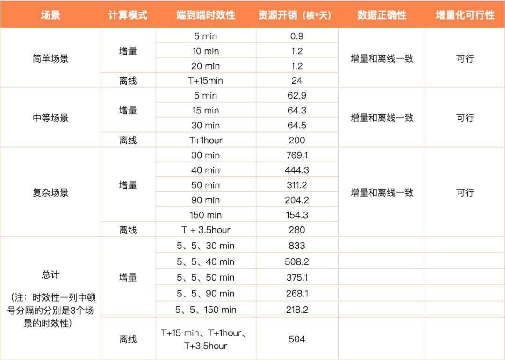
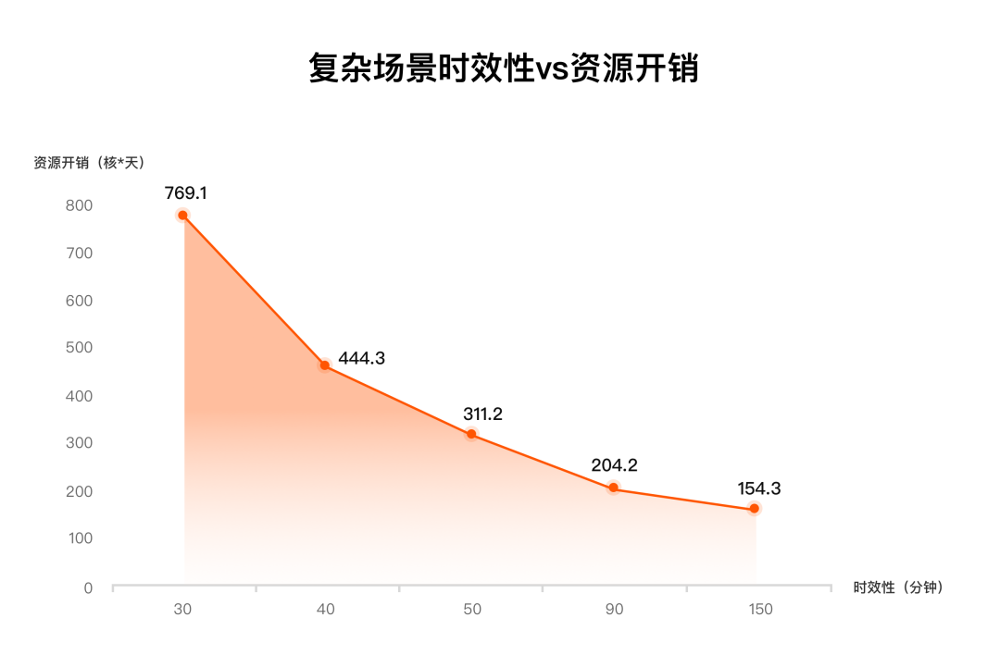
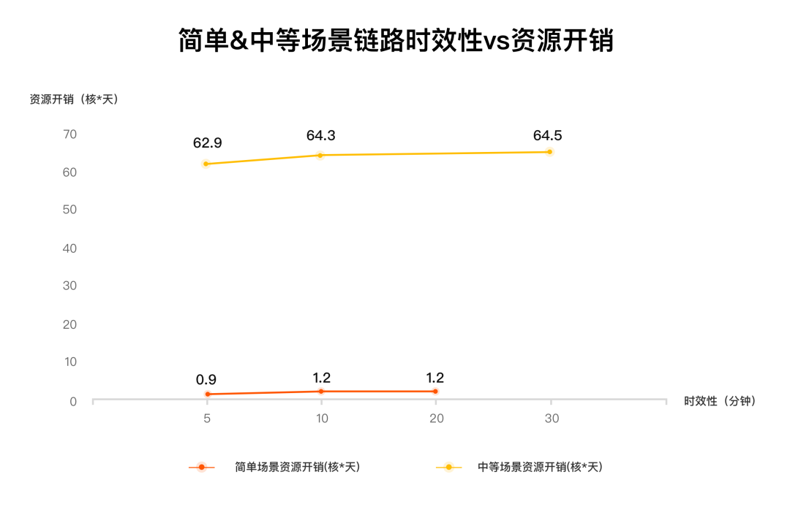
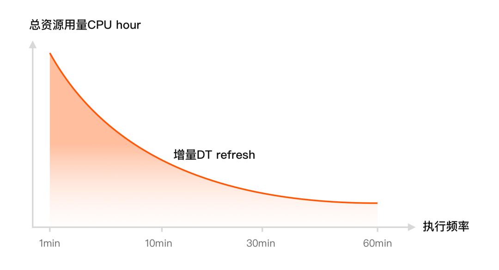
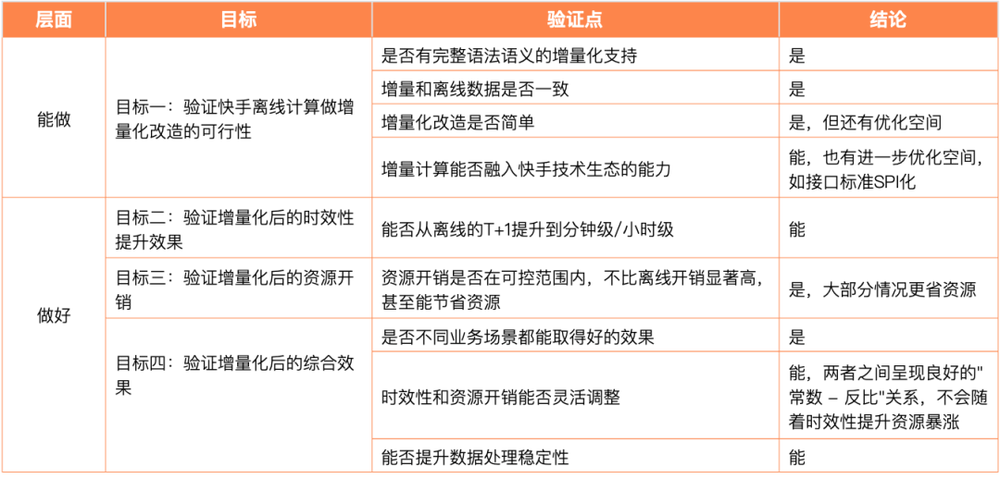

#  破解千亿数据处理痛点：快手增量计算如何解决时效、成本、运维三大难题？

快手技术 快手技术 [ 快手技术 ](javascript:void\(0\);)

______

在小说阅读器中沉浸阅读

**导读**

  

在数据驱动业务的时代，快手作为国内领先的短视频平台，日均处理数据量达千亿级，传统离线数据处理架构已难以满足业务对时效性和成本的双重需求。本文与大家分享快手数据平台团队和云器科技深度合作，共同探索和共建的新一代增量计算架构在海量数据大规模计算场景下提升计算时效性和降低成本的一些实践结果。  

  
  

**一、背景**

  

  
  
  

** _1.1 业务概述  
_**

快手是国内领先的短视频平台，每天产生海量数据，日均处理数据量达千亿级，快手数据平台部大数据计算引擎团队采用离线计算技术支撑起了每天各种业务数据的计算，涉及数据量EB级别，计算资源达数百万核。

  

** _1.2 问题分析  
_**

快手离线计算技术成功地支撑了公司每天产生的海量数据处理，但随着业务快速发展，传统离线数据处理架构面临三重挑战：

  * 时效性不足：现有离线处理模式时效性为T+1，数据价值随时间流逝大幅衰减，无法高效满足业务对实时数据的迫切需求以支撑实时的业务决策；

  * 资源成本高昂：随着公司业务快速增长，数据量也持续上涨，成本越来越高。另外，在离线全量计算模式下，即使只有 1% 的数据发生变化，也需对 100% 的历史数据进行重算，存量数据的反复计算带来高昂的成本；

  * 开发维护割裂：为了提升时效性，以往通常需要引入流计算（如Flink），这导致了 Lambda 架构下的两套代码、两套运维体系，维护成本高企。

  

** _1.3 方案选型  
_**

为了提升时效性同时保持较低的成本，快手数据平台团队对业界主流的近实时技术方案进行了多轮调研，最终选择增量计算作为方向。增量计算是一种同时面向高性能和低延迟优化的计算模式。当上游数据在不断发生变更的时候，通过只计算数据变化的部分，与之前的查询结果合并，快速的生成对应的最新查询结果，是继批处理、流计算和交互计算之后的新一代数据处理流程，能避免Lambda架构的缺点，实现Kappa架构。

  

快手数据平台团队和云器科技成立了联合项目组，共同探索和研发大规模计算场景下的新一代计算架构 \- 通用增量计算（Generic Incremental Computing，GIC）。

  

**二、实践目标和设计**

  

  
  
  

** _2.1 目标  
_**

 业内与近实时计算相关的技术多多少少都跟纯离线计算有一定区别，因此为了拿到提升时效性和降本的目标，还面临一定的改造工作。离线改造成增量计算可以从两个层面来看，首先是能不能做，如果能做，接下来是怎样才能做好。下面从“能做 -> 做好”两个层面定义本次探索和实践的目标：

  * 目标一：验证在快手复杂生产场景下离线计算做增量化改造的可行性，属于“能做”层面；  

  * 目标二：验证增量化后的时效性提升效果，属于“做好”层面；
  * 目标三：验证增量化后的资源开销是否在可控范围内，不比离线开销高太多，甚至能节省资源，属于“做好”层面；  

  * 目标四：验证增量化后的综合效果，属于“做好”层面。

  

** _2.2 设计  
_**

为了达到上述目标，我们将每个目标拆解成具体的验证点，具体如下：

  

为了全面充分地覆盖上述验证点，我们从线上业务中抽取简单、中等、复杂三个典型场景的链路，各个场景的特点如下：

  * 简单场景：数据量较小（每天几十GB级），计算简单，主流业务场景

  * 中等场景：数据量较大（每天几TB），计算简单，主流业务场景

  * 复杂场景：数据量大（10多张表，其中3张每天10+TB），计算复杂，如各种join、window等算子和UDF，且复杂算子数量多达十几个，是关键业务场景，该场景能做增量化改造并取得较好的结果，快手其他场景理论上问题不大

**三、实践结果**

  

  
  
  

** _3.1 测试结果数据  
_**

  

  

说明：

  * 上述结果中增量计算资源开销是每天所有单次增量累加所得，如简单场景5分钟时效性时，每5分钟做一次增量计算，每天做24*60/5 = 288次计算所耗资源相加所得；离线资源开销是单次全量计算所用资源。

  * 离线部分其中30%资源开销为数据同步部分（150 CU），剩余离线批处理场景由于时间关系非最优测试结果，预期优化后时间和资源开销还可以进一步降低到约150分钟/280 CU + 150 CU。

  

从上述结果可以看到：

1\. 简单和中等复杂场景下：

  * 增量计算都能取得非常好的时效性 \- **5 分钟**甚至可以更低；

  * 资源开销低，简单场景是离线的不到**1/20** ，中等场景不到**1/3。**

  

2\. 复杂场景下：

  * 增量计算也能取得很好的时效性，该场景的链路有3张大表，加工层次有4层，最快可以达到**30 分钟；**

  * 资源开销上如果追求极致时效性，增量累加资源比离线单次要高，到50分钟两者接近，90分钟及以上增量计算开销更低；

  * 该复杂场景是增量化改造最难的场景之一（计算复杂，有十几个join、window等复杂算子，同时IO特别重，30TB数据反复计算），该链路的顺利改造说明快手离线计算改增量化理论上没有大问题。

  

3\. 现实中往往简单任务和复杂任务一起执行，上述测试模拟了这一现象，结果数据是将三个场景在一起混跑得到。从整体来看，当简单、中等、复杂场景时效性分别在**5 、5、40分钟**时增量资源开销和离线基本持平，当复杂场景时效性进一步降低时增量资源开销快速下降，显著低于离线；

  

4\. 各个场景下时效性和资源开销都能**灵活调整。**

** _  
_**

**_  
_**

**_3.2 结果解读  
_**

 下面结合实践目标和对应的验证点进一步从技术角度详细解读上述结果数据。  
3.2.1 离线转增量 - “能做”

离线转增量是否“能做”，包含了以下几个验证点：

  * 是否有完整语法语义的增量化支持

  * 增量和离线数据是否一致

  * 增量化改造是否简单

  * 增量计算能否融入快手技术生态的能力

  

本次实践均已覆盖上述验证点并得到肯定结论，其中“增量和离线数据是否一致”和“增量计算能否融入快手技术生态的能力”容易理解不再详述，重点针对“是否有完整语法语义的增量化支持”和“增量化改造是否简单”展开说明。

  

**是否有完整语法语义的增量化支持：**

对于变化的数据来说，每隔一段时间新增的数据是增量数据，已有的数据是存量数据。增量计算的核心思想是计算尽量聚焦在增量数据的计算，存量数据在计算中涉及的越少越好。这要求计算的各种算子（计算的基础组件）支持增量化。由于全量计算和增量计算模式差异很大，有的算子增量化容易支持，如count，有的很难，如left join。没有完整支持各种算子的增量化导致的问题是有的计算会退化为全量计算，因此性能可能大幅下降，资源开销大幅上涨。不支持增量化的算子越多，从离线到增量改造过程中越会频繁遇到无法增量化的场景，这大大降低了增量化改造的意义。

  

本次实践覆盖快手四个场景，有简单、有复杂（如大量join、window操作等），且都来自真实生产场景，语法语义覆盖面较广，也包含大量UDF（无随机行为的UDF），未发现无法增量化的情况。

  

**增量化改造是否简单：**

从离线到增量化改造往往涉及大量SQL的迁移，如果没有简单的方法，该过程会涉及大量的工作。通用增量计算的SQL语法、加工逻辑与离线保持一致，绝大部分内容可以用“copy - paste” 的方式做改造，其中少数调度配置做修改即可。下面是本次测试中简单场景的改造示意图（绿色字体是加工逻辑保持不变）：

另一方面来说，虽然单张离线表改增量比较简单，但还是有部分人工操作，离线表往往数量庞大，累积起来改造工作量还是很大，后续我们会提供改造工具或者AI agent，批量自动化改造。

  

**3.2.2 离线转增量 \- “做好”**

“能做”是基础，但要取得好的业务价值，需要达到“做好”的程度，包含以下验证点：

  * 能否从离线的T+1提升到分钟级/小时级

  * 资源开销是否在可控范围内，不比离线开销显著高，甚至能节省资源

  * 是否不同业务场景都能取得好的效果

  * 时效性和资源开销能否灵活调整

  * 能否提升数据处理稳定性

  

其中前三个点在上文“测试结果数据”中可以体现，下面针对后面两个点展开说明。

  

**时效性和资源开销能否灵活调整：**

能灵活平衡时效性和资源开销对业务来说非常关键，有了这个能力，关键业务或者关键时间点（如大促时期）可以增加资源获得更高的时效性，非关键业务/平常时段可以降低一定时效性减少资源开销。在本次实践中，增量计算测试了不同场景不同时效性下的资源开销，从结果来看具备调节能力。具体来说，资源开销和时效性之间关系是：**介于固定常数关系到反比关系之间** ，当每次增量刷新涉及存量数据越多，越接近反比，反之越接近常数。

  

本次测试中“超大数据量+计算复杂”的复杂场景测试结果体现了资源开销和时效性呈现反比关系，资源开销随着时效性下降也显著减少。结果如下图：

注：30分钟时效性下资源开销上涨更明显关键原因也是机器网卡带宽瓶颈导致IO等待更突出。

  

本次测试中另外两个主流场景 \- 简单和中等场景，由于计算逻辑非常简单，数据仅做简单的插入操作，资源开销和时效性呈现简化的常数关系，即资源开销不再随着时效性提升而增加，保持比较固定的值。

**  
**

**能否提升数据处理稳定性：**

离线计算往往包含很多链路，用于产出不同的指标，其中关键指标一般都有严格的产出时间，如果超过产出时间出现延迟称为“破线”。关键指标链路的破线往往是严重的故障，会影响下游业务决策。离线计算破线的原因一是单次计算数据量太大，因为是全量计算，导致单次计算耗时长；二是计算和重试的时间窗口太短，因为离线计算要等前一天数据就绪之后开始，因此往往只有凌晨开始到上午的几个小时，一旦出现问题重跑代价大，很容易超出时间窗口。

  

增量计算只要上游数据有部分更新就持续做增量迭代计算，因此单次增量计算数据量小、时间短、重跑代价低；时间窗口也比离线长很多，增量计算从前一天数据开始逐步积累阶段就开始计算，直到第二天凌晨全部数据就绪算出最终结果，时间窗口比离线富余一天多，期间出现任何问题都能及时发现和重跑。因此增量计算能降低关键指标任务的破线风险，提升数据处理稳定性。

  

** _3.3 背后的技术原理  
_**

影响性能/计算代价的主要因素有以下几个：

1.**查询复杂度** ：查询的计算时间很大程度取决于执行了多少种复杂的计算，算子的组合复杂度（Join，agg，window等）是一个重要的衡量指标，例如在计算Outer Join的时候，增量数据需要与大量的历史数据进行连接，并且在右表更新时，需要回撤之前补NULL的部分计算结果，会导致链路产生大量的更新操作。

  

2.源表数据**如何** 变化（Append Only vs Update/Delete）：整体上Append-Only 类增量数据计算代价更低，因为大部分的增量计算逻辑在处理新增的数据时，都不需要与历史数据产生交互，并且计算的结果往往也是新增的，不需要更新历史的计算结果。

  

3.源表数据**变化的频率和量** （每秒新增**1 万**行 vs 每秒新增 **1 百万**行）。

  

4.调度执行频率：整体上频率越高代价越高，为了提高数据的新鲜度，系统不得不进行高频率的数据计算，每次计算时，其中就不免包含（系统固定开销，增量数据计算开销，数据写出开销等）

资源消耗与执行频率的关系

从上述多方面因素不难看出，业务场景的多样性会显著影响增量计算的性能，能应对各种业务场景的多方面因素是一个极具挑战的工程难题。

  

传统**基于规则（ Rule-based）**的查询引擎很难同时应对上述多重因素。基于规则的查询引擎只在SQL定义时，根据查询涉及的算子类型进行判断：如果遇到不支持的算子，就直接生成全量执行计划；反之简单根据预定义好的规则将全量执行计划转换为增量执行计划，并且固化该增量执行计划，在往后的调度中都始终运行这个固定的增量执行计划。

  

然而，这种处理方式只是部分地考虑到了因素一（查询复杂度）带来的影响，却忽略了数据动态变化对性能带来的关键影响。一个固定不变的执行计划往往会使每次执行的计算性能存在巨大的波动（例如，某次计算中：源表数据量突然增大，或者包含各种操作类型的CDC源这次只出现了Append-Only的数据等）。甚至部分极端情况下，执行一次增量计算的代价反而会高于全量计算，但是基于规则的增量引擎因为缺乏动态调整的能力，难以规避此类问题。这无疑加重了用户的运维负担——除了编写业务逻辑之外，还必须频繁地介入到系统调优的工作中以应对各种性能回退带来的问题。

  

为此，通用增量计算采用**查询代价（ Cost-based）**的查询引擎，通过构建代价评估模型，综合考量上述四种影响性能的因素指标（查询复杂度/数据变化/数据变化速率/调度频率），在每次动态表刷新时，从多种可行执行计划中筛选最优方案。无论是全量与增量计算模式的抉择，还是算子层级的算法优化，系统都能根据数据变化做相应的调整，让用户得以聚焦业务逻辑开发，大幅降低数据处理的技术门槛与运维成本。

**四、结论**

  

  
  
  

本次探索和实践经过全面的测试和验证，能比较充分地回答最初定下的离线改增量“能做->做好”两个层面多个目标下的验证点，结论如下：

  

基于以上实践结论，通用增量计算能给快手带来明显的业务价值：

1.**时效性提升明显** ：上层业务即使不做任何改造，增量计算也能将离线产出时间提前，业务能更早地利用数据，同时也能减少关键任务破线风险；更进一步，增量计算能达到分钟级/小时级时效性，上层业务的数据使用时效性从一天多到分钟/小时，数据新鲜度越高数据价值越高，给业务创新带来基础，能极大地提升业务价值，如AB测试实验可以近实时做，近实时收集反馈，形成快捷的良性循环；

  

2.**资源开销低** ：在绝大部分场景下，在取得时效性明显提升的同时资源开销比离线更低，尤其是补数据等场景优势更明显；

  

3.**时效性和资源开销成本之间的灵活平衡能力** 也给业务带来很大的便利，平时大部分时间可以适当调低时效性降低资源开销以节省成本，在业务大促期间可以临时增加资源调高时效性以取得更好的业务效果；

  

4.在非极致时效性场景下（如时延要求低于秒级）通用增量计算一套架构同时满足了近实时和离线计算场景，在此统一架构下数据实时导入到加工处理用一套开发语言、一个系统，**简化了业务开发和维护成本 。**

  
总结：**新一代计算架构 \- 通用增量计算能在快手落地，并且带来明显的业务价值和收益。**

**五、未来展望  
**

  

基于上述实践结果，我们计划将通用增量计算在快手推广。

  

1\. 业务上：2026年我们选取了两个关键业务作为试点迁移到增量计算，其中一个利用增量计算分钟/小时级近实时能力提升广告AI模型的效果；另一个是公司级重点链路，涉及大量表和复杂加工任务，是离线计算的一个瓶颈点，利用增量计算提升产出表的时效性。后续持续增加其他业务，离线逐步向增量迁移。

  

2\. 技术上：  

  * 推动快手主体数据计算架构从离线升级到新一代计算架构增量计算

  * 双方技术团队紧密合作，持续深度打磨和优化增量计算能力

  * AI融合：将近实时数据与AI模型结合，构建“数据+AI”的智能决策体系

  

【END】

  

【相关阅读】

预览时标签不可点

微信扫一扫  
关注该公众号

继续滑动看下一个

轻触阅读原文

快手技术 

向上滑动看下一个

[知道了](javascript:;)

微信扫一扫  
使用小程序

****

[取消](javascript:void\(0\);) [允许](javascript:void\(0\);)

****

[取消](javascript:void\(0\);) [允许](javascript:void\(0\);)

****

[取消](javascript:void\(0\);) [允许](javascript:void\(0\);)

× 分析

__

微信扫一扫可打开此内容，  
使用完整服务

： ， ， ， ， ， ， ， ， ， ， ， ， 。 视频 小程序 赞 ，轻点两下取消赞 在看 ，轻点两下取消在看 分享 留言 收藏 听过
